---
## Author
author:
  name: Арина Андреевна Дрекина
  degrees: DSc
  orcid: 0000-0002-0877-7063
  email: 1032253548@rudn.ru
  affiliation:
    - name: Российский университет дружбы народов
      country: Российская Федерация
      postal-code: 117198
      city: Москва
      address: ул. Миклухо-Маклая, д. 6

## Title
title: "Отчет по лабораторной работе №1"
subtitle: "Дисциплина: Операционные системы"
license: "CC BY"
---

# Цель работы

Целью данной работы является приобретение практических навыков установки операционной системы на виртуальную машину, настройки минимально необходимых для дальнейшей работы сервисов.

# Задание

Установка и настройка операционной системы Linux на виртуальную машину Virtualbox.

# Теоретическое введение
Лабораторная работа подразумевает установку на виртуальную машину VirtualBox операционной системы Linux (дистрибутив Fedora).
Для установки в виртуальную машину используется дистрибутив Linux Fedora, вариант с менеджером окон sway.
При выполнении лабораторной работы на своей технике вам необходимо скачать необходимый образ операционной системы.
VirtualBox версии 7.0 или новее.

# Выполнение лабораторной работы

Сначала я скачала файл для дальнейшей работы со sway. Затем я зашла в приложение Virtualbox, нажала на кнопку  "создать". Появилось окно, в котором нужно задать настройки виртуальной машины. ([рис. @fig-001])

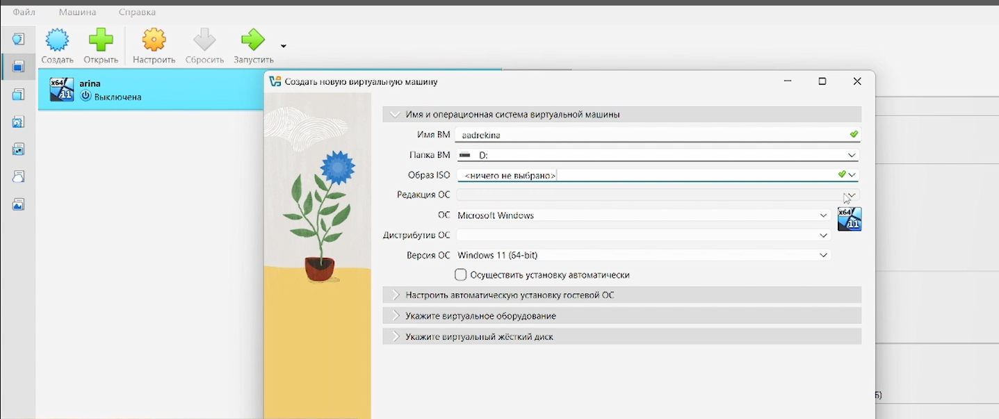{#fig-001 width=70%}

В имя ВМ я ввела первые буквы своего имени и отчества и поную фамилию. Затем выбрала где будет находится моя машина: диск D. В образе ISO я выбрала файл, который заранее скачала (sway). Затем я выставляю виртуальную память машины - 4096. Затем изменяем число ЦПО. Затем создаем виртуальный жесткий диск и выделяем 80 Гб памяти. Сохраняем все изменения.

Затем я захожу в настройки, включаю буфер обмена, далее включаем функцию UEFI. Обязательно включаем 3d-ускорение. Также я проверила подключена ли сеть.

Сохраняю изменения и после этого запускаю машину.

Здесь кратко описываются итоги проделанной работы.([рис. @fig-002])

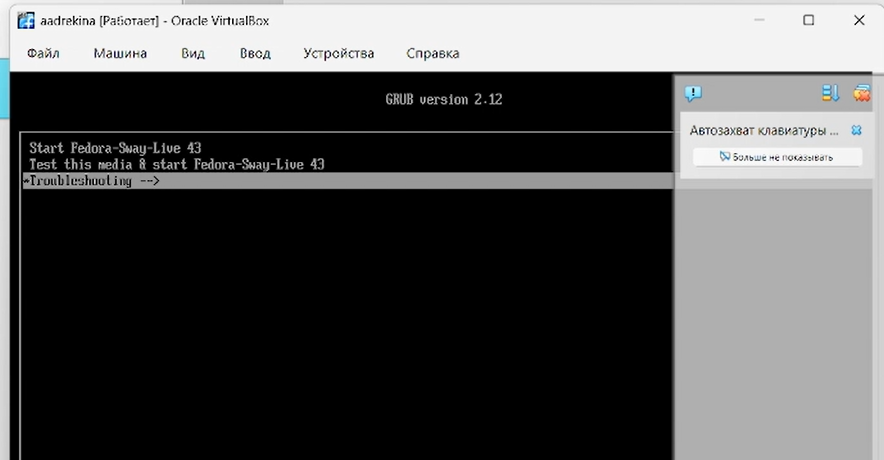{#fig-002 width=70%}

Появляется рабочий стол, с помощью клавиш win+d мы вызваем рабочее окно. ([рис. @fig-003]) в этом окне мы вводим "liveinst" и нажимаем. 

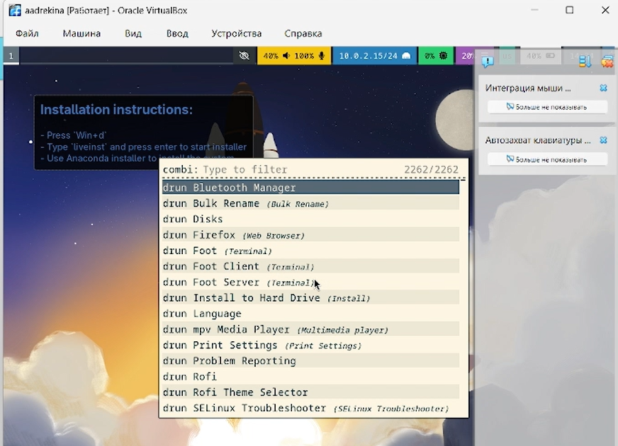{#fig-003 width=70%}

После нажатия открывается установка fedora Linux 43(sway). ([рис. @fig-004]). Я ввожу свои данные, создаю пароль для входа. После этого нажимаю на кнопку 'стереть данные и установить', после этого происходит загрузка. Как только она закончилась я выключила машину.

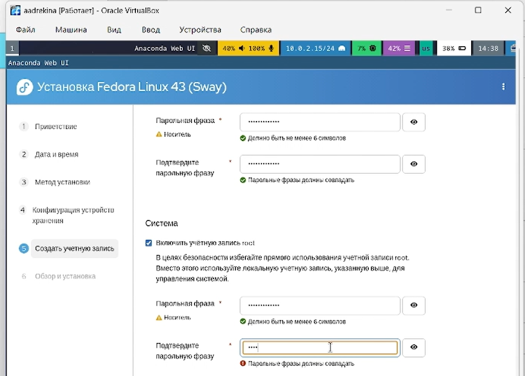{#fig-004 width=70%}

Далее мы заходим в настройки нашей виртуальной машины, заходим в раздел "носители" и правой кнопкой мыши удаляем устройство.([рис. @fig-005])

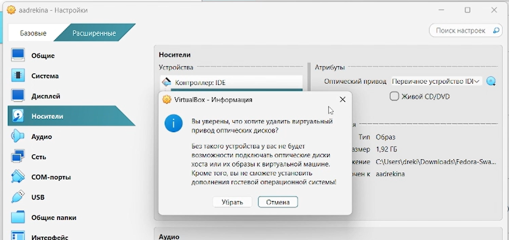{#fig-005 width=70%}

Затем снова запускаем виртуальную машину. Открываем терминал и на роль супер-пользователя, с помощью команды sudo -i. Перед тем как переключиться запрашивается пароль от виртуальной машины ([рис. @fig-006])

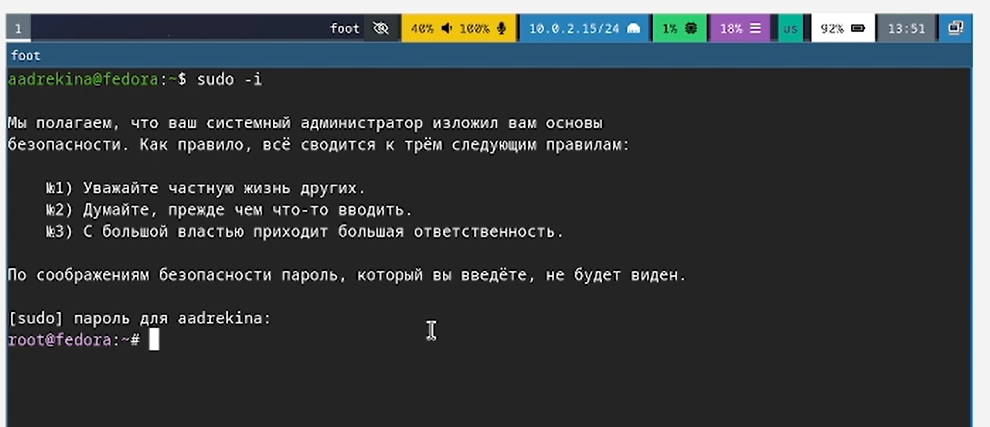{#fig-006 width=70%}

Затем необходимо установить средства разработки. ([рис. @fig-007])

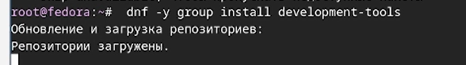{#fig-007 width=70%}

Далее необходимо установить пакет DKMS. ([рис. @fig-008])

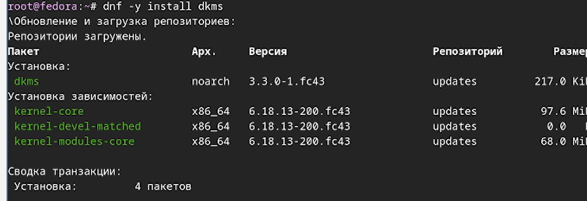{#fig-008 width=70%}

Затем нужно подмантировать диск ([рис. @fig-009]) и установить драйвер ([рис. @fig-010])

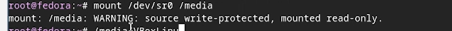{#fig-009 width=70%}

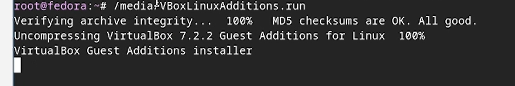{#fig-010 width=70%}

Мантировка диска и установка драйвера прошла успешно.Затем нужно перезагрзить машину.

Далее необходимо добавить внутрь виртульной машины своего пользователя в группу vboxsf.([рис. @fig-011])

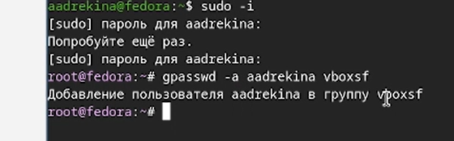{#fig-011 width=70%}

В терминале вывелось, что пользователь успешно добавлен. 

Далее нужно зайти в терминал windows и ввести туда код, чтобы подключить разделяемую папку в хоствовой системе. ([рис. @fig-012])

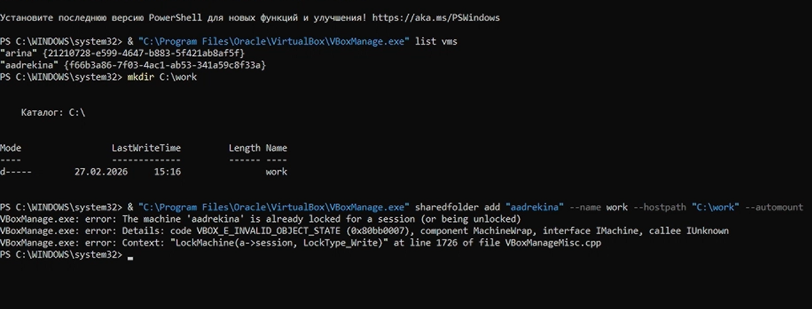{#fig-012 width=70%}

Затем я перезагрузила виртуальную машину еще раз, а после проверила наличие созданной папки. ([рис. @fig-013])

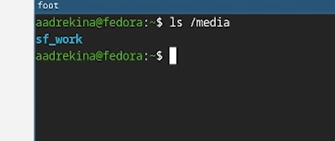{#fig-013 width=70%}

## Обновления.

Далее необходимо обновить все файлы. ([рис. @fig-014]) ([рис. @fig-015])

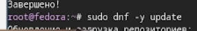{#fig-014 width=70%}

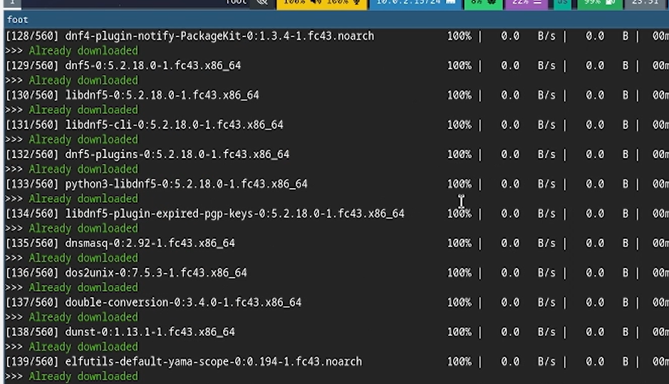{#fig-015 width=70%}
 
## Повышения комфорта работы.

Теперь нужно повысить комфорт работы на машине. Для этого нужно скачать программы для удобства работы в консоли. ([рис. @fig-016]) и также скачать другой вариант консоли.([рис. @fig-017])

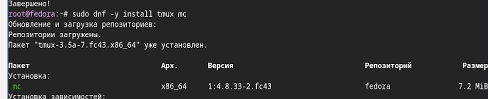{#fig-016 width=70%}

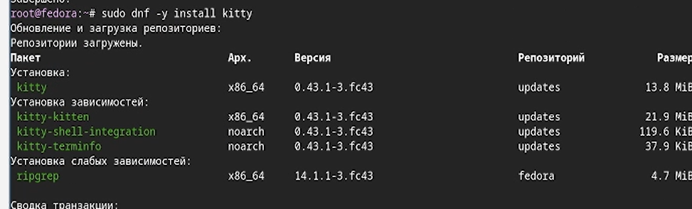{#fig-017 width=70%}

## Автоматическое обновление.

Для того чтобы обновления проходили автоматически необходимо скачать еще одно обеспечение. ([рис. @fig-018])

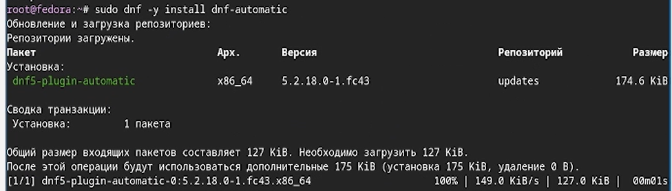{#fig-018 width=70%}

Я создала конфигурацию в файле "/etc/dnf/automatic.conf" ([рис. @fig-019]) ([рис. @fig-020])

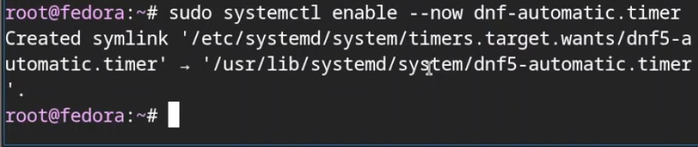{#fig-019 width=70%}

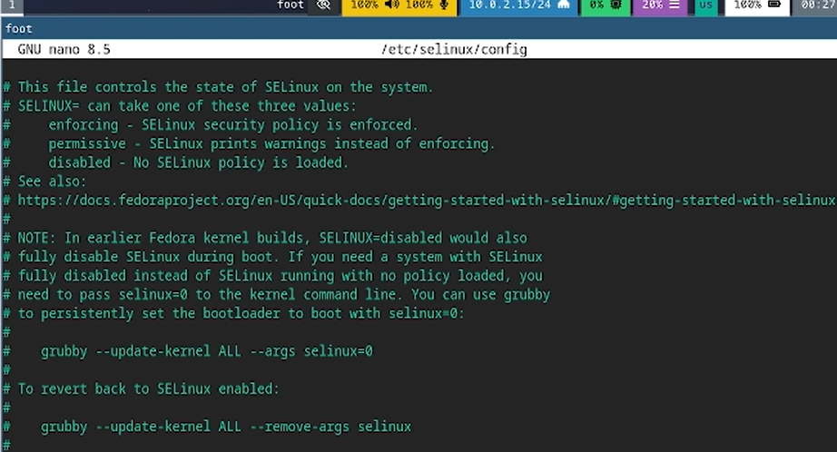{#fig-020 width=70%}

## Настройка раскладки клавиатуры.

Сначала я создала папку, а затем файл. (рис. @fig-021)

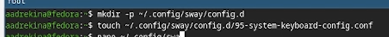{#fig-021 width=70%}

Затем я внесла изменения в созданном файле, я вставила в него "exec_always /usr/libexec/sway-systemd/locale1-xkb-config --oneshot"([рис. @fig-022])

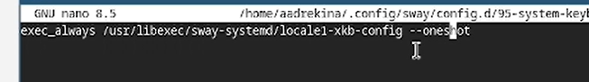{#fig-022 width=70%}

Затем нужно отредактировать еще одну кофигурацию. ([рис. @fig-023])

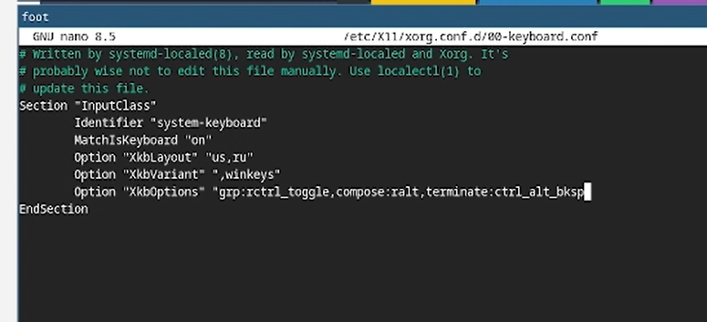{#fig-023 width=70%}

После этого необходимо снова перезагрузить виртуальную машину.

## Работа с языком разметки Markdown.

С помощью менеджера пакетов необходимо установить pandoc. ([рис. @fig-024])

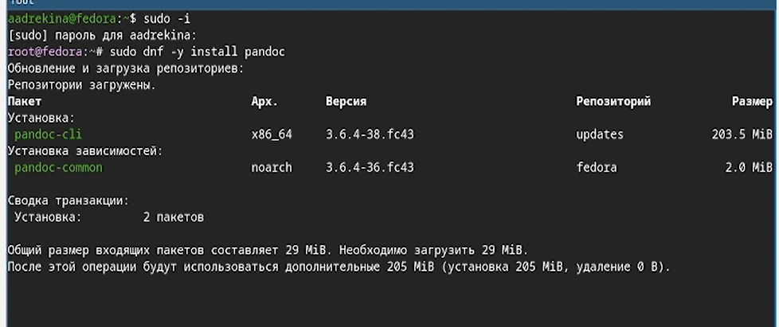{#fig-024 width=70%}

Потом с помощью команды wget мы устанавливаем pandoc-crossref файлы, с GitHub. ([рис. @fig-025])

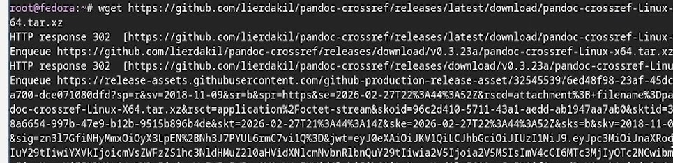{#fig-025 width=70%}

Затем я распаковала архив и добавила файлы в каталог "/usr/local/bin."([рис. @fig-026])

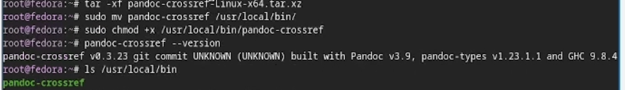{#fig-026 width=70%}

## texlive

Последнее, что нам нужно установить это дистрибутив texlive.([рис. @fig-027])

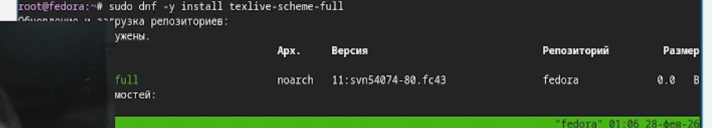{#fig-027 width=70%}

## Домашняя работа.

С помощью комнады dmesg я проанализировала последовательность загрузки системы. ([рис. @fig-028]) ([рис. @fig-029])

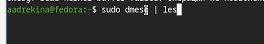{#fig-028 width=70%}

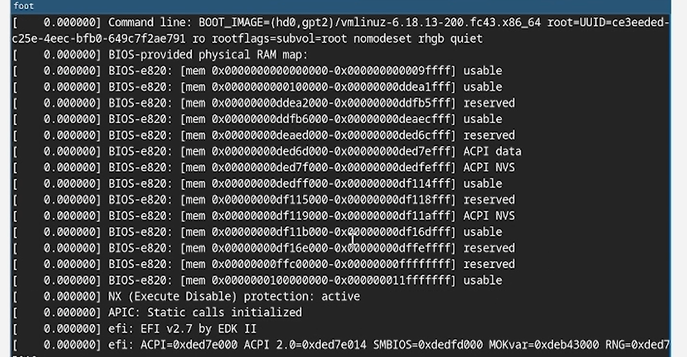{#fig-029 width=70%}

С помощью этой команды, добавив в нее аргумент поиска по слову я нашла ответы на вопросы. 

Версия ядра Linux (Linux version).([рис. @fig-030])

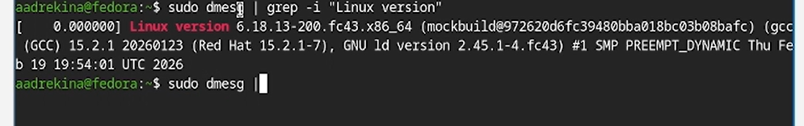{#fig-030 width=70%}

Частота процессора (Detected Mhz processor).([@fig-031])

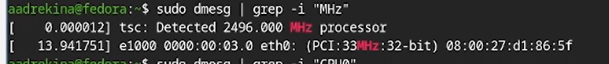{#fig-031 width=70%}

Модель процессора (CPU0).([@fig-032])

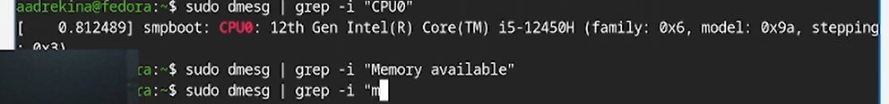{#fig-032 width=70%}

Объём доступной оперативной памяти (Memory available).([@fig-033])

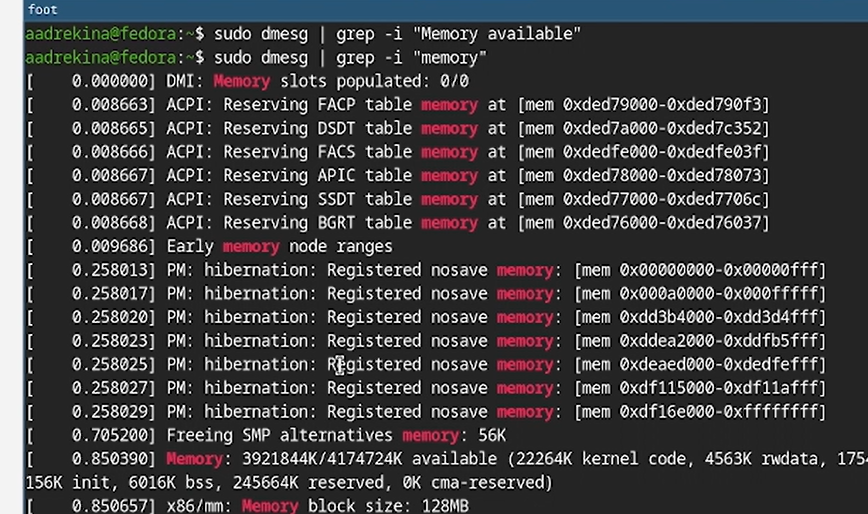{#fig-033 width=70%}

Тип обнаруженного гипервизора (Hypervisor detected).([@fig-034])

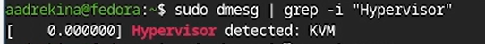{#fig-034 width=70%}

Тип файловой системы корневого раздела.([@fig-035])

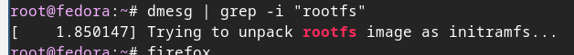{#fig-035 width=70%}

Последовательность монтирования файловых систем([@fig-036])

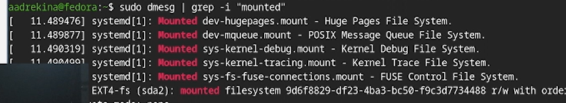{#fig-036 width=70%}

# Выводы

В ходе выполнения лабораторной работы мы приобрели практические навыки установки операционной системы на виртуальную машину, а также настроили минимально необходимые для дальнейшей работы сервера.

# Контрольные вопросы

1.Какую информацию содержит учётная запись пользователя?

Учетная запись пользователя хранит имя пользователя (login),UID (User ID) — уникальный числовой идентификатор пользователя,домашний каталог (home directory),пароль пользователя (в /etc/shadow)

2.Укажите команды терминала и приведите примеры.

для получения справки по команде;

```

команда --help

```

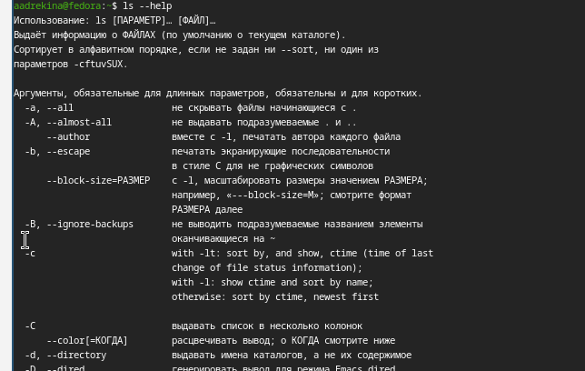{#fig-037 width=70%}

или 

```

man команда

```

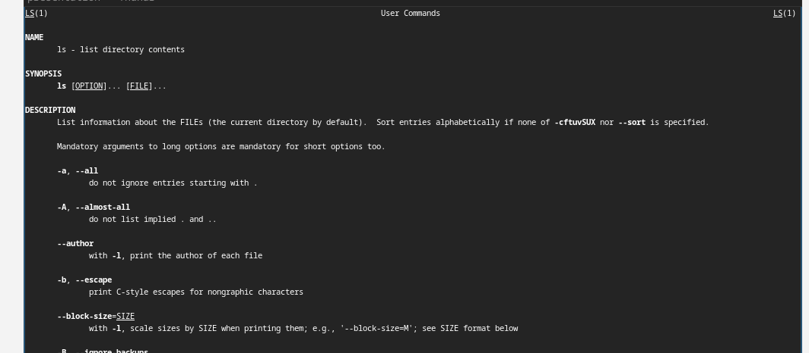{#fig-038 width=70%}

для перемещения по файловой системе;

```

cd

```

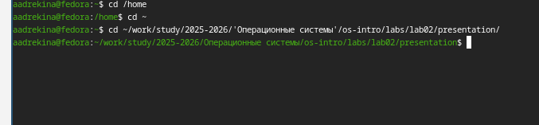{#fig-039 width=70%}

для просмотра содержимого каталога;

```

ls

```

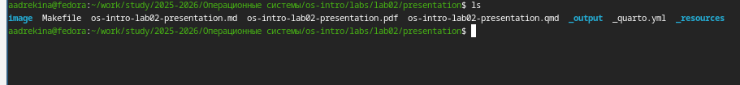{#fig-040 width=70%}

для определения объёма каталога;

```

du

```

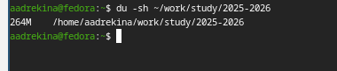{#fig-041 width=70%}

для создания / удаления каталогов / файлов;

Создание каталога:

```

mkdir test

```

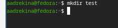{#fig-042 width=70%}

Удаление каталога:

```
rm -r test

```

{#fig-043 width=70%}

Создание файла:

```

touch file.txt

```

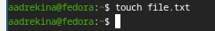{#fig-044 width=70%}

Удаление файла:

```

rm file.txt

```

{#fig-045 width=70%}

для задания определённых прав на файл / каталог;

```

chmod

```

для просмотра истории команд.

```

history

```

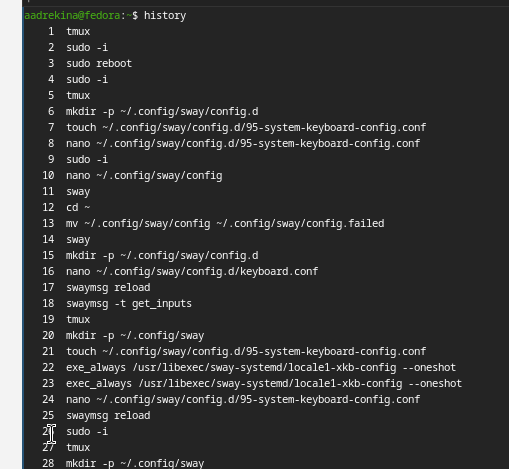{#fig-046 width=70%}

3.Что такое файловая система? Приведите примеры с краткой характеристикой.

Файловая система — это способ организации и хранения данных на носителе информации, который определяет структуру каталогов, методы хранения файлов и правила доступа к ним.
NTFS - Файловая система операционных систем Windows
FAT32 - Старая файловая система, используемая на флеш-накопителях.
ext4 - Основная файловая система Linux.

4.Как посмотреть, какие файловые системы подмонтированы в ОС?

Команда:

```

mount

```

Также можно использовать:

```

cat /proc/mounts

```

5. Как удалить зависший процесс?

Сначала нужно определить идентификатор процесса:

```

ps aux

```

После определения PID процесс можно завершить:

```

kill PID

```

Если процесс не завершается, используется принудительное завершение:

```

kill -9 PID

```

# Список литературы{.unnumbered}

::: {#refs}
:::
