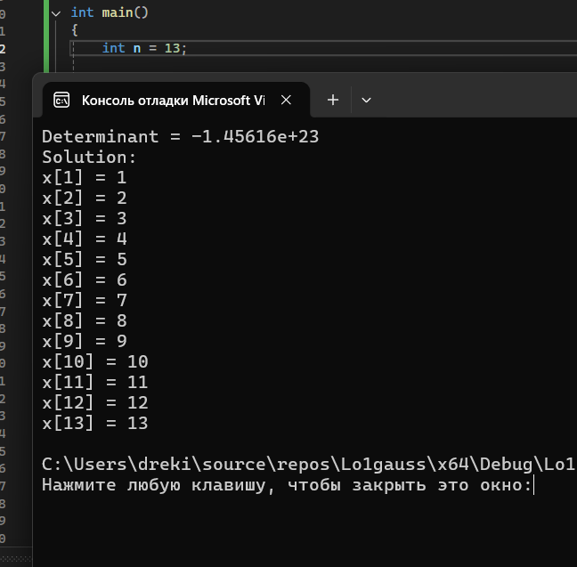
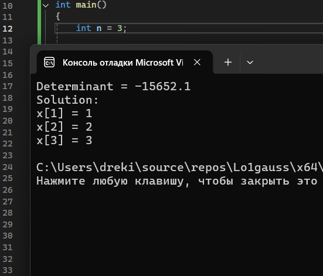
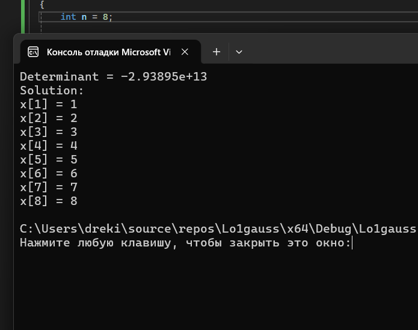
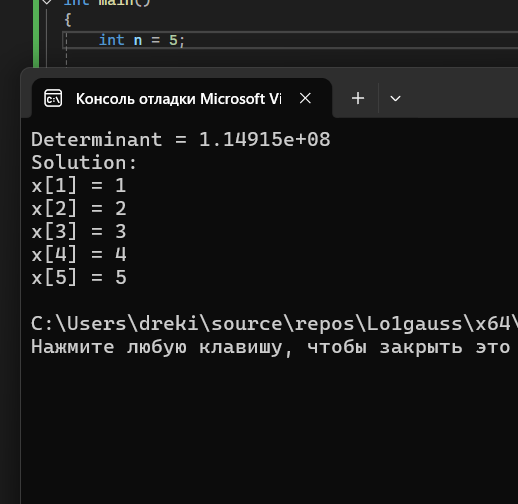

# Группа: НКАбд-02-25

# Студ.билет: 1032253548

# Лаборраторная работы №!

# Текст программы:

```

#include <iostream>
#include <cmath>
#include <cstdlib>

using namespace std;

void prepare(int n, double **&a, double *&b);
double gauss(int n, double **a, double *b, double *x);

int main()
{
    int n = 8;

    double **a, *b, *x;

    prepare(n, a, b);

    x = new double[n];

    double det = gauss(n, a, b, x);

    cout << "Determinant = " << det << endl;

    cout << "Solution:" << endl;
    for (int i = 0; i < n; i++)
        cout << "x[" << i + 1 << "] = " << x[i] << endl;

    for (int i = 0; i < n; i++)
        delete[] a[i];

    delete[] a;
    delete[] b;
    delete[] x;

    return 0;
}

void prepare(int n, double **&a, double *&b)
{
    a = new double*[n];

    for (int i = 0; i < n; i++)
        a[i] = new double[n];

    for (int i = 1; i <= n; i++)
        for (int j = 1; j <= n; j++)
            a[i-1][j-1] = rand() % 10000 / 100.0 - 50;

    b = new double[n];

    for (int i = 1; i <= n; i++)
    {
     	b[i-1] = 0;
        for (int j = 1; j <= n; j++)
            b[i-1] += a[i-1][j-1] * j;
    }
}

double gauss(int n, double **a, double *b, double *x)
{
    double eps = 0.00001;
    int sgn = 1;

    for (int i = 1; i <= n; i++)
    {
        int k = i;
        double max = fabs(a[i-1][i-1]);

        for (int j = i + 1; j <= n; j++)
        {
            if (fabs(a[j-1][i-1]) > max)
            {
             	max = fabs(a[j-1][i-1]);
                k = j;
            }
	}

	if (max < eps)
            return 0;

        if (i != k)
        {
            swap(a[i-1], a[k-1]);
            swap(b[i-1], b[k-1]);
            sgn = -sgn;
        }

        for (int j = i + 1; j <= n; j++)
        {
            double c = a[j-1][i-1] / a[i-1][i-1];

            for (int k = i + 1; k <= n; k++)
                a[j-1][k-1] -= c * a[i-1][k-1];

            b[j-1] -= c * b[i-1];
        }
    }

    double det = sgn;

    for (int i = 1; i <= n; i++)
        det *= a[i-1][i-1];

    if (fabs(det) < eps)
        return 0;

    x[n-1] = b[n-1] / a[n-1][n-1];

    for (int i = n; i > 1; i--)
    {
        for (int j = 1; j <= i - 1; j++)
            b[j-1] -= a[j-1][i-1] * x[i-1];

        x[i-2] = b[i-2] / a[i-2][i-2];
    }

    return det;
}

```

# Выводы для разных размерностей СЛУ. 

{#fig-001 width=70%}

{#fig-002 width=70%}

{#fig-003 width=70%}

{#fig-004 width=70%}

# Анализ

Во всех случаях алгоритм корректно находил решение системы линейных уравнений. Полученные значения переменных совпадают с ожидаемыми значениями (1,2,3,…,n), что подтверждает правильность реализации метода Гаусса.

# Описание программы.

## Хранение системы в программе.

Матрица А хранит коэффициенты левый части СЛУ. Матрица b - правая часть СЛУ. x - решение. ЭТо все имеет вид A*x=b

## Работа программы.

### Функция prepare() создает систему линейных уравнений.

Создание матрицы :

```

a = new double*[n];

```

Заполнение матрицы:

```

a[i-1][j-1] = rand() % 10000 / 100.0 - 50;

```

Создание правой матрицы b:

```

b = new double[n];

```

### Затем функция gauss()  решает систему уравнений  

Функция делает два прохода.

Во время первого прохода все элементы ниже диагонали обнуляются. Это делаем с помощью:

```

c = aji / aii

```

В ходе первого прохода мы нашли самую последнюю переменную. Теперь мы ее подставляем в строчку выше - это и есть обратный проход.

### Нахождение определителя (det)

