---
## Author
author:
  name: Арина Андреевна Дрекина
  degrees: DSc
  orcid: 0000-0002-0877-7063
  email: 1032253548@rudn.ru
  affiliation:
    - name: Российский университет дружбы народов
      country: Российская Федерация
      postal-code: 117198
      city: Москва
      address: ул. Миклухо-Маклая, д. 6
## Title
title: Отчет по лабораторной работе №2
subtitle:Дисциплина: Операционные системы
license: CC BY
date: today
date-format: "2026-03-04" # Example: 2025-09-06
---
# Информация

---

## Докладчик

  * Дрекина Арина Андреевна
  * студентка факультета физико-математических и естественных наук
  * Российский университет дружбы народов им. П. Лумумбы
  * [1032253548@rudn.ru](mailto:1032253548@rudn.ru)
  * <https://yamadharma.github.io/ru/>

---

## Цель работы.

Изучить идеологию и применение средств контроля версий. Освоить умение по работе с git.

---

## Задание.

Создать базовую конфигурацию для работы с git. Создать ssh ключ. Создать pgp-ключ. Настроить подпись git. Зарегистрироваться на GitHub. Создать локальный каталог для выполнения заданий по предмету.

---

## Выполнение лабораторной работы.

Для начала нужно установить програмное обеспечение. 

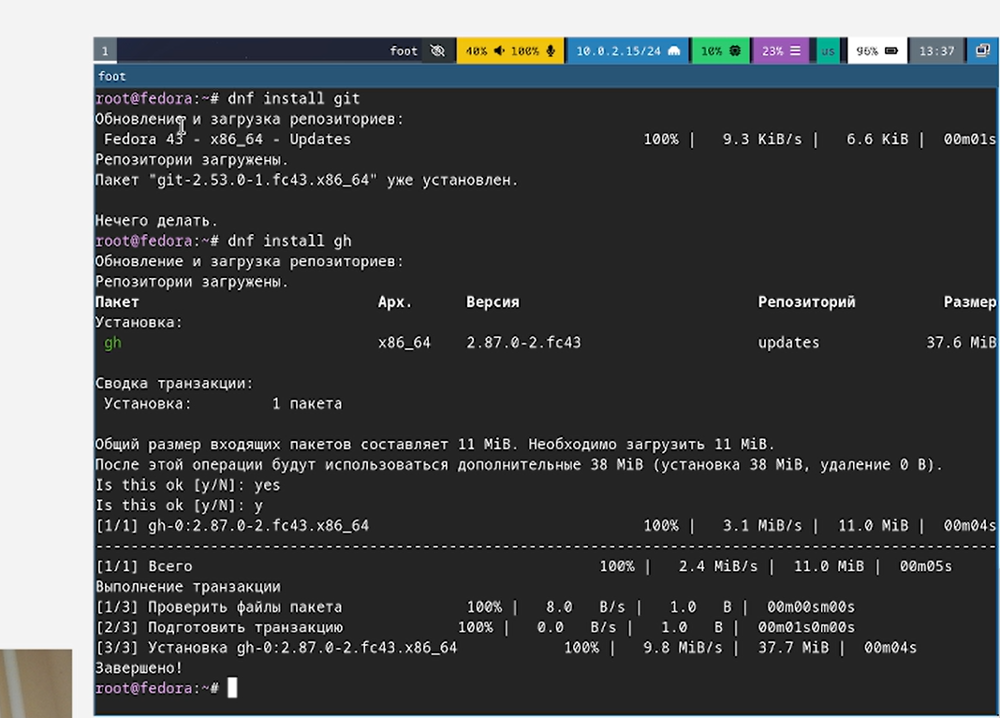{#fig-001 width=70%}

---

Задаем имя владельца репозитория и его email.

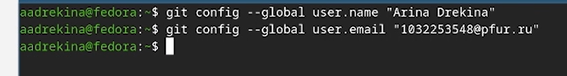{#fig-002 width=70%}

---

Настройка параметров autocrlf и safecrlf 

{#fig-003 width=70%}

{#fig-004 width=70%}

---

Создание ssh-ключа.

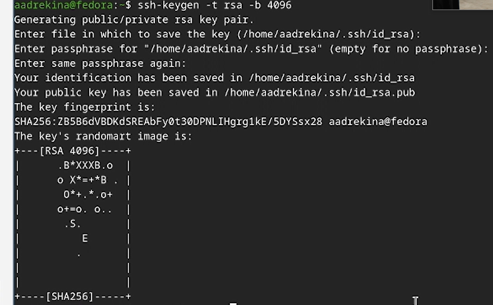{#fig-005 width=70%}

---

Генерация pgp-ключа. Выбор опций. 

{#fig-006 width=70%}

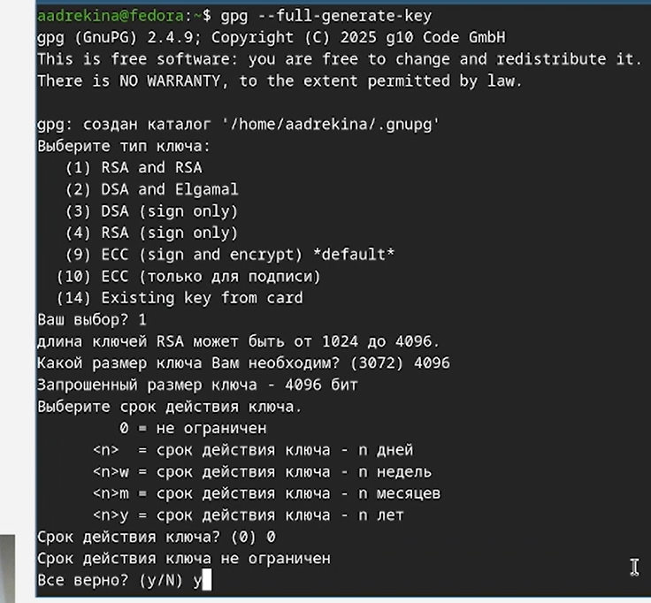{#fig-007 width=70%}

---

Для идентификации пользователя нужно ввести имя и emsil. После этого pgp-ключ создатся.

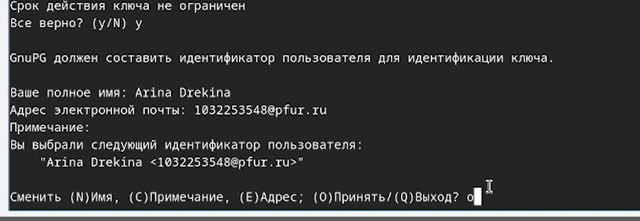{#fig-008 width=70%}

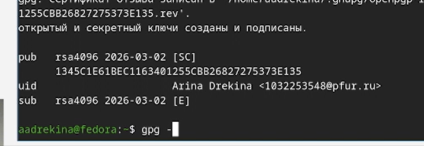{#fig-009 width=70%}

---

Вставка pgp-ключа на GitHub. 

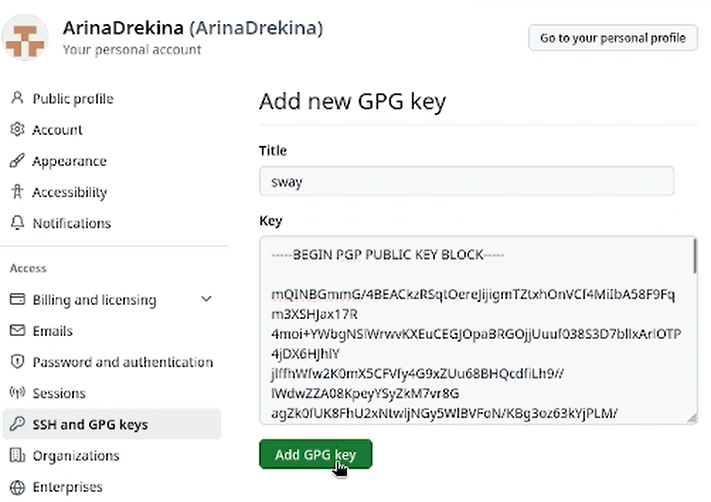{#fig-009 width=70%}

---

 Укажем Git принять его при подписи коммитов. 

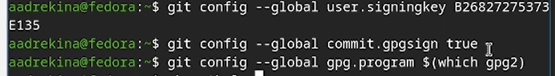{#fig-010 width=70%}

---

Нужно авторизоваться на GitHub, для этого нужно выбрать куда переходить.

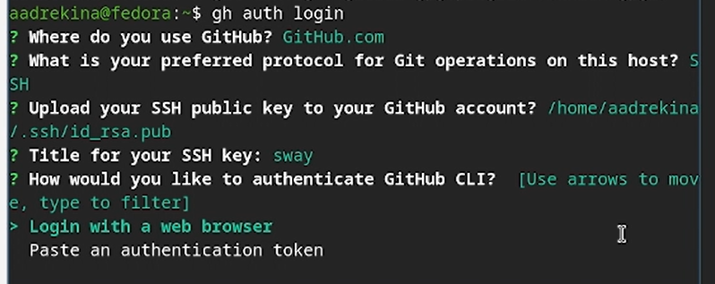{#fig-011 width=70%}

---

Создание репозитория. 

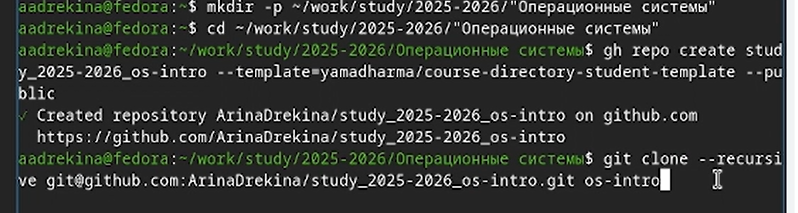{#fig-012 width=70%}

---

Клонирование репозитория в 'os-intro'.

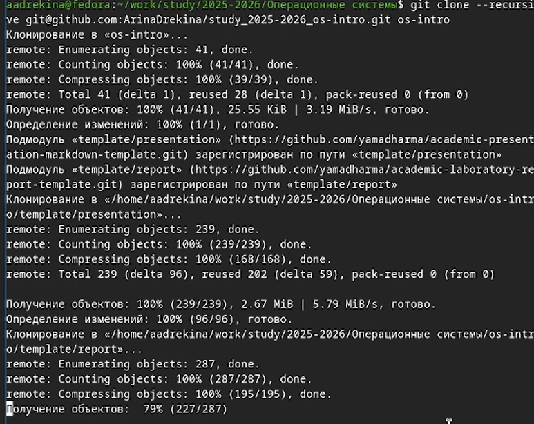{#fig-013 width=70%}

---

Создадим каталоги для работы. Откроем файл COURSE, внесем туда изменеия и скомпелируем.

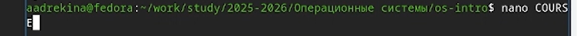{#fig-014 width=70%}

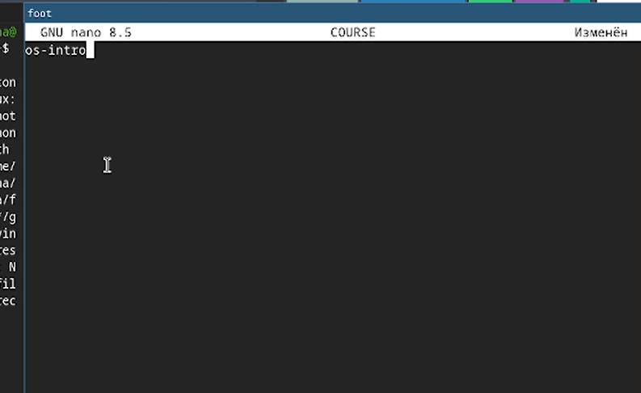{#fig-015 width=70%}

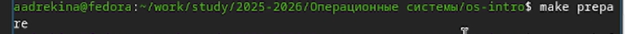{#fig-016 width=70%}

---

Отправка файлов на сервер. 

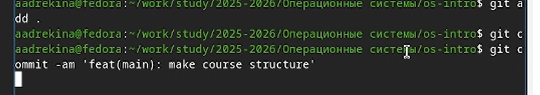{#fig-017 width=70%}

## Выводы

В ходе лабораторной работы мы научились базовым настройкам git.
Создали ssh и pgp ключи, а также  репозиторий, с которым мы продолжим работать в дальнейшем.
---
