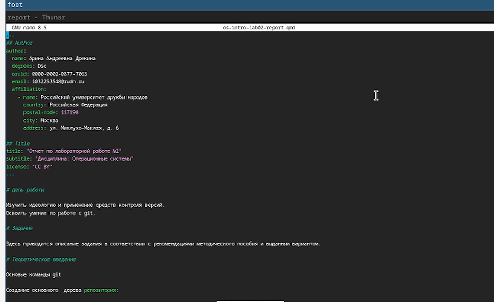
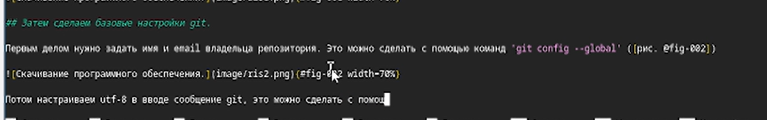
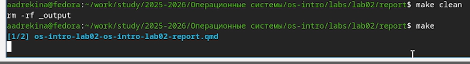
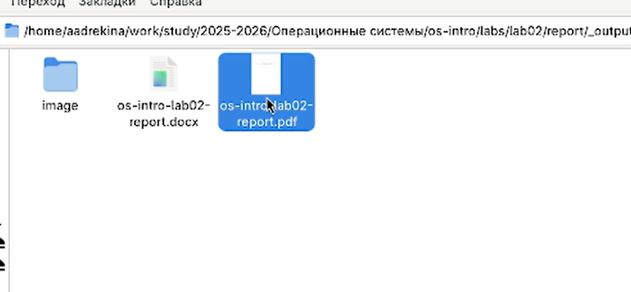

---
## Front matter
lang: ru-RU
title: Лабораторная работа №3
subtitle:Дисциплина: Операционные системы
author:
  - Дрекина Арина Андреевна
institute:
  - Российский университет дружбы народов, Москва, Россия
date: 2026.03.04

## i18n babel
babel-lang: russian
babel-otherlangs: english

## Formatting pdf
toc: false
toc-title: Содержание
slide_level: 2
aspectratio: 169
section-titles: true
theme: metropolis
header-includes:
 - \metroset{progressbar=frametitle,sectionpage=progressbar,numbering=fraction}
---
# Информация

---

## Докладчик

  * Дрекина Арина Андреевна
  * студентка факультета физико-математических и естественных наук
  * Российский университет дружбы народов им. П. Лумумбы
  * [1032253548@rudn.ru](mailto:1032253548@rudn.ru)

---

# Цель работы

Научиться оформлять отчёты с помощью легковесного языка разметки Markdown

---

# Задание

Сделайте отчёт по предыдущей лабораторной работе в формате Markdown. В качестве отчёта просьба предоставить отчёты в 3 форматах: pdf, docx и md (в архиве,поскольку он должен содержать скриншоты, Makefile и т.д.)

---

# Теоретическое введение

Для компиляции отчетов по лабораторным работам предлагается использовать следующий Makefile

```

all:
-@quarto render
clean:
-rm -rf _output
cleanall: clean
-rm -rf .quarto

```

В Markdown вставить изображение в документ можно с помощью непосредственного
указания адреса изображения. Синтаксис данной команды выглядит следующим образом:

---

# Выполнение лабораторной работы.

Заходим  в папку лабораторной работы №3. И с помощью терминала открываем шаблон для лабораторной работа, с помощью текстового редактора nano.

Затем я ознакомилась самим шаблоном.

{#fig-001 width=45%}

---

Удаляем все коментарии и описываем ход выполнения лабораторной работы №2.
Вставляем фотографии, опираясь на шаблон.

{#fig-002 width=70%}

---

В терминале вводим команду, для преобразования в pdf и docx.

{#fig-003 width=70%}  

---

Убеждаемся, что файлы действительно создались. Они создаются в отдельной папке  _output.

{#fig-004 width=70%}  

# Выводы

В ходе лабораторной работы мы научились оформлять отчёты с помощью легковесного языка разметки Markdown. И применили эти знания на практике, создали отчет по лабораторно

