---
## Front matter
lang: ru-RU
title: Лабораторная работа №4
subtitle:Дисциплина: Операционные системы
author:
  - Дрекина Арина Андреевна
institute:
  - Российский университет дружбы народов, Москва, Россия
date: 2026.03.04

## i18n babel
babel-lang: russian
babel-otherlangs: english

## Formatting pdf
toc: false
toc-title: Содержание
slide_level: 2
aspectratio: 169
section-titles: true
theme: metropolis
header-includes:
 - \metroset{progressbar=frametitle,sectionpage=progressbar,numbering=fraction}
---
# Информация

---

## Докладчик

  * Дрекина Арина Андреевна
  * студентка факультета физико-математических и естественных наук
  * Российский университет дружбы народов им. П. Лумумбы
  * [1032253548@rudn.ru](mailto:1032253548@rudn.ru)

---

# Цель работы.

Получение навыков правильной работы с репозиториями git.


# Задание.

Выполнить работу для тестового репозитория. Преобразовать рабочий репозиторий в репозиторий с git-flow и conventional commits.

# Теоретическое введение

Для фиксации истории проекта в рамках этого процесса вместо одной ветки master используются две ветки.Для github параметр Version tag prefix следует установить в v.
Создадим новую функциональную ветку: 

```

git flow feature start feature_branch

```

Создать новую ветку release можно с помощью следующей команды:

```

git flow release start 1.0.0

```

# Выполнение лабораторной работы.

Установка программного обеспечения для семантического версионирования и общепринятых коммитов.

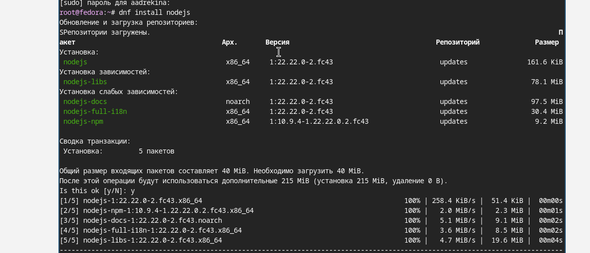{#fig-001 width=40%}

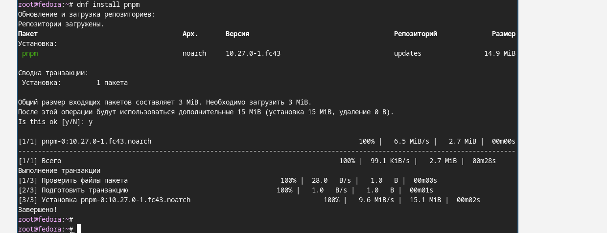{#fig-002 width=30%}

---

Скачаем файл для git-flow 

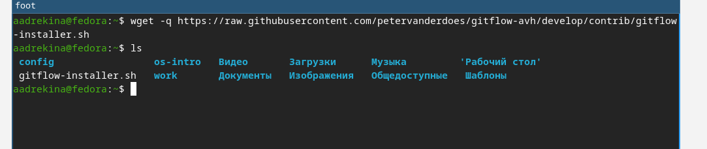{#fig-003 width=40%}

Устанавливаем пакет. 

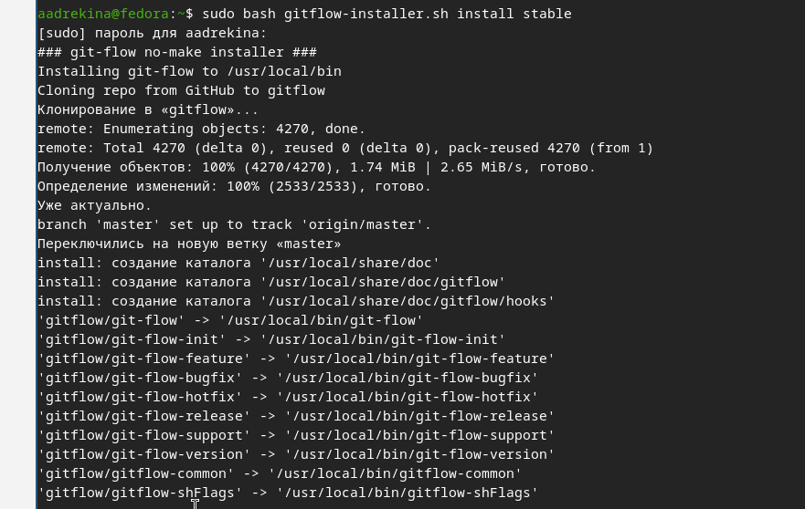{#fig-004 width=40%}

---

Запустим команду 'pnpm seturp'.

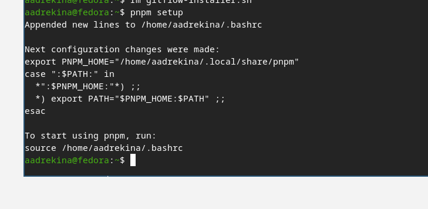{#fig-005 width=40%}

Затем выполняем программу 'source ~/.bashrc'.

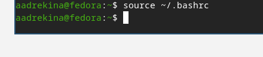{#fig-006 width=40%}

---

Скачиваем программу, которая используется для помощи в форматирование коммитов.

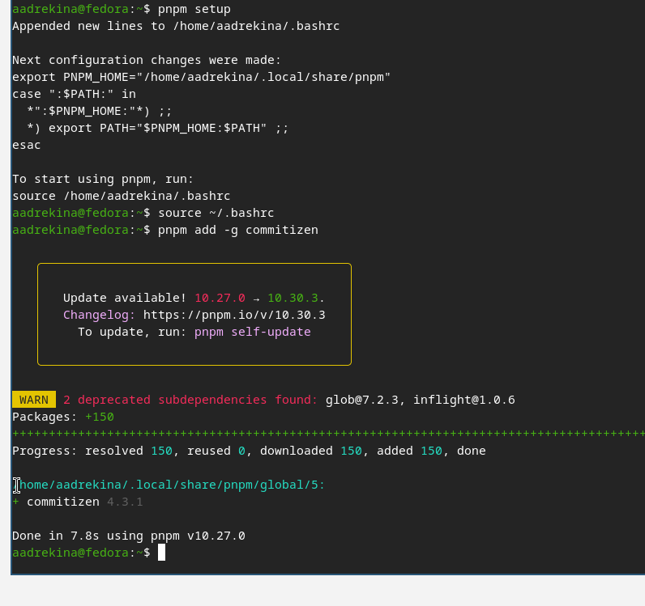{#fig-007 width=35%}

---

Далее необходимо скачать программу, которая используется для помощи в создании логов. 

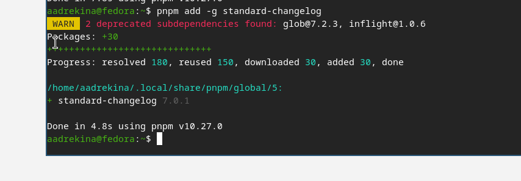{#fig-008 width=40%}

---

Создаем тестовый репозиторий, который будет называться "git-extended".

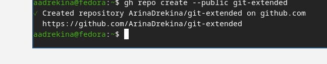{#fig-009 width=30%}

Клонируем этот репозиторий на виртуальную машину.

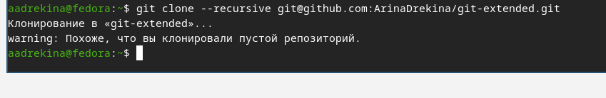{#fig-010 width=35%}

---

Делаем первый коммит.

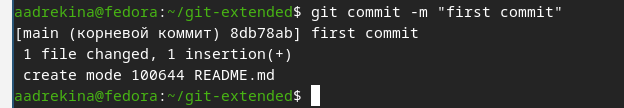{#fig-011 width=35%}

После этого загрузим изменения на GitHub.

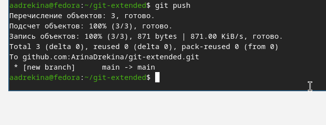{#fig-012 width=40%}

---

Делаем конфигурацию для пакетов Node.js. 

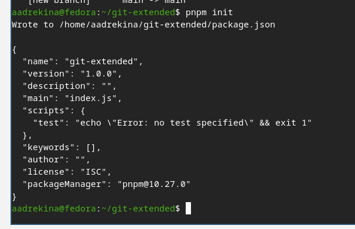{#fig-013 width=30%}

---

Открываем текстовый файл package.json и вносим туда изменения.

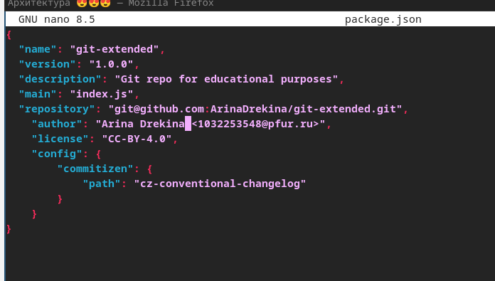{#fig-014 width=30%}

---

Выполненние коммита.

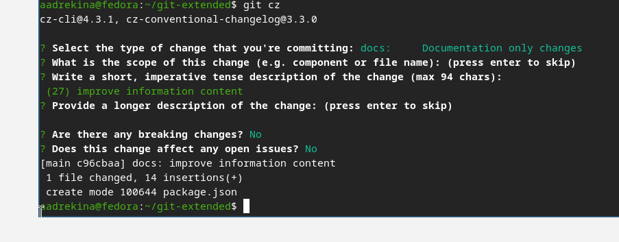{#fig-015 width=40%}

После этого отправляем все изменения на github.

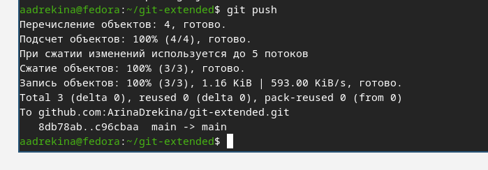{#fig-016 width=40%}

---

Инициализация git-flow. Префикс для ярлыков установим в v.

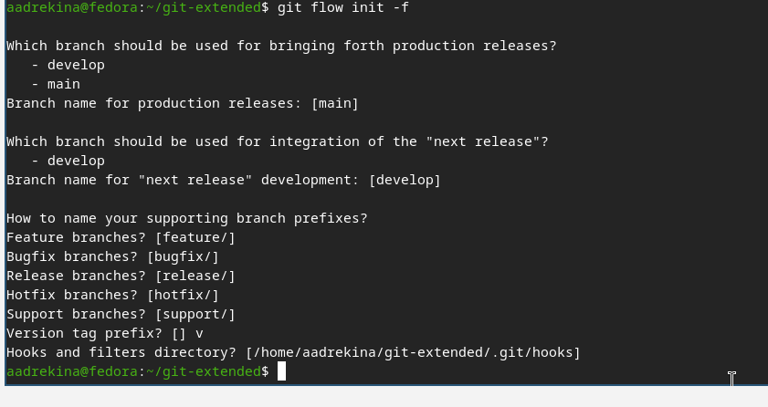{#fig-017 width=40%}

Загрузка репозитория в хранилище.

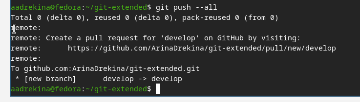{#fig-018 width=40%}

---

Установка внешней ветки как вышестоящей для этой ветки.

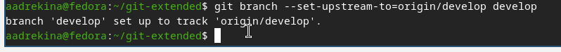{#fig-019 width=40%}

---

Создание релиз с версией 1.0.0. 

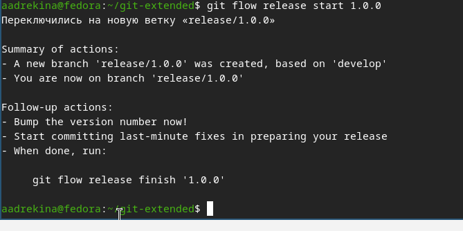{#fig-020 width=60%}

---

Создание журнала изменений.

{#fig-021 width=50%}

Зальём релизную ветку в основную ветку.

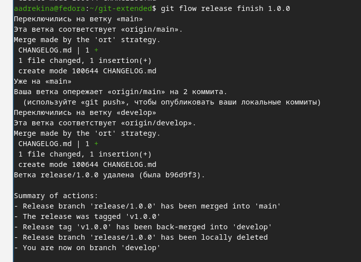{#fig-022 width=40%}

---

Отправим на github.

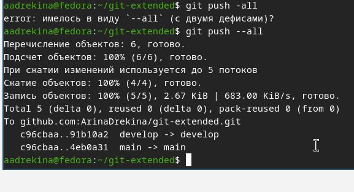{#fig-023 width=40%}

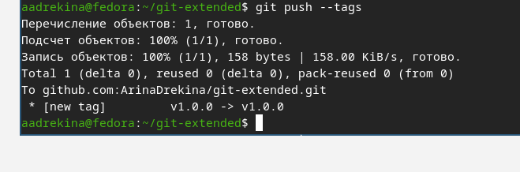{#fig-024 width=40%}

---

Выкладываем мполученный релиз на GitHub.

{#fig-025 width=40%}

---

Создание ветки для новой конфигурации.

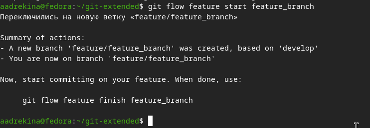{#fig-026 width=40%}

Создание нового релиза, версии 1.2.3.

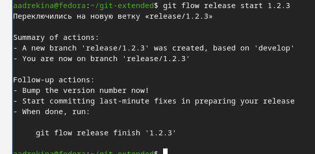{#fig-027 width=40%}

---

Изменим версию в файле.

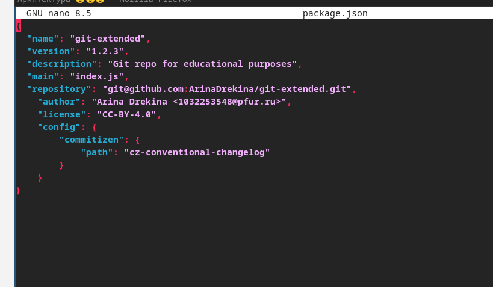{#fig-028 width=40%}

Создадим журнал изменений.

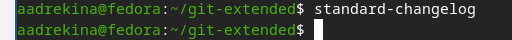{#fig-029 width=40%}

---

Проверка статуса.

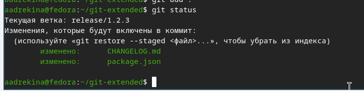{#fig-030 width=40%}

---

Зальём релизную ветку в основную ветку.

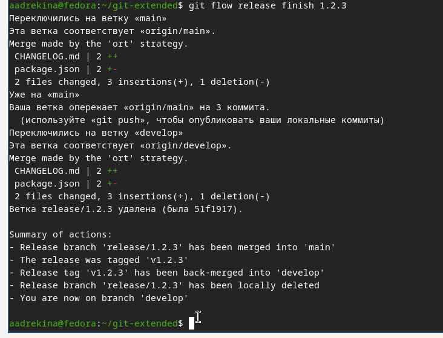{#fig-031 width=40%}

Отправим данные на GitHub.

---

Последним этапом выложим релиз на GitHub.

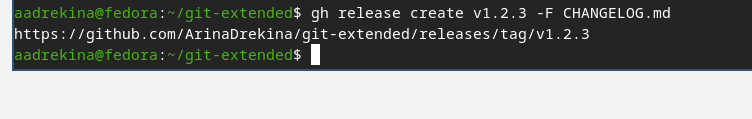{#fig-032 width=40%}


# Выводы.

В ходе выполнения лабораторной работы, мы получили навыки правильной работы с репозиториями git, применили их на практике и сами создали репозитории.
