---
## Author
author:
  name: Арина Андреевна Дрекина
  degrees: DSc
  orcid: 0000-0002-0877-7063
  email: 1032253548@rudn.ru
  affiliation:
    - name: Российский университет дружбы народов
      country: Российская Федерация
      postal-code: 117198
      city: Москва
      address: ул. Миклухо-Маклая, д. 6
## Title
title: Отчет по лабораторной работе №5
subtitle:Дисциплина: Операционные системы
license: CC BY
date: today
date-format: "2026-03-13" # Example: 2025-09-06
---
## Информация


## Докладчик

  * Дрекина Арина Андреевна
  * студентка факультета физико-математических и естественных наук
  * Российский университет дружбы народов им. П. Лумумбы
  * [1032253548@rudn.ru](mailto:1032253548@rudn.ru)


# Цель работы

Ознакомиться с утилитами pass, gopass, механизмом Native Messaging и инструментом chezmoi. Освоить их использование и научиться синхронизировать данные с помощью Git.

# Задание

Установить и настроить pass. Сохранить пароль. Установить и настроить chezmoi. Выполнить ежедневные операции с chezmoi.

# Теоретическое введение

Шаблоны используются для изменения содержимого файла в зависимости от среды. Используется синтаксис шаблонов Go.

Данные шаблона

Полный список переменных шаблона:

```

chezmoi data

```

Источники переменных: файлы .chezmoi, например, .chezmoi.os;

---

Графические интерфейсы

```

qtpass

```

qtpass — может работать как графический интерфейс к pass, так и как самостоятельная программа. В настройках можно переключаться между использова>

```

---

gopass-ui

```

gopass-ui — интерфейс к gopass.

# Выполнение лабораторной работы.

## Менеджер паролей pass.

Установка пакета: pass, gopass. ([рис. @fig-001])([рис. @fig-002])

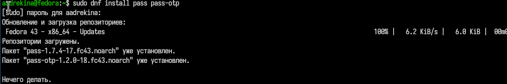{#fig-001 width=55%}

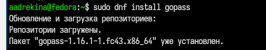{#fig-002 width=50%}

---

Просмотр списка ключей. ([рис. @fig-003])

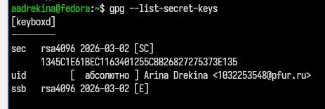{#fig-003 width=50%}

Инициализация хранилищя. ([рис. @fig-004])

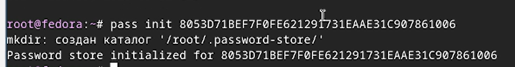{#fig-004 width=50%}

---

Создание структуры git. ([рис. @fig-005])

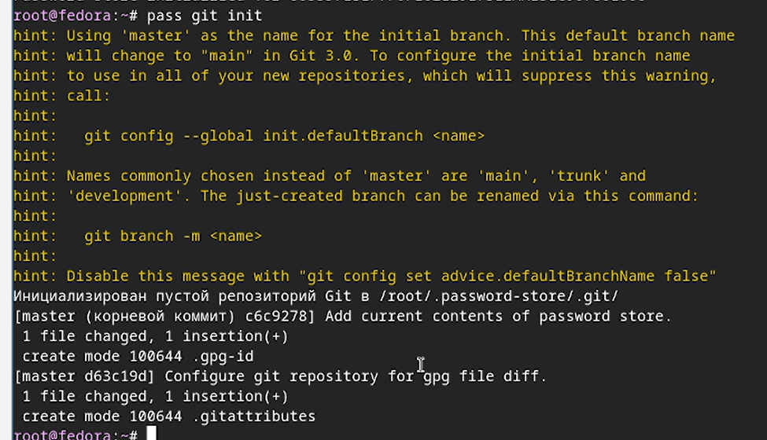{#fig-005 width=55%}

---

## Настройка интерфейса с броузером.

Скачиваем плагин для Firefox.
В терминал вводим команды, чтобы загрузить интрефейс для взаимодействия с броузером.([рис. @fig-006])([рис. @fig-007])

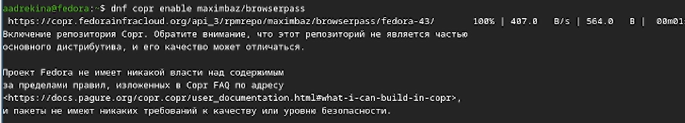{#fig-006 width=50%}

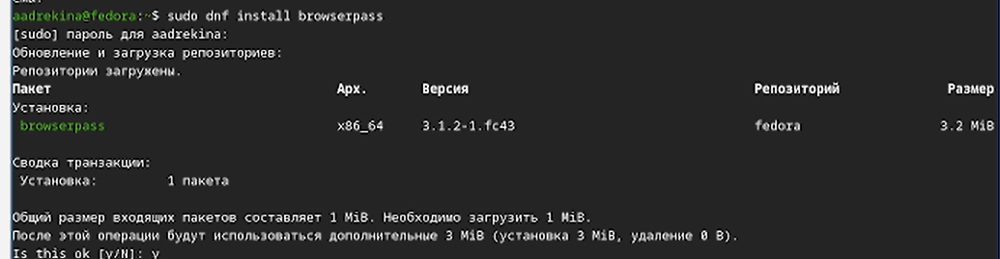{#fig-007 width=50%}

---

## Сохранение пароля.

Добавляем новый пароль. ([рис. @fig-008])

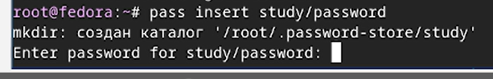{#fig-008 width=40%}

---

Сохраняем пароль в папку study и создаем файл, в котором будет лежать пароль- password.
Потом я отобразила пароль, вызвав файл ([рис. @fig-009])

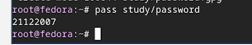{#fig-009 width=40%}

Потом я сгенерировала пароль([рис. @fig-010])

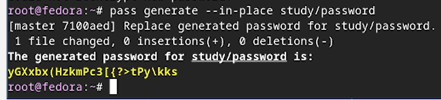{#fig-010 width=50%}

---

## Управление файлами.

Установливаем дополнительно программное обеспечение. ([рис. @fig-011])

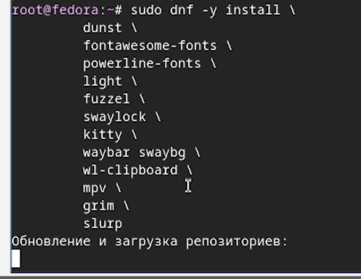{#fig-011 width=50%}

---

Затем установим шрифты. ([рис. @fig-012])([рис. @fig-013])([рис. @fig-014])

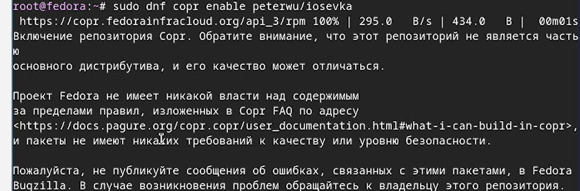{#fig-012 width=40%}

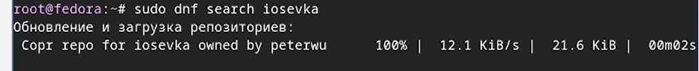{#fig-013 width=40%}

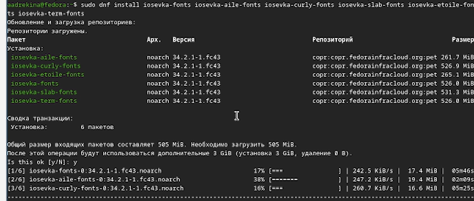{#fig-014 width=40%}

---

Устанавливаем бинарный файл. ([рис. @fig-015])

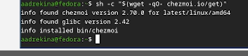{#fig-015 width=50%}

---

Создаем собственный репозиторий. ([рис. @fig-016])

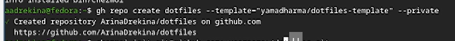{#fig-016 width=50%}

Затем инициализируем chezmoi с моим репозиторием dotfiles. ([рис. @fig-017])

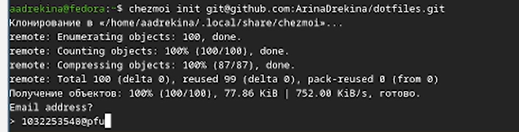{#fig-017 width=50%}

---

Вносим изменения в домашний каталог ([рис. @fig-018])

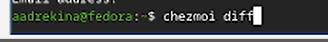{#fig-018 width=50%}

Извлекаем последние изменения из репозитория и применяем их. ([рис. @fig-019])

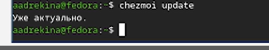{#fig-019 width=50%}

---

Перейдем в каталог. ([рис. @fig-020])

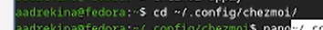{#fig-020 width=50%}

Затем открываем текстовый файл и редактируем его. ([рис. @fig-021])

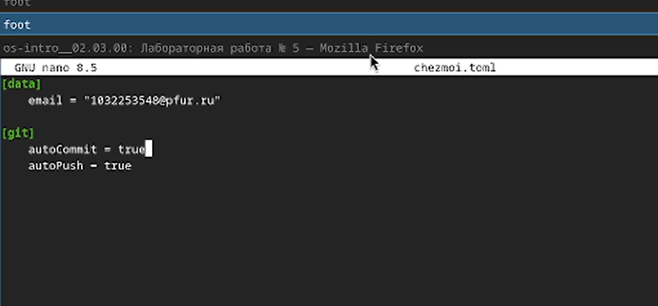{#fig-021 width=50%}

---

## Выводы

В ходе лабораторной работы мы познакомились с утилитами pass, gopass и инструментами chezmoi. И применили полученные знания на практике.
