---
## Author
author:
  name: Арина Андреевна Дрекина
  degrees: DSc
  orcid: 0000-0002-0877-7063
  email: 1032253548@rudn.ru
  affiliation:
    - name: Российский университет дружбы народов
      country: Российская Федерация
      postal-code: 117198
      city: Москва
      address: ул. Миклухо-Маклая, д. 6

## Title
title: "Отчет по лабораторной работе №6"
subtitle: "Дисциплина: Операционные системы"
license: "CC BY"
---

# Цель работы

Приобретение практических навыков взаимодействия пользователя с системой посредством командной строки.

# Задание

1. Определите полное имя вашего домашнего каталога. Далее относительно этого ката-
лога будут выполняться последующие упражнения.
2. Выполните следующие действия:
2.1. Перейдите в каталог /tmp.
2.2. Выведите на экран содержимое каталога /tmp. Для этого используйте команду ls
с различными опциями. Поясните разницу в выводимой на экран информации.
2.3. Определите, есть ли в каталоге /var/spool подкаталог с именем cron?
2.4. Перейдите в Ваш домашний каталог и выведите на экран его содержимое. Опре-
делите, кто является владельцем файлов и подкаталогов?
3. Выполните следующие действия:
3.1. В домашнем каталоге создайте новый каталог с именем newdir.
3.2. В каталоге ~/newdir создайте новый каталог с именем morefun.
3.3. В домашнем каталоге создайте одной командой три новых каталога с именами
letters, memos, misk. Затем удалите эти каталоги одной командой.
3.4. Попробуйте удалить ранее созданный каталог ~/newdir командой rm. Проверьте,
был ли каталог удалён.
3.5. Удалите каталог ~/newdir/morefun из домашнего каталога. Проверьте, был ли
каталог удалён.
4. С помощью команды man определите, какую опцию команды ls нужно использо-
вать для просмотра содержимое не только указанного каталога, но и подкаталогов,
входящих в него.
5. С помощью команды man определите набор опций команды ls, позволяющий отсорти-
ровать по времени последнего изменения выводимый список содержимого каталога
с развёрнутым описанием файлов.
6. Используйте команду man для просмотра описания следующих команд: cd, pwd, mkdir,
rmdir, rm. Поясните основные опции этих команд.
7. Используя информацию, полученную при помощи команды history, выполните мо-
дификацию и исполнение нескольких команд из буфера команд.

# Теоретическое введение

Команда man. Команда man используется для просмотра (оперативная помощь) в диалоговом режиме руководства (manual) по основным командам операционной системы типа Linux.
Формат команды:

```

man <команда>

```

Команда cd. Команда cd используется для перемещения по файловой системе операционной системы типа Linux.
Формат команды:

```

cd [путь_к_каталогу]

```

Команда pwd. Для определения абсолютного пути к текущему каталогу используется команда pwd.

Команда ls. Команда ls используется для просмотра содержимого каталога.
Формат команды:

```

ls [-опции] [путь]

```

Команда mkdir. Команда mkdir используется для создания каталогов.
Формат команды:

```

mkdir имя_каталога1 [имя_каталога2...]

```

Команда rm. Команда rm используется для удаления файлов и/или каталогов.
Формат команды:

```

rm [-опции] [файл]

```

Команда history. Для вывода на экран списка ранее выполненных команд используется команда history. Выводимые на экран команды в списке нумеруются. К любой команде из выведенного на экран списка можно обратиться по её номеру в списке, воспользовавшись конструкцией

# Выполнение лабораторной работы

Определим полное имя моего домашнего каталога. Это мы сделаем с помощью команды 'pwd'. ([рис. @fig-001])

{#fig-001 width=60%}

Далее перейдем в каталог /tmp. Далее с помощью команды 'ls' просмотрим содержимое каталога.([рис. @fig-002])

{#fig-002 width=60%}

Воспольуемся командой ls с различными опциями.([рис. @fig-003])([рис. @fig-004])([рис. @fig-005])

{#fig-003 width=60%}

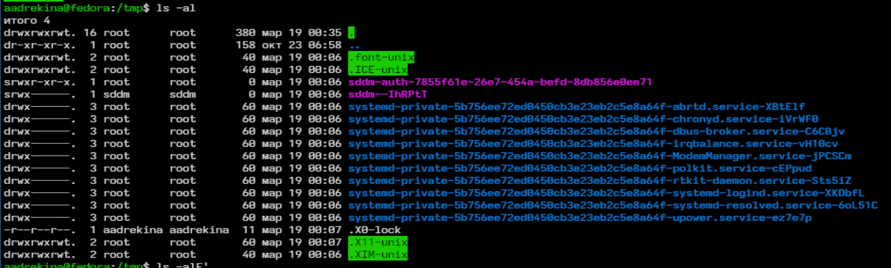{#fig-004 width=60%}

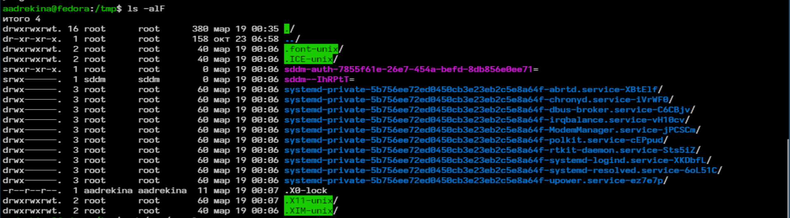{#fig-005 width=60%}

ls -a показывает все файлы, даже скрытые. ls -al показывает права доступа, тип файла, владельца, размер. ls -alF показывает тип файла в конце имени. В итоге самый информативный вариант ls -alF.

Заходим в каталог /var/spool с помощью команды cd. Проверяем есть ли подкаталог с имененем cron - да, есть.([рис. @fig-006])

{#fig-006 width=60%}

Далее переходим в домашний каталог с помощью команды 'cd' и проверяем его содержимое с помощью команды 'ls -l'.([рис. @fig-007])

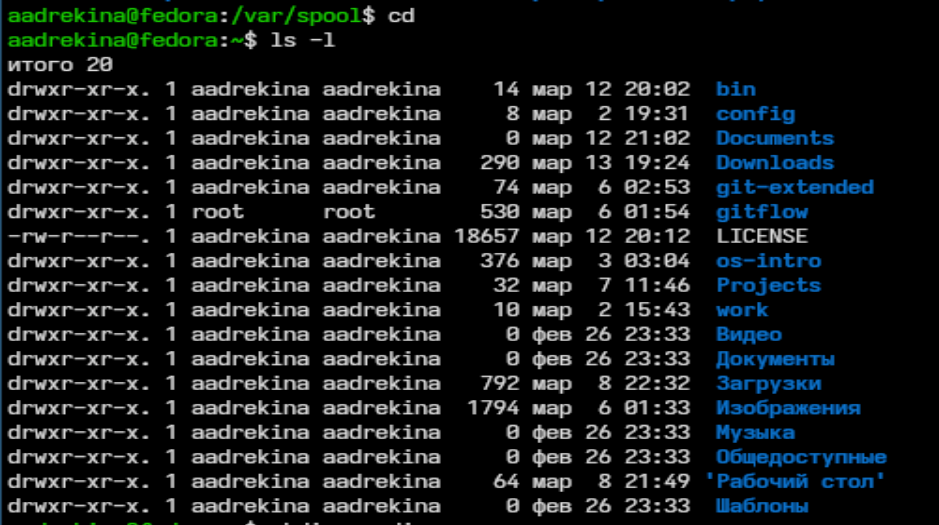{#fig-007 width=60%}

В основом владельцем всех файлов и каталогов являюсь я.

Теперь мы создаем новый каталог с именем 'newdir'.([рис. @fig-008])

{#fig-008 width=60%}

Потом в каталоге newdir создадим подкаталог 'morefun'. ([рис. @fig-009])

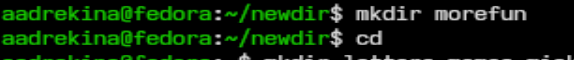{#fig-009 width=60%}

Затем нам нужно создать три каталога одной командой и после этого удалить их, тоже одной командой.([рис. @fig-010])

{#fig-010 width=60%}

Делаем попыптку удалить созданный ранее каталог newdir с помощью команды 'rm'.([рис. @fig-011])

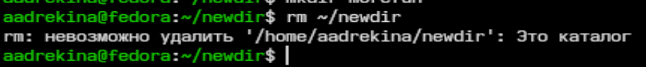{#fig-011 width=60%}

Каталог удалить не получилоь.

Теперь действительно удалим созданные каталоги. Для этого сначала удалим подкаталог 'morefun'. ([рис. @fig-012])

{#fig-012 width=60%}

Затем удалим каталог 'newdir' и проверим, лействительно ли он удалился. ([рис. @fig-013])

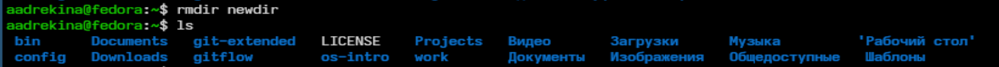{#fig-013 width=60%}

С помощью команды man ls я определила, что для просмотра содержимое не только указанного каталога, но и подкаталогов, входящих в него нужно использовать опцию '-R'. ([рис. @fig-014])

{#fig-014 width=60%}

Теперь необходимо определить опции позволяющие отсортировать по времени последнего изменения выводимый список содержимого каталога с развёрнутым описанием файлов.([рис. @fig-015])

{#fig-015 width=60%}

Это можно сделать с помощью опции '--sort=WORD'

Просмотрим с помощью man следующие команды.

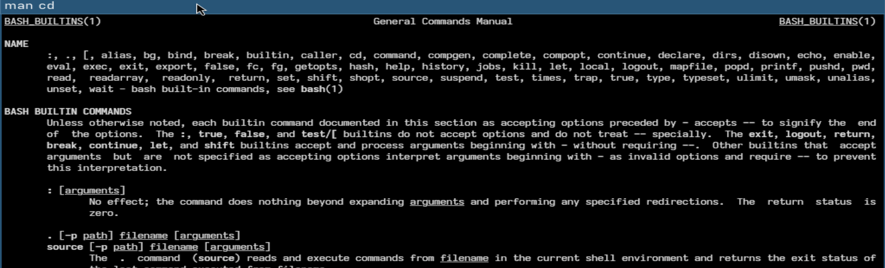{#fig-016 width=60%}

{#fig-017 width=60%}

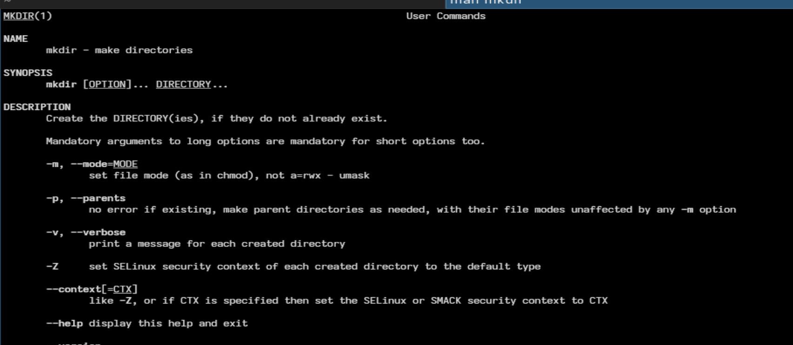{#fig-018 width=60%}

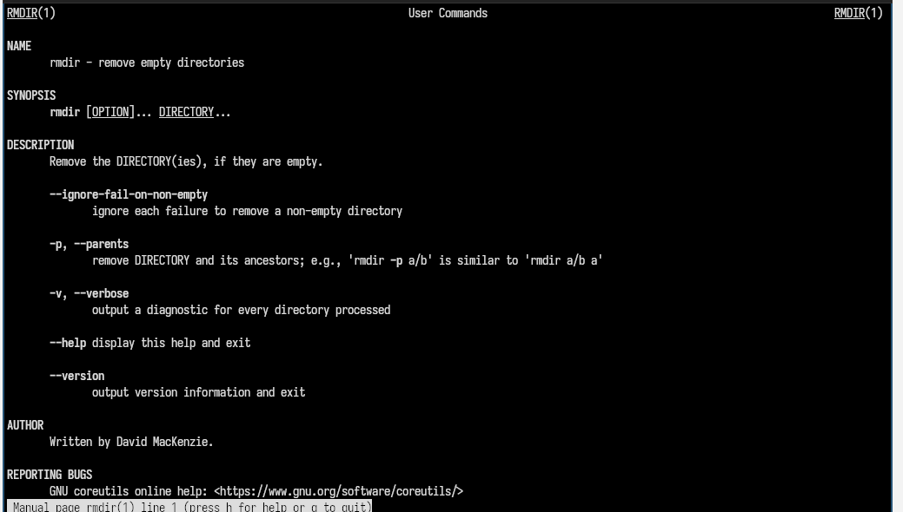{#fig-019 width=60%}

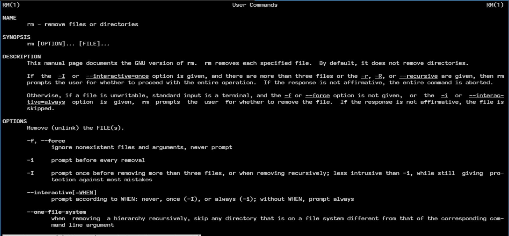{#fig-020 width=60%}

Ищет команды по описанию.

```

cd -k

```

Показывает короткое описание команды

```

pwd -f

```

Выводит информацию об удаление

```

rmdir -v

```

Удалает без запроса подтверждения

```

rm -f

```

Запускаем команду 'history'.([рис. @fig-021])

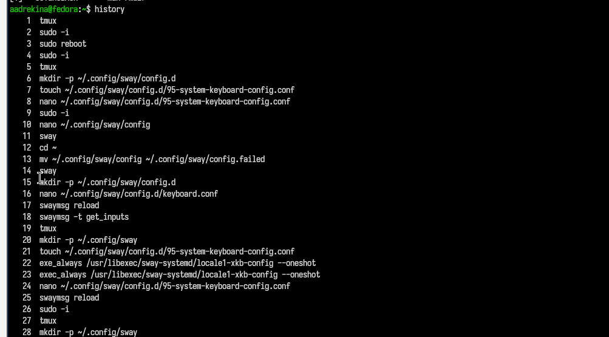{#fig-021 width=60%}

Выполняем модификацию и исполнение команды из буфера команд.([рис. @fig-022])

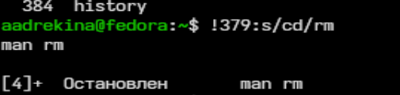{#fig-022 width=60%}

# Выводы

В ходе выполнения лаборатороной работы мы приобрели практические навыки взаимодействия с системой посредством командной строки.

# Контрольные вопросы

1.Что такое командная строка?
Командная строка - это взаимодействия пользователя с операционной системой, при котором  команды вводятся вручную в текстовом виде и выполняется системой через интерпретатор.

2.При помощи какой команды можно определить абсолютный путь текущего каталога? Приведите пример.
Используется команда pwd.

{#fig-023 width=60%}

3.При помощи какой команды и каких опций можно определить только тип файлов и их имена в текущем каталоге? Приведите примеры.
Используется команда ls -F.

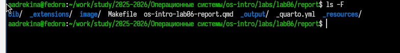{#fig-024 width=60%}

4.Каким образом отобразить информацию о скрытых файлах? Приведите примеры.
Для это используется команда ls -a.

{#fig-025 width=60%}

5.При помощи каких команд можно удалить файл и каталог? Можно ли это сделать одной и той же командой? Приведите примеры.
Можно с помощью rmdir.

{#fig-026 width=60%}

6.Каким образом можно вывести информацию о последних выполненных пользователем командах? работы?
С помощью команды history.

7.Как воспользоваться историей команд для их модифицированного выполнения? Приведите примеры.
Выполнить команду по номеру. 

{#fig-027 width=60%}

8.Приведите примеры запуска нескольких команд в одной строке.

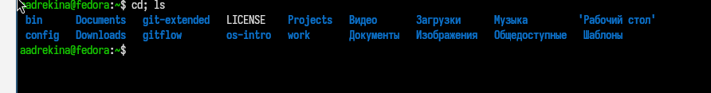{#fig-028 width=60%}

9.Дайте определение и приведите примера символов экранирования.
Экранирование - это способ указать системе воспринимать специальные символы буквально.Используется "\".

```

ls file\*name

```

Звездочка не воспринемается как шаблон

10.Охарактеризуйте вывод информации на экран после выполнения команды ls с опцией l.
Команда выводит тип файла, права доступа, владельца, размер, дата изменения

11.Что такое относительный путь к файлу? Приведите примеры использования относительного и абсолютного пути при выполнении какой-либо команды.

Относительный путь - это путь относительно текущего каталога.

Относительный путь

```

cd ../dir

```

Абсолютный путь

```

cd /home/user/dir

```

12.Как получить информацию об интересующей вас команде?
С помощью команды 'man'

13.Какая клавиша или комбинация клавиш служит для автоматического дополнения вводимых команд?
Используется клавиша 'tab'

# Список литературы{.unnumbered}

::: {#refs}
:::
