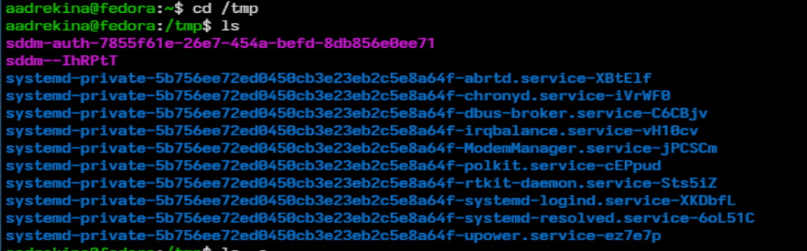
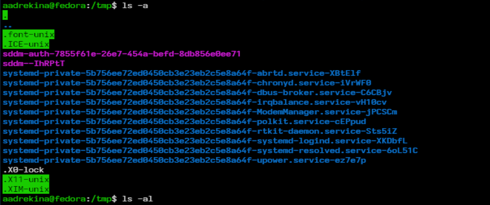
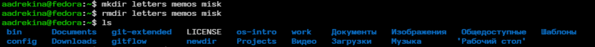
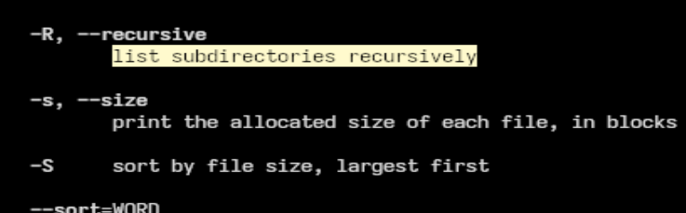
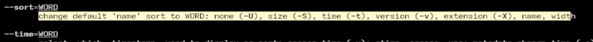
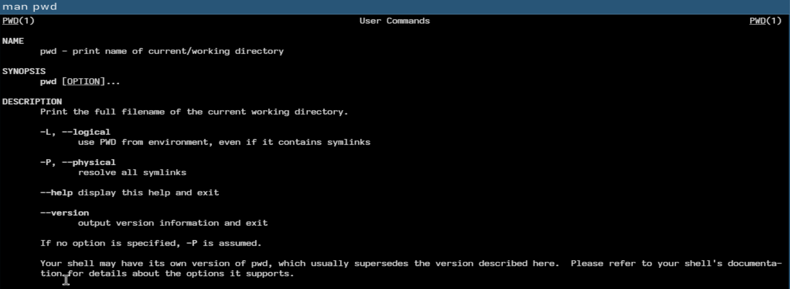

---
## Front matter
lang: ru-RU
title: Лабораторная работа №6
subtitle:Дисциплина: Операционные системы
author:
  - Дрекина Арина Андреевна
institute:
  - Российский университет дружбы народов, Москва, Россия
date: 2026.03.04

## i18n babel
babel-lang: russian
babel-otherlangs: english

## Formatting pdf
toc: false
toc-title: Содержание
slide_level: 2
aspectratio: 169
section-titles: true
theme: metropolis
header-includes:
 - \metroset{progressbar=frametitle,sectionpage=progressbar,numbering=fraction}
---

# Информация

## Докладчик

  * Дрекина Арина Андреевна
  * студентка факультета физико-математических и естественных наук
  * Российский университет дружбы народов им. П. Лумумбы
  * [1032253548@rudn.ru](mailto:1032253548@rudn.ru)

## Цель работы.

Приобретение практических навыков взаимодействия пользователя с системой посредством командной строки.

## Задание.

1. Определите полное имя вашего домашнего каталога. Далее относительно этого ката-
лога будут выполняться последующие упражнения.
2. Выполните следующие действия:
2.1. Перейдите в каталог /tmp.
2.2. Выведите на экран содержимое каталога /tmp. Для этого используйте команду ls
с различными опциями. Поясните разницу в выводимой на экран информации.
2.3. Определите, есть ли в каталоге /var/spool подкаталог с именем cron?
2.4. Перейдите в Ваш домашний каталог и выведите на экран его содержимое. Опре-
делите, кто является владельцем файлов и подкаталогов?

---

3. Выполните следующие действия:
3.1. В домашнем каталоге создайте новый каталог с именем newdir.
3.2. В каталоге ~/newdir создайте новый каталог с именем morefun.
3.3. В домашнем каталоге создайте одной командой три новых каталога с именами
letters, memos, misk. Затем удалите эти каталоги одной командой.
3.4. Попробуйте удалить ранее созданный каталог ~/newdir командой rm. Проверьте,
был ли каталог удалён.
3.5. Удалите каталог ~/newdir/morefun из домашнего каталога. Проверьте, был ли
каталог удалён.
4. С помощью команды man определите, какую опцию команды ls нужно использо-
вать для просмотра содержимое не только указанного каталога, но и подкаталогов,
входящих в него.

---

5. С помощью команды man определите набор опций команды ls, позволяющий отсорти-
ровать по времени последнего изменения выводимый список содержимого каталога
с развёрнутым описанием файлов.
6. Используйте команду man для просмотра описания следующих команд: cd, pwd, mkdir,
rmdir, rm. Поясните основные опции этих команд.
7. Используя информацию, полученную при помощи команды history, выполните мо-
дификацию и исполнение нескольких команд из буфера команд.

## Теоретическое введение

Команда man. Команда man используется для просмотра (оперативная помощь) в диалоговом режиме руководства (manual) по основным командам операцион>
Формат команды:

```

man <команда>

```

Команда cd. Команда cd используется для перемещения по файловой системе операционной системы типа Linux.
Формат команды:

```

cd [путь_к_каталогу]

```

---

Команда pwd. Для определения абсолютного пути к текущему каталогу используется команда pwd.

Команда ls. Команда ls используется для просмотра содержимого каталога.
Формат команды:

```

ls [-опции] [путь]

```

Команда mkdir. Команда mkdir используется для создания каталогов.
Формат команды:

```

mkdir имя_каталога1 [имя_каталога2...]

```

---

Команда rm. Команда rm используется для удаления файлов и/или каталогов.
Формат команды:

```

rm [-опции] [файл]

```

Команда history. Для вывода на экран списка ранее выполненных команд используется команда history. Выводимые на экран команды в списке нумеруется. К любой команде из выведенного на экран списка можно обратиться по её номеру в списке, воспользовавшись конструкцией.

##  Выполнение лабораторной работы.

Определение имени домашнего каталога.

{#fig-001 width=60%}

---

Переходим в каталог /tmp и просмотриваем содержимое каталога.

{#fig-002 width=60%}

---

Команда ls с различными опциями.

{#fig-003 width=40%}

{#fig-004 width=40%}

---

Заходим в каталог /var/spool. Проверяем есть ли подкаталог с имененем cron - да, есть.

{#fig-006 width=60%}

---

Далее переходим в домашний каталог с помощью команды 'cd' и проверяем его содержимое с помощью команды 'ls -l'.

{#fig-007 width=45%}

В основом владельцем всех файлов и каталогов являюсь я.

---

Cоздаем новый каталог с именем 'newdir'.

{#fig-008 width=40%}

В каталоге newdir создадаем подкаталог 'morefun'.

{#fig-009 width=40%}

---

Создаем три каталога одной командой и после этого удалить их, тоже одной командой.

{#fig-010 width=60%}

---

Делаем попыптку удалить созданный ранее каталог newdir с помощью команды 'rm'.

{#fig-011 width=60%}

Удаляем созданные каталоги.

{#fig-012 width=40%}

{#fig-013 width=40%}

---

Для просмотра содержимое не только указанного каталога, но и подкаталогов, входящих в него нужно использовать опцию '-R'. 

{#fig-014 width=60%}

---

Опции позволяющие отсортировать по времени последнего изменения выводимый список содержимого каталога с развёрнутым описанием файлов.

{#fig-015 width=50%}

Это можно сделать с помощью опции '--sort=WORD'

---

Просмотрим с помощью man следующие команды.

{#fig-016 width=40%}

{#fig-017 width=40%}

---

Запускаем команду 'history'.

{#fig-021 width=40%}

Выполняем модификацию и исполнение команды из буфера команд.

{#fig-022 width=40%}

## Выводы.

В ходе выполнения лаборатороной работы мы приобрели практические навыки взаимодействия с системой посредством командной строки.


