---
## Author
author:
  name: Арина Андреевна Дрекина
  degrees: DSc
  orcid: 0000-0002-0877-7063
  email: 1032253548@rudn.ru
  affiliation:
    - name: Российский университет дружбы народов
      country: Российская Федерация
      postal-code: 117198
      city: Москва
      address: ул. Миклухо-Маклая, д. 6
## Title
title: Отчет по лабораторной работе №7
subtitle:Дисциплина: Операционные системы
license: CC BY
date: today
date-format: "2026-03-27" # Example: 2025-09-06
---

## Информация

## Докладчик

  * Дрекина Арина Андреевна
  * студентка факультета физико-математических и естественных наук
  * Российский университет дружбы народов им. П. Лумумбы
  * [1032253548@rudn.ru](mailto:1032253548@rudn.ru)

# Цель работы

Ознакомление с файловой системой Linux, её структурой, именами и содержанием каталогов. Приобретение практических навыков по применению команд для работы с файлами и каталогами, по управлению процессами (и работами), по проверке использования диска и обслуживанию файловой системы.

# Задание

1. Выполните все примеры, приведённые в первой части описания лабораторной работы.
2. Выполните следующие действия, зафиксировав в отчёте по лабораторной работе используемые при этом команды и результаты их выполнения:
2.1. Скопируйте файл /usr/include/sys/io.h в домашний каталог и назовите его equipment. Если файла io.h нет, то используйте любой другой файл в каталоге /usr/include/sys/ вместо него.
2.2. В домашнем каталоге создайте директорию ~/ski.plases.
2.3. Переместите файл equipment в каталог ~/ski.plases.

---

2.4. Переименуйте файл ~/ski.plases/equipment в ~/ski.plases/equiplist.
2.5. Создайте в домашнем каталоге файл abc1 и скопируйте его в каталог ~/ski.plases, назовите его equiplist2.
2.6. Создайте каталог с именем equipment в каталоге ~/ski.plases.
2.7. Переместите файлы ~/ski.plases/equiplist и equiplist2 в каталог ~/ski.plases/equipment.
2.8. Создайте и переместите каталог ~/newdir в каталог ~/ski.plases и назовите его plans.

---

3.Определите опции команды chmod, необходимые для того, чтобы присвоить перечисленным ниже файлам выделенные права доступа, считая, что в начале таких прав нет:
3.1. drwxr--r-- ... australia
3.2. drwx--x--x ... play
3.3. -r-xr--r-- ... my_os
3.4. -rw-rw-r-- ... feathers

---

При необходимости создайте нужные файлы.
4. Проделайте приведённые ниже упражнения, записывая в отчёт по лабораторной работе используемые при этом команды:
4.1. Просмотрите содержимое файла /etc/password.
4.2. Скопируйте файл ~/feathers в файл ~/file.old.
4.3. Переместите файл ~/file.old в каталог ~/play.
4.4. Скопируйте каталог ~/play в каталог ~/fun.
4.5. Переместите каталог ~/fun в каталог ~/play и назовите его games.
4.6. Лишите владельца файла ~/feathers права на чтение.
4.7. Что произойдёт, если вы попытаетесь просмотреть файл ~/feathers командой cat?
4.8. Что произойдёт, если вы попытаетесь скопировать файл ~/feathers?
4.9. Дайте владельцу файла ~/feathers право на чтение.
4.10. Лишите владельца каталога ~/play права на выполнение.
4.11. Перейдите в каталог ~/play. Что произошло?
4.12. Дайте владельцу каталога ~/play право на выполнение.
5. Прочитайте man по командам mount, fsck, mkfs, kill и кратко их охарактеризуйте, приведя примеры.

# Теоретическое введение

Для создания текстового файла можно использовать команду touch.
Формат команды:

```

touch имя-файла

```

Для просмотра файлов небольшого размера можно использовать команду cat.
Формат команды:

```

cat имя-файла

```

---

Команда tail выводит умолчанию 10 последних строк файла.
Формат команды:

```

tail [-n] имя-файла

```

Команда cp используется для копирования файлов и каталогов.
Формат команды:

```

cp [-опции] исходный_файл целевой_файл

```

---

Команды mv и mvdir предназначены для перемещения и переименования файлов и каталогов.
Формат команды mv:

```

mv [-опции] старый_файл новый_файл

```

Права доступа к файлу или каталогу можно изменить, воспользовавшись командой chmod. Сделать это может владелец файла (или каталога) или пользователь с правами администратора.
Формат команды:

```

chmod режим имя_файла

```

---

Режим (в формате команды) имеет следующие компоненты структуры и способ записи:

```

= установить право
- лишить права
+ дать право
r чтение
w запись
x выполнение
u (user) владелец файла
g (group) группа, к которой принадлежит владелец файла
o (others) все остальные

```

# Выполнение лабораторной работы

---

Создание файл abc1. Копирование его в файл april и в файл may.

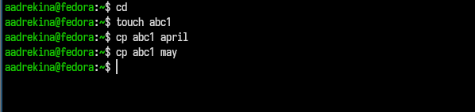{#fig-001 width=50%}

Копирование файлов april и may в каталог monthly.

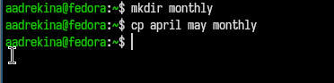{#fig-002 width=50%}

---

Копирование файла monthly/may в файл с именем june. 

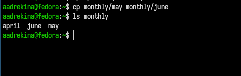{#fig-003 width=50%}

Копируем каталог monthly в каталог monthly.00.

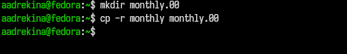{#fig-004 width=50%}

---

Смена названия файла april на july в домашнем каталоге.

{#fig-006 width=50%}

Переиминуем каталог monthly.00 в monthly.01.

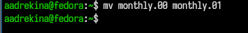{#fig-008 width=50%}

---

Создаем файл с правом выполнения для владельца.

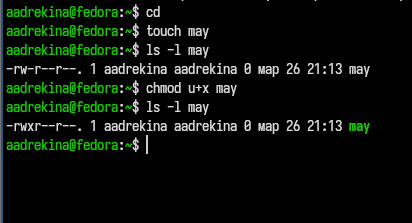{#fig-011 width=50%}

Лишение владельца прав на выполнение. 

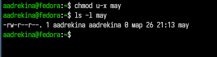{#fig-012 width=50%}

---

Создаем каталог monthly с запретом на чтение для членов группы и всех остальных пользователей.

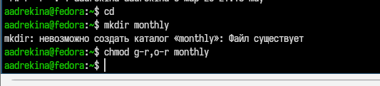{#fig-013 width=50%}

Создаем файл с правом записи для членов группы. 

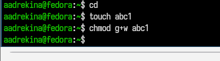{#fig-014 width=50%}

---

Копирование файла /usr/include/sys/io.h в домашний каталог

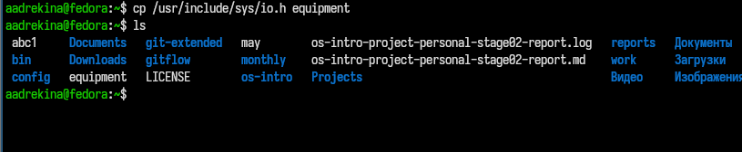{#fig-016 width=50%}

Создаем директорию ~/ski.plases.

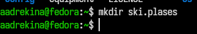{#fig-017 width=50%}

---

Перемещение файлов equiplist и equiplist2 в каталог equipment

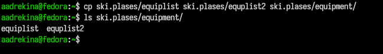{#fig-021 width=50%}

Создаем каталог newdir и перемещаем его в каталог ~/ski.plases

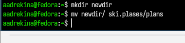{#fig-022 width=60%}

---

С помощью команды chmod присваиваем необходимые права доступа каталогу.

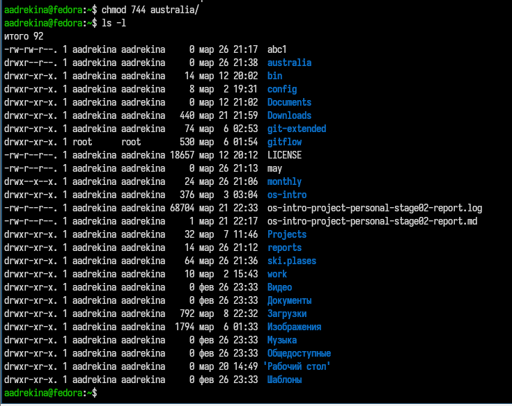{#fig-023 width=40%}

---

Создадим каталог play и с помощью команды chmod присовоим необходимые права доступа.

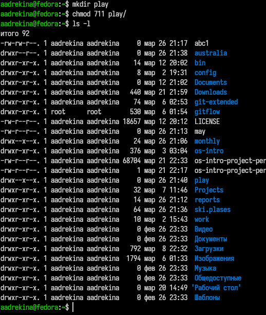{#fig-024 width=45%}

---

Создадим два текстовых файла my_os и feathers. И изменим права у этих файлов.

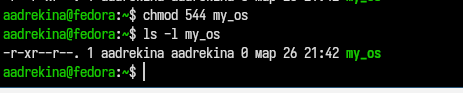{#fig-025 width=40%}

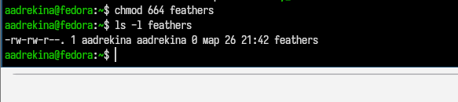{#fig-026 width=40%}

---

Просматриваем содержимое  файла /etc/password, с помощью команды cat.

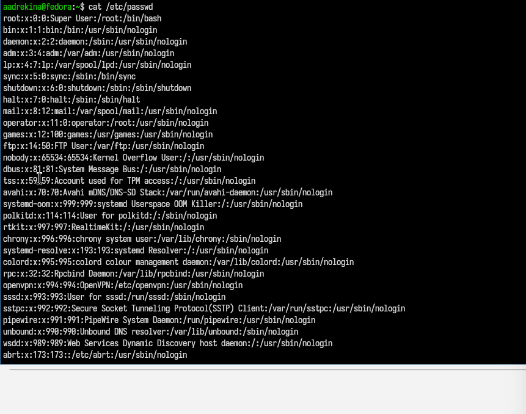{#fig-027 width=60%}

---

Лишим владельца файла feathers прав для чтения.

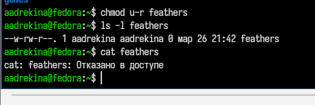{#fig-031 width=40%}

Таким же образом я лишаем владельца прав на чтение каталога play

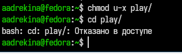{#fig-033 width=60%}

---

Чтение man по команде mount

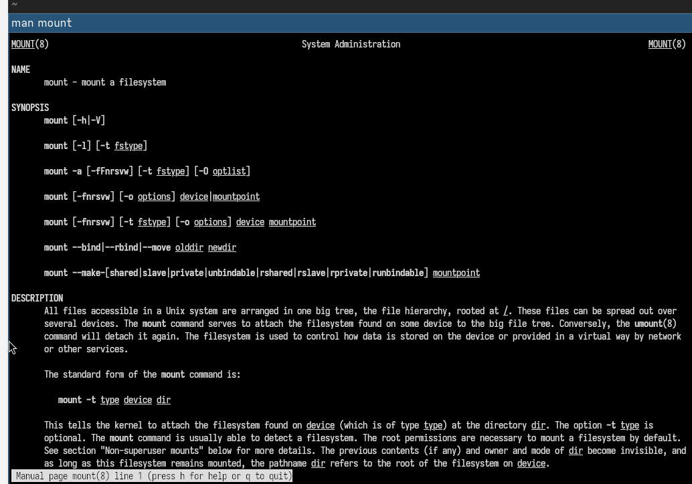{#fig-034 width=50%}

---

Чтение man по команде fsck

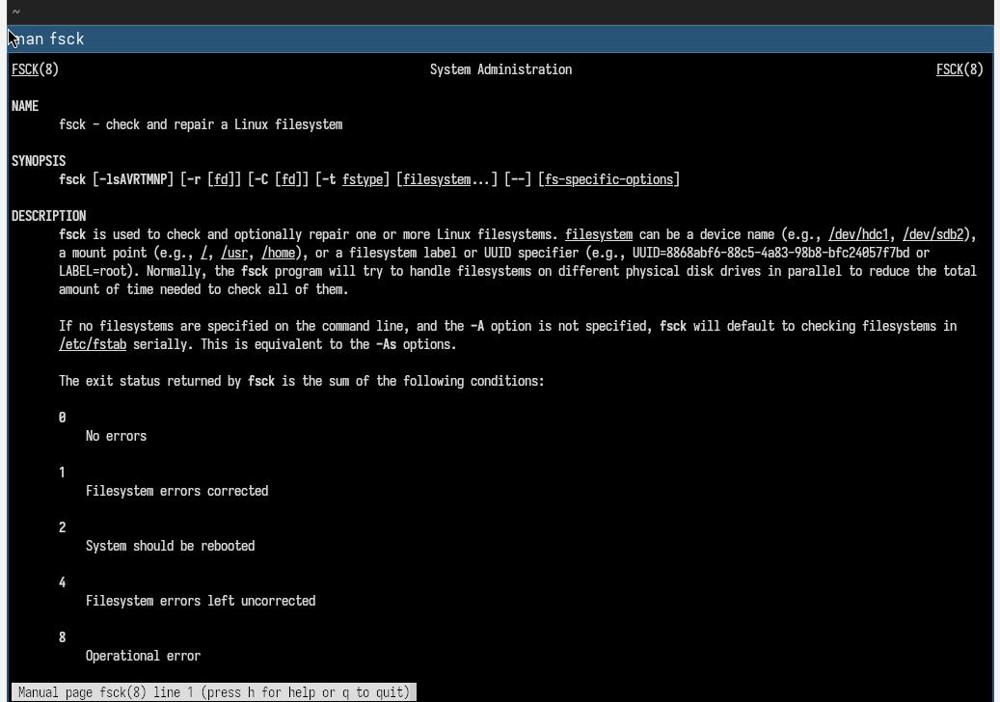{#fig-035 width=50%}

---

Чтение man по команде mkfs

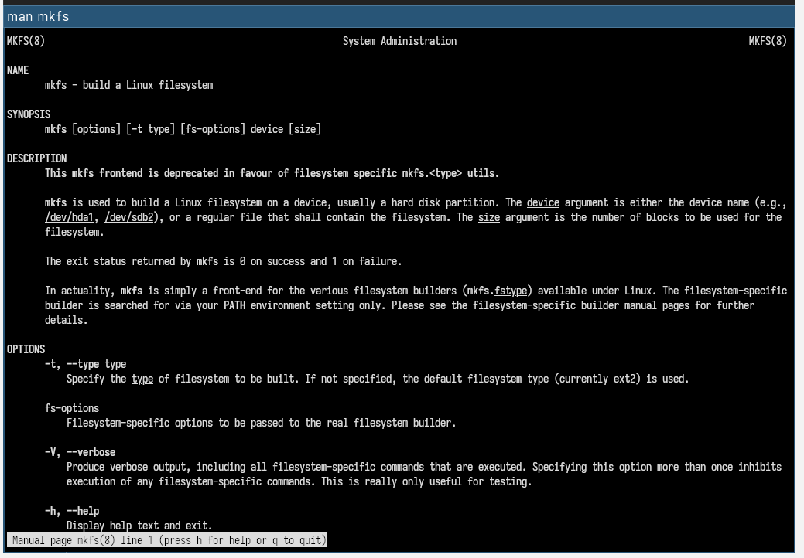{#fig-036 width=50%}

---

Чтение man по команде kill

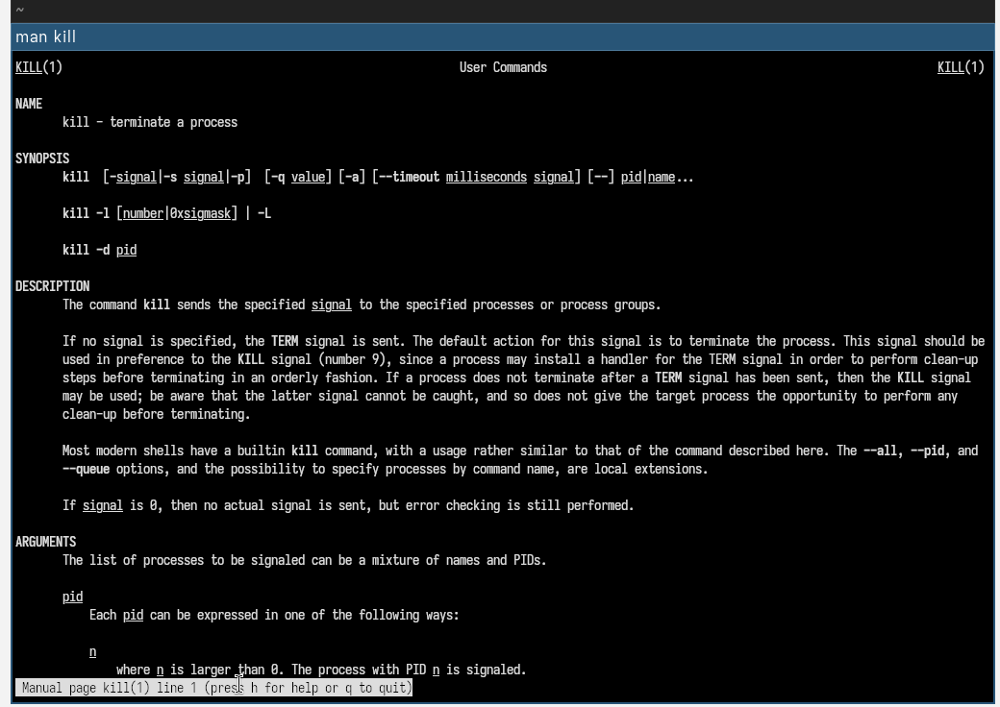{#fig-037 width=50%}

# Выводы

В зоде выполнения лабораторной работы мы ознакомление с файловой системой Linux, её структурой, именами и содержанием каталогов. Приобрели практические навыки по применению команд для работы с файлами и каталогами, по управлению процессами.

