---
## Author
author:
  name: Арина Андреевна Дрекина
  degrees: DSc
  orcid: 0000-0002-0877-7063
  email: 1032253548@rudn.ru
  affiliation:
    - name: Российский университет дружбы народов
      country: Российская Федерация
      postal-code: 117198
      city: Москва
      address: ул. Миклухо-Маклая, д. 6

## Title
title: "Отчет по лабораторной работе №7"
subtitle: "Дисциплина: Операционные системы"
license: "CC BY"
---

# Цель работы

Ознакомление с файловой системой Linux, её структурой, именами и содержанием каталогов. Приобретение практических навыков по применению команд для работы с файлами и каталогами, по управлению процессами (и работами), по проверке использования диска и обслуживанию файловой системы.

# Задание

1. Выполните все примеры, приведённые в первой части описания лабораторной работы.
2. Выполните следующие действия, зафиксировав в отчёте по лабораторной работе используемые при этом команды и результаты их выполнения:
2.1. Скопируйте файл /usr/include/sys/io.h в домашний каталог и назовите его equipment. Если файла io.h нет, то используйте любой другой файл в каталоге /usr/include/sys/ вместо него.
2.2. В домашнем каталоге создайте директорию ~/ski.plases.
2.3. Переместите файл equipment в каталог ~/ski.plases.
2.4. Переименуйте файл ~/ski.plases/equipment в ~/ski.plases/equiplist.
2.5. Создайте в домашнем каталоге файл abc1 и скопируйте его в каталог ~/ski.plases, назовите его equiplist2.
2.6. Создайте каталог с именем equipment в каталоге ~/ski.plases.
2.7. Переместите файлы ~/ski.plases/equiplist и equiplist2 в каталог ~/ski.plases/equipment.
2.8. Создайте и переместите каталог ~/newdir в каталог ~/ski.plases и назовите его plans.
3.Определите опции команды chmod, необходимые для того, чтобы присвоить перечисленным ниже файлам выделенные права доступа, считая, что в начале таких прав нет:
3.1. drwxr--r-- ... australia
3.2. drwx--x--x ... play
3.3. -r-xr--r-- ... my_os
3.4. -rw-rw-r-- ... feathers
При необходимости создайте нужные файлы.
4. Проделайте приведённые ниже упражнения, записывая в отчёт по лабораторной работе используемые при этом команды:
4.1. Просмотрите содержимое файла /etc/password.
4.2. Скопируйте файл ~/feathers в файл ~/file.old.
4.3. Переместите файл ~/file.old в каталог ~/play.
4.4. Скопируйте каталог ~/play в каталог ~/fun.
4.5. Переместите каталог ~/fun в каталог ~/play и назовите его games.
4.6. Лишите владельца файла ~/feathers права на чтение.
4.7. Что произойдёт, если вы попытаетесь просмотреть файл ~/feathers командой cat?
4.8. Что произойдёт, если вы попытаетесь скопировать файл ~/feathers?
4.9. Дайте владельцу файла ~/feathers право на чтение.
4.10. Лишите владельца каталога ~/play права на выполнение.
4.11. Перейдите в каталог ~/play. Что произошло?
4.12. Дайте владельцу каталога ~/play право на выполнение.
5. Прочитайте man по командам mount, fsck, mkfs, kill и кратко их охарактеризуйте, приведя примеры.

# Теоретическое введение

Для создания текстового файла можно использовать команду touch.
Формат команды:

```

touch имя-файла

```

Для просмотра файлов небольшого размера можно использовать команду cat.
Формат команды:

```

cat имя-файла

```

Команда tail выводит умолчанию 10 последних строк файла.
Формат команды:

```

tail [-n] имя-файла

```

Команда cp используется для копирования файлов и каталогов.
Формат команды:

```

cp [-опции] исходный_файл целевой_файл

```

Команды mv и mvdir предназначены для перемещения и переименования файлов и каталогов.
Формат команды mv:

```

mv [-опции] старый_файл новый_файл

```

Права доступа к файлу или каталогу можно изменить, воспользовавшись командой chmod. Сделать это может владелец файла (или каталога) или пользователь с правами администратора.
Формат команды:

```

chmod режим имя_файла

```

Режим (в формате команды) имеет следующие компоненты структуры и способ записи:

```

= установить право
- лишить права
+ дать право
r чтение
w запись
x выполнение
u (user) владелец файла
g (group) группа, к которой принадлежит владелец файла
o (others) все остальные

```

# Выполнение лабораторной работы

## Для начала сделаем все примеры из лабораторной работы. 

Создадим файл abc1. Скопируем его в файл april и в файл may.([рис. @fig-001])

{#fig-001 width=60%}

Затем скопируем файлы april и may  в каталог monthly.([рис. @fig-002])

{#fig-002 width=60%}

Теперь мы копируем файл monthly/may в файл с именем june. ([рис. @fig-003])

{#fig-003 width=60%}

Копируем каталог monthly в каталог monthly.00. ([рис. @fig-004])

{#fig-004 width=60%}

Скопируем каталог monthly.00 в каталог /tmp. ([рис. @fig-005])

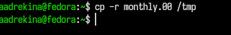{#fig-005 width=60%}

Теперь изменим название файла april на july в домашнем каталоге. ([рис. @fig-006])

{#fig-006 width=60%}

Переместим файл july  в каталог monthly.00 ([рис. @fig-007])

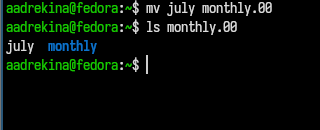{#fig-007 width=60%}

Теперь переиминуем каталог monthly.00 в monthly.01.([рис. @fig-008])

{#fig-008 width=60%}

Затем переместим каталог monthle.01 в каталог reports.([рис. @fig-009])

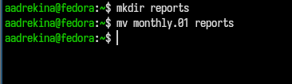{#fig-009 width=60%}

Теперь поменяем название каталога не являющегося текущим.([@fig-010])

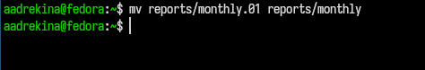{#fig-010 width=60%}

Необходимо создать файл с правом выполнения для владельца. ([рис. @fig-011])

{#fig-011 width=60%}

Теперь лишаем владельца прав на выполнение. ([рис. @fig-012])

{#fig-012 width=60%}

Создадим каталог monthly с запретом на чтение для членов групаы и всех остальных пользователей. ([рис. @fig-013])

{#fig-013 width=60%}

Создаем файл с правом записи для членов группы. ([рис. @fig-014])

{#fig-014 width=60%}

С помощью команды fsck можно проверитть целостность файловой системы. ([рис. @fig-015])

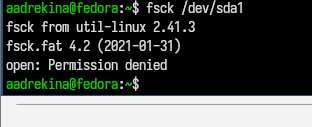{#fig-015 width=60%}

## Выполним следующие действия. 

Скопируем файл /usr/include/sys/io.h в домашний каталог и назовем его equipment.([рис. @fig-016] )

{#fig-016 width=60%}

Создаем директорию ~/ski.plases. ([рис. @fig-017])

{#fig-017 width=60%}

Перемещаем файл equipment в каталог ~ski/plases.([рис. @fig-018])

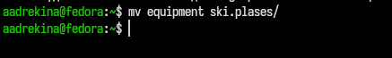{#fig-018 width=60%}

Теперь поменяем название у файла equipment на equiplist.([рис. @fig-019])

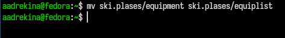{#fig-019 width=60%}

Созданный ранее файл abc1 нужно скопировать в каталог ski/plases и там назвать его equiplist2.([рис. @fig-020])

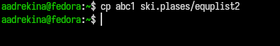{#fig-020 width=60%}

Переместим файлы equiplist и equiplist2 в каталог equipment.([рис. @fig-021])

{#fig-021 width=60%}

Теперь создаем каталог newdir и перемещаем его в каталог ~/ski.plases и называем его plans.([рис. @fig-022])

{#fig-022 width=60%}

## Определение опций команды chmod.

Создадим каталог australia и с помощью команды chmod присовоим необходимые права доступа.([рис. @fig-023])

{#fig-023 width=60%}

С помощью комбинации '744' мы присвоим необходимые права.

Создадим каталог play и с помощью команды chmod присовоим необходимые права доступа.([рис. @fig-024])

{#fig-024 width=60%}

С помощью комбинации '711' мы присвоим необходимые права.

Теперь создадим два текстовых файла my_os и feathers. И изменим права у этих файлов.

С помощью комбинации '544' изменим права доступа к файлу my_os.([рис. @fig-025])

{#fig-025 width=60%}

С помощью комбинации '664' изменим права доступа к файлу feathers.([рис. @fig-026])

{#fig-026 width=60%}

## Проделываем упражнения

Сначал апросмотрим содержимое  файла /etc/password, с помощью команды cat.([рис. @fig-027])

{#fig-027 width=60%}

Теперь копируем файл feathers в файл file.old.([рис. @fig-028])

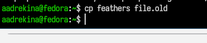{#fig-028 width=60%}

Затем переместим файл file.old в каталог play.([рис. @fig-029])

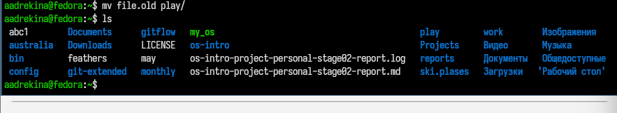{#fig-029 width=60%}

Скопируем каталог play в каталог fun.([рис. @fig-030])

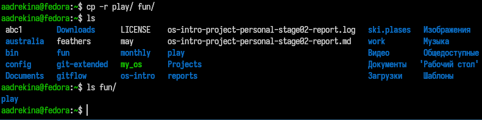{#fig-030 width=60%}

Лишим владельца файла feathers прав для чтения.([рис. @fig-031])

{#fig-031 width=60%}

Я попыталсь просмотреть содержимое этого файла. Мне вывелась, что отказано в доступе.

Я попыталсь скопировать тот же файл, но мне так же вывелось, что в доступе отказано.([рис. @fig-032])

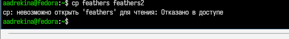{#fig-032 width=60%}

Затем я вернула владельцу права на чтение.

Далее, таким же образом я лишила владельца прав на чтение каталога play.([рис. @fig-033])

{#fig-033 width=60%}

Я также попыталсь перейти в каталог play, но у меня ничего не получилось. Вывелось, что отказано в доступе. Затем я вернула права владельцу.

## Чтение команд с помощью man.

Я прочитала man по команде mount.([рис. @fig-034])

{#fig-034 width=60%}

Назначение: подключает файловую систему.
Описание: команда mount присоединяет файловую систему, находящуюся на устройстве, к указанной точке монтирования в иерархии каталогов.

Я прочитала man по команде fsck.([рис. @fig-035])

{#fig-035 width=60%}

Назначение: проверка и восстановление файловых систем.
Описание: fsck проверяет файловую систему и при необходимости исправляет обнаруженные ошибки.

Я прочитала man по команде mkfs.([рис. @fig-036])

{#fig-036 width=60%}

Назначение: создание файловой системы.
Описание: mkfs используется для создания файловой системы на устройстве или разделе (фактически выполняет форматирование).

Я прочитала man по команде kill.([рис. @fig-037])

{#fig-037 width=60%}

Назначение: отправка сигнала процессу.
Описание: команда kill посылает сигнал указанному процессу. По умолчанию отправляется сигнал завершения (SIGTERM).

# Выводы

В зоде выполнения лабораторной работы мы ознакомление с файловой системой Linux, её структурой, именами и содержанием каталогов. Приобрели практические навыки по применению команд для работы с файлами и каталогами, по управлению процессами.

# Конторльные вопросы

1.Дайте характеристику каждой файловой системе, существующей на жёстком диске компьютера, на котором вы выполняли лабораторную работу.

2.Приведите общую структуру файловой системы и дайте характеристику каждой директории первого уровня этой структуры.

```

/ — корень всей системы
/bin — основные исполняемые файлы (команды)
/etc — конфигурационные файлы
/home — домашние каталоги пользователей
/root — домашний каталог администратора
/var — переменные данные (логи, кэш)
/tmp — временные файлы
/usr — программы и библиотеки
/dev — устройства (диски, терминалы)
/proc — информация о процессах (виртуальная ФС)
/sys — информация о системе и устройствах

```

3.Какая операция должна быть выполнена, чтобы содержимое некоторой файловой системы было доступно операционной системе?

Операция мантирование mount. Перед использованием файловую систему нужно смонтировать в дерево каталогов.

4.Назовите основные причины нарушения целостности файловой системы. Как устранить повреждения файловой системы?

Причины: аварийное выключение питания, сбои оборудования (жёсткий диск), ошибки ядра или драйверов, вирусы (реже в Linux)
Устранение: команда fsck (проверка и восстановление)

5.Как создаётся файловая система?

С помощью команды форматирования:

```

mkfs.ext4 /dev/sda1

```

6.Дайте характеристику командам для просмотра текстовых файлов.

```

cat — вывод всего файла
less — постраничный просмотр (удобно)
more — упрощённый просмотр
head — первые строки
tail — последние строки

```

7.Приведите основные возможности команды cp в Linux.

Команда копирования файлов и каталогов:

копирование файла:

```

cp file1 file2

```

копирование каталогов:

```

cp -r dir1 dir2

```

сохранение атрибутов:

```

cp -p file1 file2

```

Возможности: копирование файлов и папок, рекурсивное копирование, сохранение прав доступа

8.Приведите основные возможности команды mv в Linux.

Команда перемещения и переименования

перемещение:

```

mv file /home/user/

```

переименование:

```

mv old.txt new.txt

```

Возможности: перемещение файлов и каталогов, переименование

9.Что такое права доступа? Как они могут быть изменены?

Права доступа определяют, кто может читать, писать и выполнять файл.

Типы прав:

```

r — чтение
w — запись
x — выполнение

```

Для кого: владелец (user), группа (group), остальные (others)
Изменение прав с помощью команды 'chmod'

