---
## Author
author:
  name: Арина Андреевна Дрекина
  degrees: DSc
  orcid: 0000-0002-0877-7063
  email: 1032253548@rudn.ru
  affiliation:
    - name: Российский университет дружбы народов
      country: Российская Федерация
      postal-code: 117198
      city: Москва
      address: ул. Миклухо-Маклая, д. 6

## Title
title: "Отчет по лабораторной работе №8"
subtitle: "Дисциплина: Операционные системы"
license: "CC BY"
---

# Цель работы

Ознакомление с инструментами поиска файлов и фильтрации текстовых данных. Приобретение практических навыков: по управлению процессами (и заданиями), по проверке использования диска и обслуживанию файловых систем.

# Задание

1. Осуществите вход в систему, используя соответствующее имя пользователя.
2. Запишите в файл file.txt названия файлов, содержащихся в каталоге /etc. Допишите в этот же файл названия файлов, содержащихся в вашем домашнем каталоге.
3. Выведите имена всех файлов из file.txt, имеющих расширение .conf, после чего запишите их в новый текстовой файл conf.txt.
4. Определите, какие файлы в вашем домашнем каталоге имеют имена, начинавшиеся с символа c? Предложите несколько вариантов, как это сделать.
5. Выведите на экран (по странично) имена файлов из каталога /etc, начинающиеся с символа h.
6. Запустите в фоновом режиме процесс, который будет записывать в файл ~/logfile файлы, имена которых начинаются с log.
7. Удалите файл ~/logfile.
8. Запустите из консоли в фоновом режиме редактор gedit.
9. Определите идентификатор процесса gedit, используя команду ps, конвейер и фильтр grep. Как ещё можно определить идентификатор процесса?
10. Прочтите справку (man) команды kill, после чего используйте её для завершения процесса gedit.
11. Выполните команды df и du, предварительно получив более подробную информацию об этих командах, с помощью команды man.
12. Воспользовавшись справкой команды find, выведите имена всех директорий, имеющихся в вашем домашнем каталоге.

# Теоретическое введение

Конвейер (pipe) служит для объединения простых команд или утилит в цепочки, в которых результат работы предыдущей команды передаётся последующей. Синтаксис следующий:

```

команда 1 | команда 2

означает, что вывод команды 1 передастся на ввод команде 2

```

Конвейеры можно группировать в цепочки и выводить с помощью перенаправления в файл, например:

```

ls -la |sort > sortilg_list

```

вывод команды ls -la передаётся команде сортировки sort\verb, которая пишет результат в файл sorting_list\verb.

Команда find используется для поиска и отображения на экран имён файлов, соответствующих заданной строке символов.

Формат команды:

```

find путь [-опции]

```

Вывести на экран имена файлов из вашего домашнего каталога и его подкаталогов, начинающихся на f:

```

find ~ -name "f*" -print

```

Найти в текстовом файле указанную строку символов позволяет команда grep. Формат команды:

```

grep строка имя_файла

```

Показать строки во всех файлах в вашем домашнем каталоге с именами, начинающимися на f, в которых есть слово begin:

```

grep begin f*

```

Команда df показывает размер каждого смонтированного раздела диска. Формат команды:

```

df [-опции] [файловая_система]

```

Команда ps используется для получения информации о процессах. Формат команды:

```

ps [-опции]

```

# Выполнение лабораторной работы

Для начала я осуществила вход в систему, используя соответствующее имя пользователя. Затем записала в файл file.txt названия файлов, содержащихся в каталоге /etc. Дописала в этот же файл названия файлов, содержащихся в моем домашнем каталоге. ([рис. @fig-001]) ([рис. @fig-002])

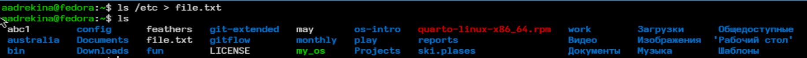{#fig-001 width=60%}

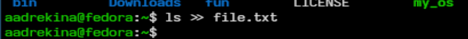{#fig-002 width=60%}

Потом с помощью команды cat я посмотрела, что в файл действительно все записалось. ([рис. @fig-003])

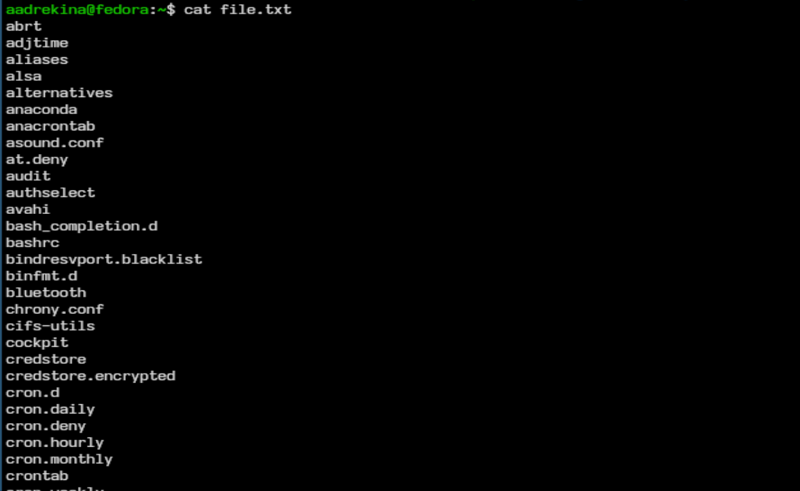{#fig-003 width=60%}

Потом нужно вывести имена всех файлов из file.txt, имеющих расширение .conf, после чего запишем их в новый текстовой файл conf.txt. ([рис. @fig-004]) ([рис. @fig-005]) ([рис. @fig-006])

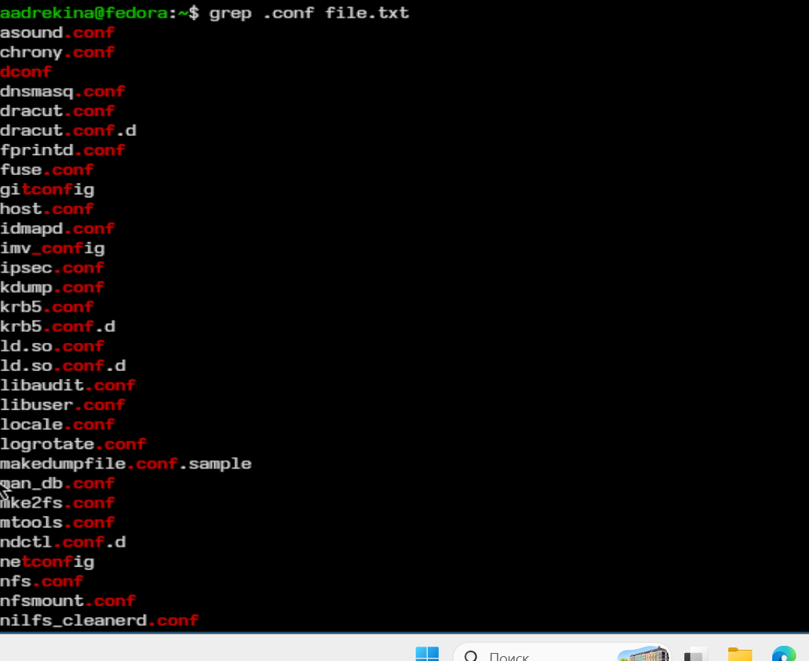{#fig-004 width=60%}

{#fig-005 width=60%}

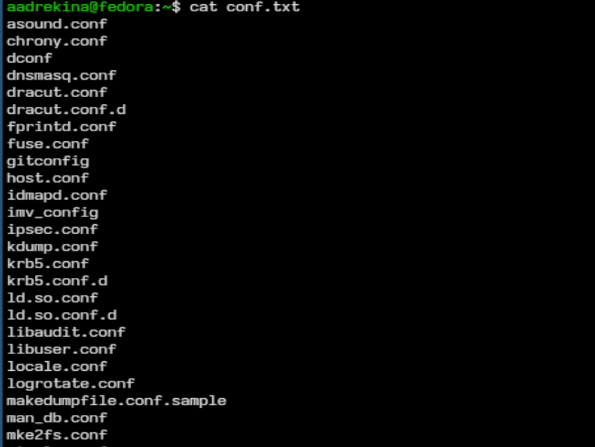{#fig-006 width=60%}

Определим, какие файлы в домашнем каталоге имеют имена, начинавшиеся с символа c? ([рис. @fig-007])

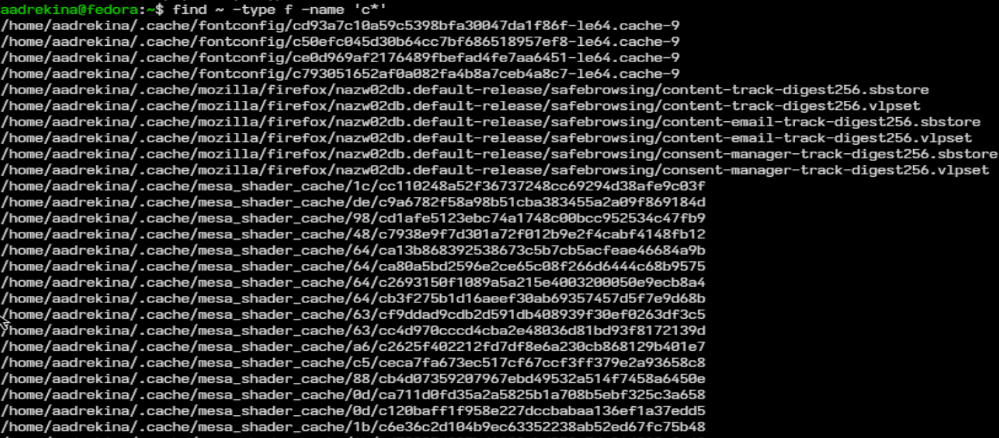{#fig-007 width=60%}

Потом выведем на экран имена файлов из каталога /etc, начинающиеся с символа h. ([рис. @fig-008])

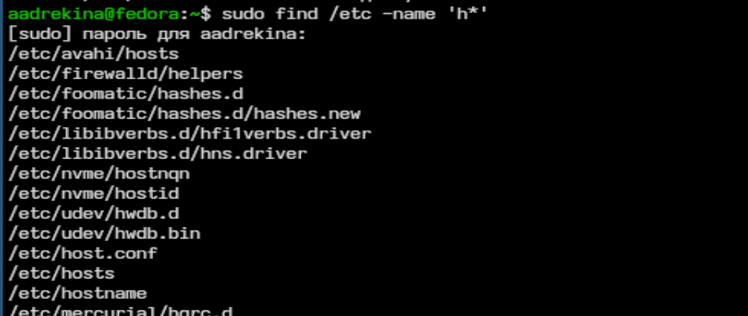{#fig-008 width=60%}

Потом запустим в фоновом режиме процесс, который будет записывать в файл ~/logfile файлы, имена которых начинаются с log. ([рис. @fig-009])([рис. @fig-010])

{#fig-009 width=60%}

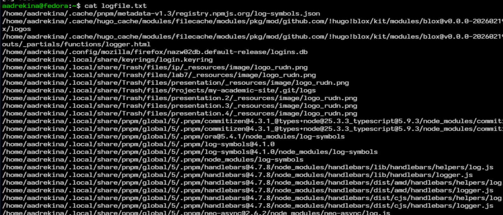{#fig-010 width=60%}

Удалим файл ~/logfile. ([рис. @fig-011])

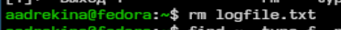{#fig-011 width=60%}

Запустите из консоли в фоновом режиме редактор gedit. ([рис. @fig-012])

{#fig-012 width=60%}

Затем с помощью команды kill завершим процесс gedit.

Теперь выполняем команды df и du. ([рис. @fig-013]) ([рис. @fig-014])

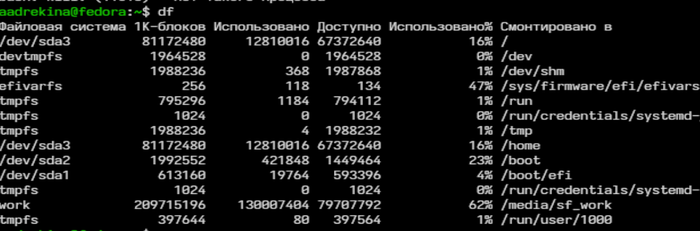{#fig-013 width=60%}

{#fig-014 width=60%}

Потом с помощью команды man мы  анализируем df и du. ([рис. @fig-015]) ([рис. @fig-016])

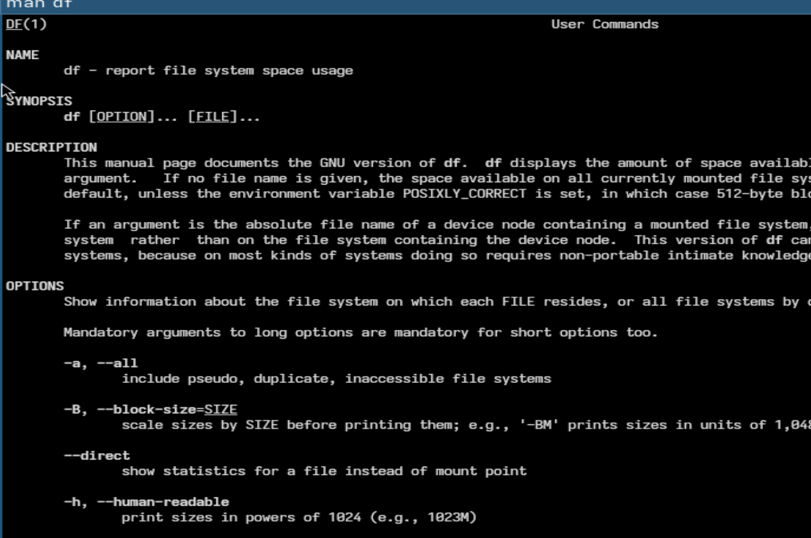{#fig-015 width=60%}

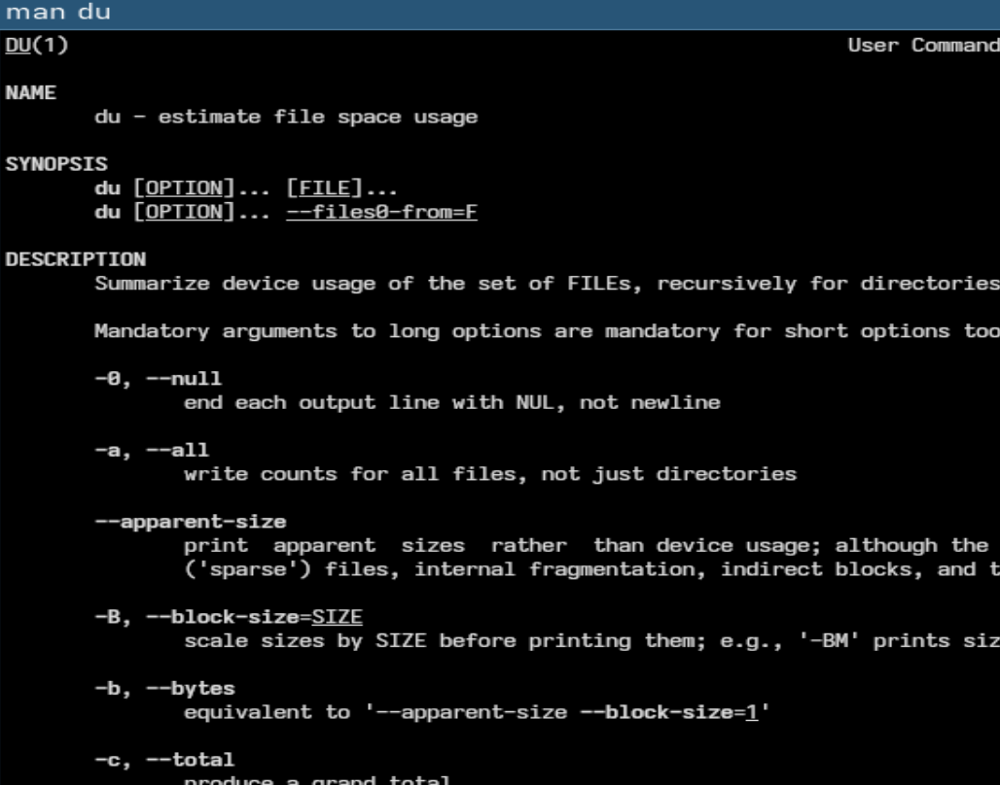{#fig-016 width=60%}

# Выводы

В ходе лабораторной работы мы ознакомились  с инструментами поиска файлов и фильтрации текстовых данных. Приобрели практические навыки: по управлению процессами, по проверке использования диска и обслуживанию файловых систем.

# Конторольные вопросы 

1.Какие потоки ввода вывода вы знаете?

В Linux есть 3 стандартных потока:

stdin (0) — стандартный ввод (клавиатура)
stdout (1) — стандартный вывод (экран)
stderr (2) — поток ошибок

2. Объясните разницу между операцией > и >>.

> — перезаписывает файл >> — добавляет в конец файла

3. Что такое конвейер?

Передача вывода одной команды на вход другой. Используется символ |

4. Что такое процесс? Чем это понятие отличается от программы?

Программа — файл на диске
Процесс — выполняющаяся программа

5. Что такое PID и GID?

PID (Process ID) — идентификатор процесса
GID (Group ID) — идентификатор группы пользователя

6. Что такое задачи и какая команда позволяет ими управлять?

Задачи (jobs) — процессы, запущенные в терминале

Команды: jobs — список задач, fg — вернуть в передний план, bg — отправить в фон

7. Найдите информацию об утилитах top и htop. Каковы их функции?

top - показывает процессы в реальном времени; загрузку CPU, RAM
htop - улучшенная версия top; цветной интерфейс; удобное управление процессами

8. Назовите и дайте характеристику команде поиска файлов. Приведите примеры использования этой команды.

Команда поиска файлов - find
Возможности: поиск по имени, размеру, типу, дате
Примеры:

```

find . -name "file.txt"
find /home -type f

```

9. Можно ли по контексту (содержанию) найти файл? Если да, то как?

Да, с помощью grep
Пример:

```

grep "text" file.txt
grep -r "text" 

```

10. Как определить объем свободной памяти на жёстком диске?

Команда df

```

df -h

```

11. Как определить объем вашего домашнего каталога?

Команда du

```

du -sh ~

```

12. Как удалить зависший процесс?

Команда kill

```

kill PID

```
