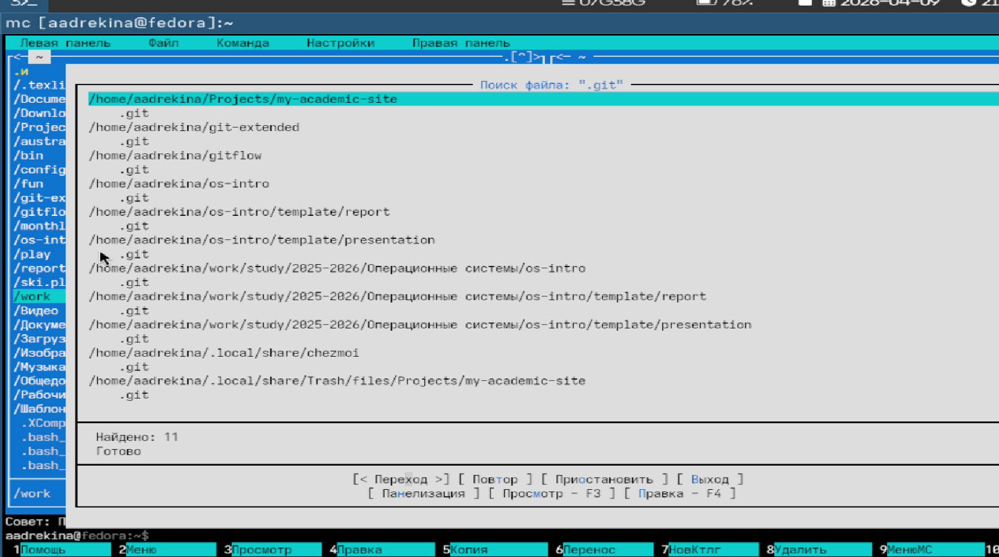
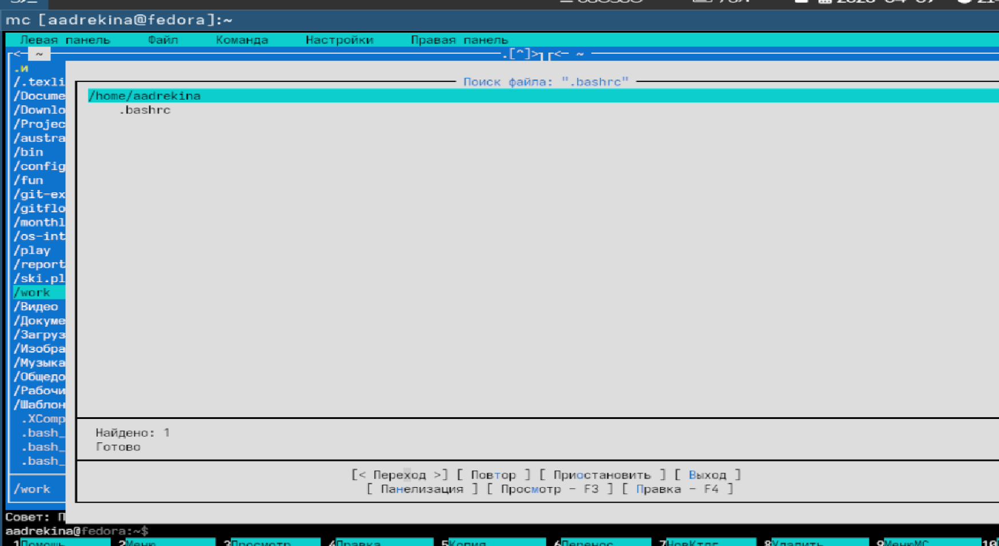
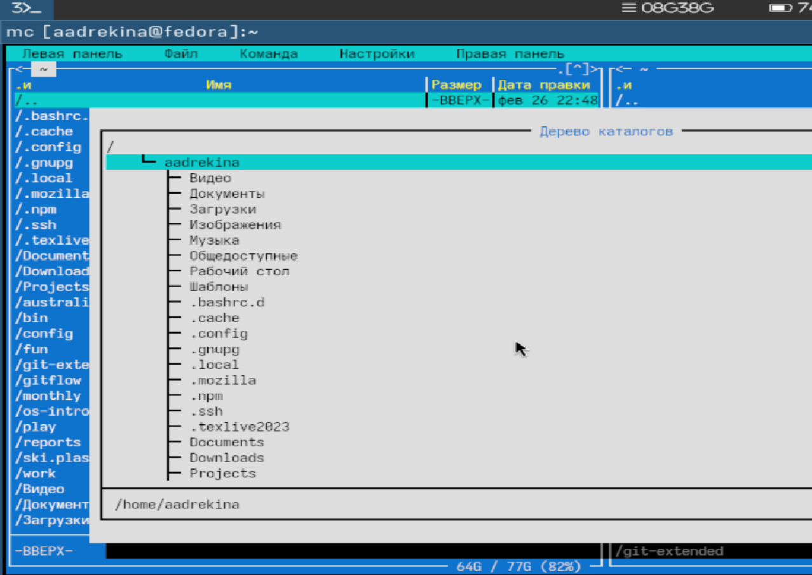
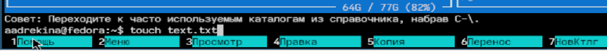

---
## Author
author:
  name: Арина Андреевна Дрекина
  degrees: DSc
  orcid: 0000-0002-0877-7063
  email: 1032253548@rudn.ru
  affiliation:
    - name: Российский университет дружбы народов
      country: Российская Федерация
      postal-code: 117198
      city: Москва
      address: ул. Миклухо-Маклая, д. 6

## Title
title: "Отчет по лабораторной работе №9"
subtitle: "Дисциплина: Операционные системы"
license: "CC BY"
---

# Цель работы

Освоение основных возможностей командной оболочки Midnight Commander. Приобретение навыков практической работы по просмотру каталогов и файлов; манипуляций с ними.

# Задание

9.1. Задание по mc

1. Изучите информацию о mc, вызвав в командной строке man mc.

2. Запустите из командной строки mc, изучите его структуру и меню.

3. Выполните несколько операций в mc, используя управляющие клавиши (операции с панелями; выделение/отмена выделения файлов, копирование/перемещение файлов, получение информации о размере и правах доступа на файлы и/или каталоги и т.п.)

4. Выполните основные команды меню левой (или правой) панели. Оцените степень подробности вывода информации о файлах.

5. Используя возможности подменю Файл , выполните:

– просмотр содержимого текстового файла;

– редактирование содержимого текстового файла (без сохранения результатов редактирования);

– создание каталога;

– копирование в файлов в созданный каталог.

6. С помощью соответствующих средств подменю Команда осуществите:

– поиск в файловой системе файла с заданными условиями (например, файла с расширением .c или .cpp, содержащего строку main);

– выбор и повторение одной из предыдущих команд;

– переход в домашний каталог;

– анализ файла меню и файла расширений.

7. Вызовите подменю Настройки . Освойте операции, определяющие структуру экрана mc (Full screen, Double Width, Show Hidden Files и т.д.)ю

9.2.Задание по встроенному редактору mc

1. Создайте текстовой файл text.txt.

2. Откройте этот файл с помощью встроенного в mc редактора.

3. Вставьте в открытый файл небольшой фрагмент текста, скопированный из любого другого файла или Интернета.

4. Проделайте с текстом следующие манипуляции, используя горячие клавиши:

4.1. Удалите строку текста.

4.2. Выделите фрагмент текста и скопируйте его на новую строку.

4.3. Выделите фрагмент текста и перенесите его на новую строку.

4.4. Сохраните файл.

4.5. Отмените последнее действие.

4.6. Перейдите в конец файла (нажав комбинацию клавиш) и напишите некоторый текст.

4.7. Перейдите в начало файла (нажав комбинацию клавиш) и напишите некоторый текст.

4.8. Сохраните и закройте файл.

5. Откройте файл с исходным текстом на некотором языке программирования (например C или Java)

6. Используя меню редактора, включите подсветку синтаксиса, если она не включена, или выключите, если она включена.

# Теоретическое введение

Командная оболочка — интерфейс взаимодействия пользователя с операционной системой и программным обеспечением посредством команд.

Midnight Commander (или mc) — псевдографическая командная оболочка для UNIX/Linux систем. Для запуска mc необходимо в командной строке набрать mc и нажать Enter .

Команды меню Файл :

– Просмотр ( F3 ) — позволяет посмотреть содержимое текущего (или выделенного) файла без возможности редактирования.

– Просмотр вывода команды ( М + ! ) — функция запроса команды с параметрами (аргумент к текущему выбранному файлу).

– Правка ( F4 ) — открывает текущий (или выделенный) файл для его редактирования.

– Копирование ( F5 ) — осуществляет копирование одного или нескольких файлов или каталогов в указанное пользователем во всплывающем окне место.

– Права доступа ( Ctrl-x c ) — позволяет указать (изменить) права доступа к одному или нескольким файлам или каталогам

– Жёсткая ссылка ( Ctrl-x l ) — позволяет создать жёсткую ссылку к текущему (или выделенному) файлу1.

– Символическая ссылка ( Ctrl-x s ) — позволяет создать символическую ссылку к текущему (или выделенному) файлу2.

– Владелец/группа ( Ctrl-x o ) — позволяет задать (изменить) владельца и имя группы для одного или нескольких файлов или каталогов.

– Права (расширенные) — позволяет изменить права доступа и владения для одного или нескольких файлов или каталогов.

– Переименование ( F6 ) — позволяет переименовать (или переместить) один или несколько файлов или каталогов.

– Создание каталога ( F7 ) — позволяет создать каталог.

– Удалить ( F8 ) — позволяет удалить один или несколько файлов или каталогов.

– Выход ( F10 ) — завершает работу mc

Ctrl-y удалить строку

Ctrl-u отмена последней операции

Ins вставка/замена

F7 поиск (можно использовать регулярные выражения)

-F7 повтор последней операции поиска

F4 замена

F3 первое нажатие — начало выделения, второе — окончание выделения

F5 копировать выделенный фрагмент

F6 переместить выделенный фрагмент

F8 удалить выделенный фрагмент

F2 записать изменения в файл

F10 выйти из редактора

# Выполнение лабораторной работы

Я изучила информацию о mc, вызвав в командной строке man mc.([рис. @fig-001])

{#fig-001 width=60%}

Запустите из командной строки mc, изучите его структуру и меню.([рис. @fig-002])

{#fig-002 width=60%}

Потом я выполнила несколько операций в mc, используя управляющие клавиши.

Далее я создала каталог 'workk' ([рис. @fig-003])

{#fig-003 width=60%}

Теперь скопируем любой файл и вставим в созданный каталог ([рис. @fig-004])

{#fig-004 width=60%}

Далее с помощью соответствующих средств подменю Команда я осуществила поиск в файловой системе файла. ([рис. @fig-005])([рис. @fig-006])

{#fig-005 width=60%}

{#fig-006 width=60%}

Затем я перешла в домашний каталог([рис. @fig-007])([рис. @fig-008])

{#fig-007 width=60%}

{#fig-008 width=60%}

Я создала текстовой файл text.txt.([рис. @fig-009])

{#fig-009 width=60%}

Потом я открыла этот текстовый файл с помощью встроенного в mc редактора. Далее вставила в открытый файл небольшой фрагмент текста.
Затем я удалила строку текста. Выделила фрагмент текста и скопировала его на новую строку.
В конце я  сохранила файл.Далее я отмените последнее действие.

Потом я создала еще один файл с расширение 'pcc'
Затем я включила подсветку синтаксиса.([рис. @fig-010])

{#fig-010 width=60%}

# Выводы

В ходе выполнения лабораторной работы мы освоили основные возможности командной оболочки Midnight Commander. Приобрели навыки практической работы по просмотру каталогов и файлов; манипуляций с ними.

#Контрольные вопросы

1. Какие режимы работы есть в mc. Охарактеризуйте их.

mc — это файловый менеджер с несколькими режимами:

Двухпанельный режим (основной): две панели (левая и правая),работа с файлами и каталогами
Командный режим: внизу есть командная строка, можно вводить обычные команды shell
Режим просмотра (Viewer): просмотр файлов (F3), без редактирования
Режим редактирования (Editor): редактирование файлов (F4)

2. Какие операции с файлами можно выполнить как с помощью команд shell, так и с по-
мощью меню (комбинаций клавиш) mc? Приведите несколько примеров.

Копирование  в shell - cp, в mc -  F5
Перемещение  в shell - mv, в mc -  F6
Удаление в shell - rm, в mc - F8
Создание файла  в shell - touch,  в mc - Shift+F4
Создание каталога в shell -  mkdir,  в mc - F7
Просмотр  в shell - cat, less, в mc -  F3

3. Опишите структура меню левой (или правой) панели mc, дайте характеристику ко-
мандам.

Основные пункты:

List mode — обычный список файлов
Brief — краткий список
Long — подробная информация
User defined — пользовательский формат
Sort order — сортировка (по имени, дате, размеру)
Filter — фильтрация файлов

4. Опишите структура меню Файл mc, дайте характеристику командам.

Основные команды:

View (F3) — просмотр
Edit (F4) — редактирование
Copy (F5) — копирование
Move (F6) — перемещение
Delete (F8) — удаление
Make directory (F7) — создать каталог
Quick cd — быстрый переход

5. Опишите структура меню Команда mc, дайте характеристику командам.

Основные функции:

Find file — поиск файлов
Swap panels — поменять панели
Compare directories — сравнение каталогов
History — история команд
External panelize — вывод команд в панель

6. Опишите структура меню Настройки mc, дайте характеристику командам.

Содержит:

Configuration — общие настройки
Layout — внешний вид
Panel options — настройки панелей
Confirmation — подтверждения операций
Display bits — кодировки

7. Назовите и дайте характеристику встроенным командам mc.

cd — смена каталога
view — просмотр файла
edit — редактирование
copy, move, delete — операции с файлами

8. Назовите и дайте характеристику командам встроенного редактора mc.

Основные:

F2 — сохранить
F10 — выйти
F7 — поиск
F4 — замена
Ctrl+Y — удалить строку
Ctrl+O — скрыть/показать панели

9. Дайте характеристику средствам mc, которые позволяют создавать меню, определяемые пользователем.

Файл:

```

~/.config/mc/menu

```

Позволяет: создавать свои команды, привязывать их к клавишам

10. Дайте характеристику средствам mc, которые позволяют выполнять действия, определяемые пользователем, над текущим файлом.

Через файл:

```

~/.config/mc/mc.ext

```

Позволяет: задавать действия по типу файла, автоматически запускать команды
