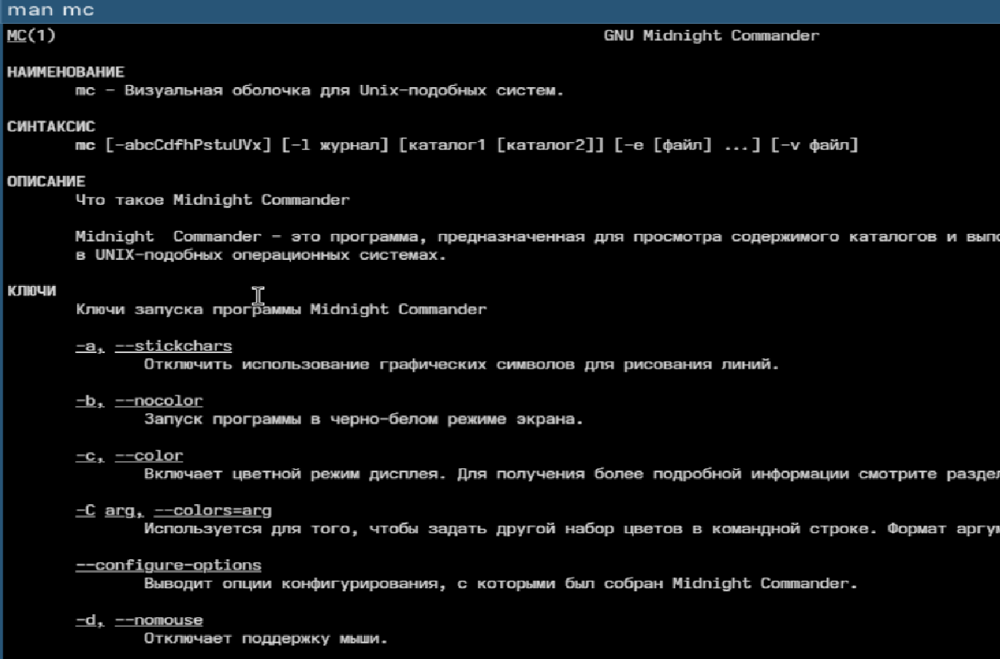
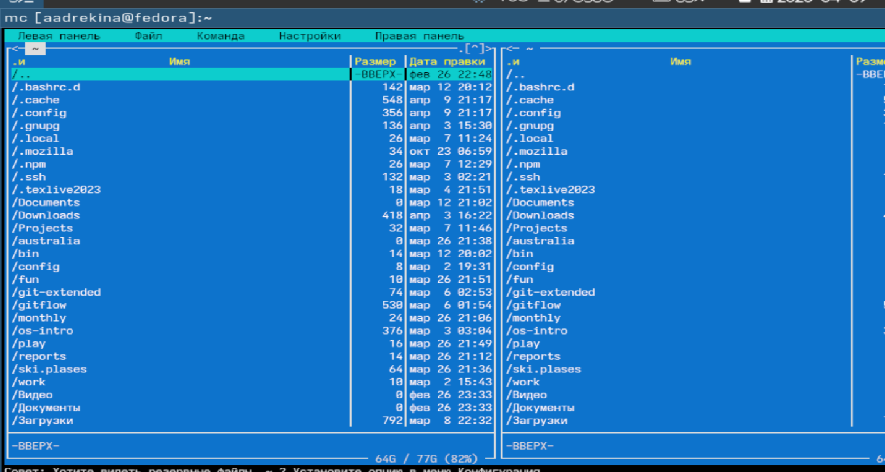
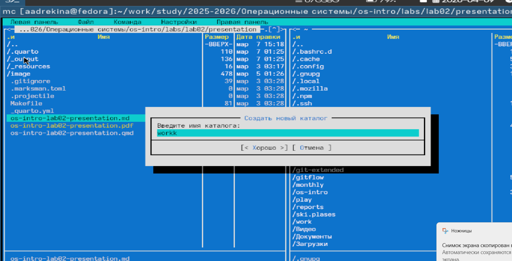
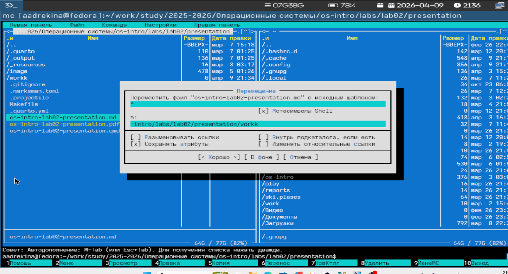
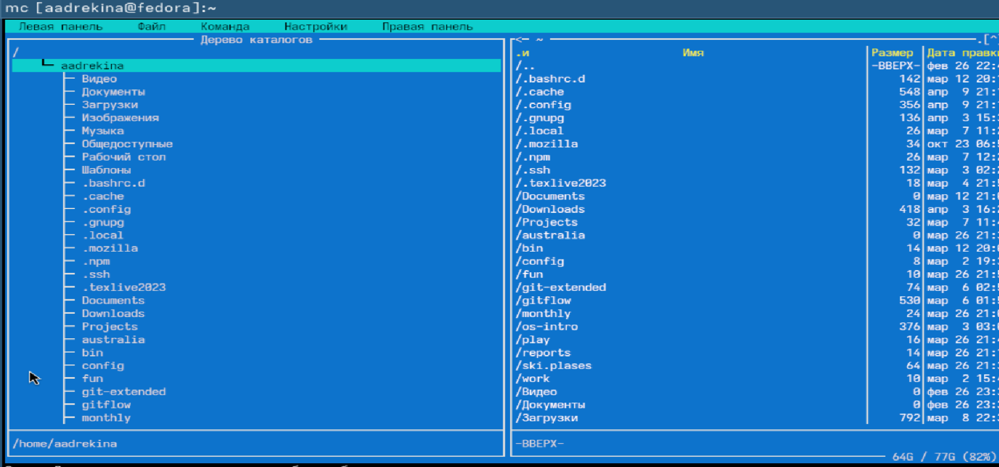
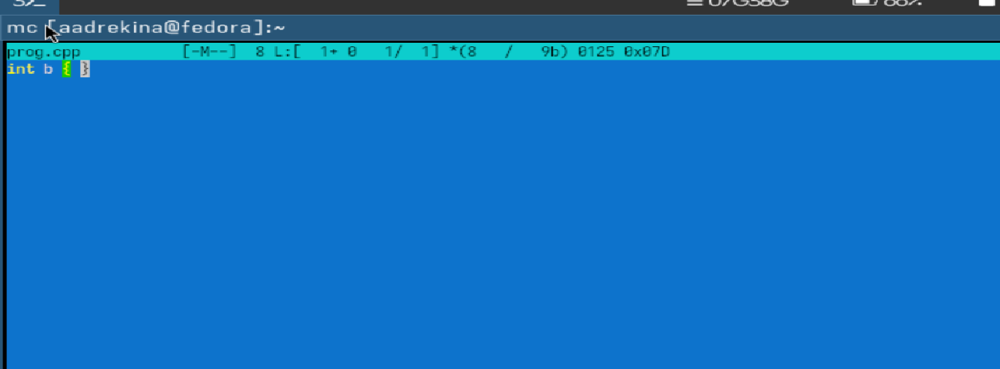

---
## Front matter
lang: ru-RU
title: Лабораторная работа №9
subtitle:Дисциплина: Операционные системы
author:
  - Дрекина Арина Андреевна
institute:
  - Российский университет дружбы народов, Москва, Россия
date: 2026.03.04

## i18n babel
babel-lang: russian
babel-otherlangs: english

## Formatting pdf
toc: false
toc-title: Содержание
slide_level: 2
aspectratio: 169
section-titles: true
theme: metropolis
header-includes:
 - \metroset{progressbar=frametitle,sectionpage=progressbar,numbering=fraction}
---

# Информация

## Докладчик

  * Дрекина Арина Андреевна
  * студентка факультета физико-математических и естественных наук
  * Российский университет дружбы народов им. П. Лумумбы
  * [1032253548@rudn.ru](mailto:1032253548@rudn.ru)
# Цель работы

Освоение основных возможностей командной оболочки Midnight Commander. Приобретение навыков практической работы по просмотру каталогов и файлов; манипуляций с ними.

# Задание

9.1. Задание по mc

1. Изучите информацию о mc, вызвав в командной строке man mc.

2. Запустите из командной строки mc, изучите его структуру и меню.

3. Выполните несколько операций в mc, используя управляющие клавиши (операции с панелями; выделение/отмена выделения файлов, копирование/перемещение файлов, получение информации о размере и правах доступа на файлы и/или каталоги и т.п.)

4. Выполните основные команды меню левой (или правой) панели. Оцените степень подробности вывода информации о файлах.

---

5. Используя возможности подменю Файл , выполните:

– просмотр содержимого текстового файла;

– редактирование содержимого текстового файла (без сохранения результатов редактирования);

– создание каталога;

– копирование в файлов в созданный каталог.

---

6. С помощью соответствующих средств подменю Команда осуществите:

– поиск в файловой системе файла с заданными условиями (например, файла с расширением .c или .cpp, содержащего строку main);

– выбор и повторение одной из предыдущих команд;

– переход в домашний каталог;

– анализ файла меню и файла расширений.

7. Вызовите подменю Настройки . Освойте операции, определяющие структуру экрана mc (Full screen, Double Width, Show Hidden Files и т.д.)ю

---

9.2.Задание по встроенному редактору mc

1. Создайте текстовой файл text.txt.

2. Откройте этот файл с помощью встроенного в mc редактора.

3. Вставьте в открытый файл небольшой фрагмент текста, скопированный из любого другого файла или Интернета.

---

4. Проделайте с текстом следующие манипуляции, используя горячие клавиши:

4.1. Удалите строку текста.

4.2. Выделите фрагмент текста и скопируйте его на новую строку.

4.3. Выделите фрагмент текста и перенесите его на новую строку.

4.4. Сохраните файл.

4.5. Отмените последнее действие.

4.6. Перейдите в конец файла (нажав комбинацию клавиш) и напишите некоторый текст.

4.7. Перейдите в начало файла (нажав комбинацию клавиш) и напишите некоторый текст.

4.8. Сохраните и закройте файл.

---

5. Откройте файл с исходным текстом на некотором языке программирования (например C или Java)

6. Используя меню редактора, включите подсветку синтаксиса, если она не включена, или выключите, если она включена.

---

# Теоретическое введение

Командная оболочка — интерфейс взаимодействия пользователя с операционной системой и программным обеспечением посредством команд.

Midnight Commander (или mc) — псевдографическая командная оболочка для UNIX/Linux систем. Для запуска mc необходимо в командной строке набрать mc и нажать Enter .

---

Команды меню Файл :

– Просмотр ( F3 ) — позволяет посмотреть содержимое текущего (или выделенного) файла без возможности редактирования.

– Просмотр вывода команды ( М + ! ) — функция запроса команды с параметрами (аргумент к текущему выбранному файлу).

– Правка ( F4 ) — открывает текущий (или выделенный) файл для его редактирования.

– Копирование ( F5 ) — осуществляет копирование одного или нескольких файлов или каталогов в указанное пользователем во всплывающем окне место.

– Права доступа ( Ctrl-x c ) — позволяет указать (изменить) права доступа к одному или нескольким файлам или каталогам

---

– Жёсткая ссылка ( Ctrl-x l ) — позволяет создать жёсткую ссылку к текущему (или выделенному) файлу1.

– Символическая ссылка ( Ctrl-x s ) — позволяет создать символическую ссылку к текущему (или выделенному) файлу2.

– Владелец/группа ( Ctrl-x o ) — позволяет задать (изменить) владельца и имя группы для одного или нескольких файлов или каталогов.

– Права (расширенные) — позволяет изменить права доступа и владения для одного или нескольких файлов или каталогов.

– Переименование ( F6 ) — позволяет переименовать (или переместить) один или несколько файлов или каталогов.

– Создание каталога ( F7 ) — позволяет создать каталог.

– Удалить ( F8 ) — позволяет удалить один или несколько файлов или каталогов.

– Выход ( F10 ) — завершает работу mc

---

Ctrl-y удалить строку

Ctrl-u отмена последней операции

Ins вставка/замена

F7 поиск (можно использовать регулярные выражения)

-F7 повтор последней операции поиска

F4 замена

---

F3 первое нажатие — начало выделения, второе — окончание выделения

F5 копировать выделенный фрагмент

F6 переместить выделенный фрагмент

F8 удалить выделенный фрагмент

F2 записать изменения в файл

F10 выйти из редактора

---

# Выполнение лабораторной работы

Я изучила информацию о mc, вызвав в командной строке man mc.

{#fig-001 width=60%}

---

Запустите из командной строки mc, изучите его структуру и меню.

{#fig-002 width=60%}

---

Далее я создала каталог 'workk'

{#fig-003 width=60%}

---

Теперь скопируем любой файл и вставим в созданный каталог

{#fig-004 width=60%}

---

Далее с помощью соответствующих средств подменю Команда я осуществила поиск в файловой системе файла.

{#fig-005 width=45%}

---

{#fig-006 width=45%}

---

Затем я перешла в домашний каталог

{#fig-007 width=45%}

---

{#fig-008 width=45%}

---

Я создала текстовой файл text.txt.

{#fig-009 width=60%}

---

Потом я создала еще один файл с расширение 'pcc'. Затем я включила подсветку синтаксиса.

{#fig-010 width=60%}

---

# Выводы

В ходе выполнения лабораторной работы мы освоили основные возможности командной оболочки Midnight Commander. Приобрели навыки практической работы по просмотру каталогов и файлов; манипуляций с ними.
