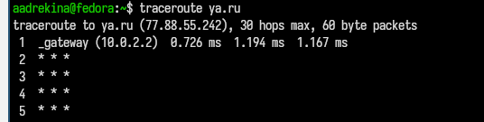

---
## Front matter
lang: ru-RU
title: Реферат на тему 'Обзор стратегий маршрутизации и маршрутизаторов'
subtitle:Дисциплина: Операционные системы
author:
  - Дрекина Арина Андреевна
institute:
  - Российский университет дружбы народов, Москва, Россия
date: 2026.04.17

## i18n babel
babel-lang: russian
babel-otherlangs: english

## Formatting pdf
toc: false
toc-title: Содержание
slide_level: 2
aspectratio: 169
section-titles: true
theme: metropolis
header-includes:
 - \metroset{progressbar=frametitle,sectionpage=progressbar,numbering=fraction}
---

## Докладчик

:::::::::::::: {.columns align=center}
::: {.column width="70%"}

  * Дрекина Арина Андреевна
  * студентка факультета физико-математических наук
  * группа НКАбд-02-25
  * Российский университет дружбы народов им. П. Лумумбы
  * [1032253548@rudn.ru](mailto:1032253548@rudn.ru)

:::
::: {.column width="30%"}

:::
::::::::::::::

## Актуальность

Современные сети испытывают постоянный рост нагрузки из-за развития технологий, облачных сервисов.

Эффективная маршрутизация становится ключевым фактором стабильности, производительности и безопасности сетей.

## Объект и предмет исследования 

Объект - компьютерныее сети передачи данных

Предмет исследования - стратегии маршрутизации и алгоритмы их реализации.

## Цели, задачи и гипотеза

Цель - изучить маршрутизацию и определить ее влияние на эффективность сети.

Задачи:

- изучить основы маршрутизации

- проанализировать алгоритмы

- рассмотреть работу маршрутизаторов

- сравнить подходы

Гипотеза - динамическая маршрутизация повышает устойчивость и производительность сети.

## Материалы и методы

Исследование основано на научной литературе и статьях.

Использованы методы анализа, сравнения и обобщения.

Теоретическая база включает теорию сетей и алгоритмы теории графов.

## Основы маршрутизации

Маршрутизация - процесс выбора пути передачи данных в сети .

Реализуется распределенно и адаптивно, что повышает устойчивость системы.

Есть два основных вида маршрутизации: 

1.Статическая - простая и предсказуемая, но не адаптируется под изменния.

2.Динамическая - автоматически обновляет маршруты и учитывает изменения сети

## Алгоритмы, иерархия и способы реализации

В динамисекой маршрутизации существуют алгоритмы: 

- дистанционно-векторные

- состояние каналов

- гибридные

Метрики - числовые показатели, которые используются для определения оптимального пути. (пропускная способоность, задержка)

Иерархическая маршрутизация повышает масштабируемость сети.

Используются аппаратные, программные и виртуальные решения.

Дополнительно применяются мультипутевая и политическая маршрутизация.

## Просмотр текущей таблицы маршрутизации и ее путь

Таблица маршрутизации - это инструмент, который использует маршрутизатор для принятия решения. С помощью команды 'netstat -r' или 'route' можно посмотреть текущую таблицу маршрутизации. 

{#fig-001 width=45%}

А с помощью команды traceroute ya.ru  можно посмотреть сам маршрут.

{#fig-002 width=45%}

## Результаты и практическая значимость

Проведённый анализ показал, что эффективность сети напрямую зависит от выбранной стратегии маршрутизации.
Распределённый и адаптивный подход обеспечивает устойчивость и гибкость системы.

Сравнение алгоритмов выявило баланс между простотой и точностью решений, а использование метрик позволяет выбирать оптимальные маршруты.
Иерархическая структура повышает масштабируемость сети.

Результаты работы могут применяться при проектировании и настройке компьютерных сетей для повышения их надёжности и производительности.

## Список литературы 

1. [Маршрутизация](https://ru.wikipedia.org/wiki/Маршрутизация)

2. [Статическая маршрутизация](https://ru.wikipedia.org/wiki/Статическая_маршрутизация)

3. [Dynamic routing](https://en.wikipedia.org/wiki/Dynamic_routing)

4. [Дистанционно-векторная маршрутизация](https://ru.wikipedia.org/wiki/Дистанционно-векторная_маршрутизация)

5. [Link-state routing protocol](https://en.wikipedia.org/wiki/Link-state_routing_protocol)

6. [Metrics (networking)](https://en.wikipedia.org/wiki/Metrics_(networking))

7. [Hierarchical routing](https://en.wikipedia.org/wiki/Hierarchical_routing)
