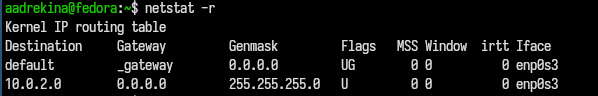
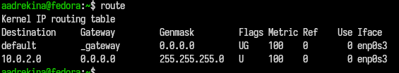

---
## Author
author:
  name: Арина Андреевна Дрекина
  degrees: DSc
  orcid: 0000-0002-0877-7063
  email: 1032253548@rudn.ru
  affiliation:
    - name: Российский университет дружбы народов
      country: Российская Федерация
      postal-code: 117198
      city: Москва
      address: ул. Миклухо-Маклая, д. 6

## Title
title: "Реферат на тему 'Обзор стратегий маршрутизации и маршрутизаторов.'"
subtitle: "Дисциплина: Операционные системы"
license: "CC BY"
---

# Введение 

Современное общество невозможноо представить без компьютерных сетей, которые обеспечивают обмен данными между миллионами устройств по всему миру.
Основной функционирования таких сетей является процесс маршрутизации - определение оптимального пути передачи информации от отправителя к получателю.
Именно благодаря маршрутизаторам данные могут проходить через множество промежуточных узлов, достигая конечной точки быстро и надежно.

Важнейшую роль в этом процессе играют маршрутизаторы — специализированные устройства, которые анализируют сетевые адреса и принимают решения о дальнейшем направлении передачи пакетов. 
От эффективности выбранной стратегии маршрутизации напрямую зависят такие характеристики сети, как скорость, устойчивость к сбоям и качество обслуживания пользователей.

В условиях постоянного роста сетевого трафика и усложнения инфраструктуры особую значимость приобретает изучение различных стратегий маршрутизации, алгоритмов их реализации и принципов работы маршрутизаторов.

# Основная часть 

## Общие принцыпы маршрутизации

Маршрутизация - это процесс предачи данных по сети от одного устройства к другому.
Основная задача маршрутизации - определить, по какму пути пакет данных должен пойти, чтобы попасть к получателю.
При  этом учитывается как структура сети, так и ее состояние.[@routing_general]

В современных сетях маршрутизация реализуется как распределённый процесс. 
Это означает, что управление сетью не сосредоточено в одном устройстве.
Каждый маршрутизатор самостоятельно принимает решения о том, куда отправить пакет дальше. 
Для этого он использует свою таблицу маршрутизации и информацию, получаемую от соседних устройств.

Такой подход делает сеть более устойчивой. Если один из маршрутизаторов выходит из строя, остальные продолжают работать, а маршруты могут быть перестроены. 
Это особенно важно для больших сетей, где сбои отдельных узлов неизбежны.

Кроме того, маршрутизация в современных сетях является адаптивной. Это значит, что маршруты могут изменяться в зависимости от ситуации в сети. 
Например, если один из каналов перегружен или временно недоступен, данные могут быть направлены по другому пути. 
Благодаря этому удаётся избежать задержек и повысить надёжность передачи данных.[@studfile_routing]

## Статистическая и динамическая маршрутизация

Существует два основных подхода к маршрутиазции: статистический и динамический.

Статистическая маршрутизация предполагает, что маршруты задаются вручную администратором.
Все пути прописываются заранее и не изменяются автоматически. Такой способ удобен своей простотой и предсказуемостью.
Администратор тончо знает, как будет передаваться трафик. [@static_routing]

Однако у статической маршрутизации есть серьезный недостаток - она не реагирует на изменения в сети. Если изменится структура сети или произойдет сбой,маршруты придется настраивать заново вручную. Поэтоу этот подход используют в основном в небольших сетях или там, где структура почти не меняется. [3](#ref3)

Динамическая маршрутизация работает иначе. Маршрутизаторы обмениваются информацией друг с другом и автоматически обновляют свои таблицы маршрутов. Это позволяет им учитывать изменения в сети и выбирать более подходящие пути.

Такой подход значительно упрощает управление сетью и делает ее более гибкой. Именно поэтоум динамическая маршрутизация используется в большинстве современных сетей, включая интернет. [@dynamic_routing]

## Алгоритмы маршрутизации

В основе динамической маршрутизации лежат различные алгоритмы, которые определяют, как именно выбираются маршруты.

Один из самыз простых - дистанционно-векторный алгоритм. В этом случае каждый маршрутизатор знает, через какого соседа можно добраться до нужной сети и сколько 'шагов' до нее.
Он переодически обменивается этой информацией с соседними устройствами.[@distance_vector]

Несмотря на простоту, у такого подхода есть недостатики. Например, он довольно медленно реагирует на изменения в сети, а иногда формирует не самые оптимальные маршруты.

Более продвинутым считается подход на основе состояния каналов.
В этом случае маршрутизаторы не просто обмениваются расстояниями, а передают информацию о состоянии всех соединений.
На основе этих данных каждый маршрутизатор формирует у себя полную «карту» сети.

После этого он самостоятельно вычисляет оптимальные маршруты, обычно с помощью алгоритмов поиска кратчайшего пути.
Такой способ позволяет быстрее реагировать на изменения и точнее выбирать маршруты.
Однако он требует больше памяти и вычислительных ресурсов, так как нужно обрабатывать больше информации.[@link_state]

Чтобы объединить преимущества этих подходов, используются гибридные алгоритмы. Они сочетают элементы обоих методов: уменьшают объём передаваемой информации и при этом достаточно быстро реагируют на изменения.
Благодаря этому они хорошо подходят для сетей среднего и большого размера.

## Метрики маршрутизации

При выборе маршрута маршрутизатор должен решить, какой путь лучше. Для этого используются метрики — специальные показатели, по которым сравниваются маршруты.[@metrics_networking]

К основным метрикам относятся:

1.задержка передачи данных

2.пропускная способность канала

3.количество промежуточных узлов

4.загрузка сети

Например, один маршрут может быть короче по количеству узлов, но иметь низкую пропускную способность. Другой — длиннее, но быстрее. В этом случае выбор зависит от того, какие метрики считаются более важными.

Если используется только один показатель, выбор делается быстрее, но не всегда точно. Поэтому в современных сетях часто учитывается сразу несколько параметров. Это позволяет выбирать более подходящие маршруты, хотя и усложняет расчёты.

Таким образом, метрики играют важную роль, так как именно от них зависит, какой путь будет выбран для передачи данных.

## Иерархическая маршрутизация

Когда сеть становится большой, возникает проблема: маршрутизаторам приходится хранить и обрабатывать слишком много информации. Чтобы решить эту проблему, применяется иерархическая маршрутизация.

Суть её в том, что сеть делится на отдельные части — области. Внутри каждой области маршрутизация выполняется отдельно, и подробная информация о ней не передаётся в другие области.[@hierarchical_routing]

Это позволяет значительно уменьшить объём служебной информации и снизить нагрузку на маршрутизаторы. Кроме того, такой подход упрощает управление сетью и делает её более масштабируемой.

Иерархическая маршрутизация особенно важна для крупных корпоративных сетей и глобальных систем.

## Способы реализации маршрутизации

Маршрутизация может реализовываться разными способами в зависимости от используемого оборудования и программного обеспечения.

Аппаратная маршрутизация выполняется с помощью специализированных устройств — маршрутизаторов, которые предназначены именно для обработки сетевого трафика. Они работают очень быстро и используются в сетях с большой нагрузкой [@studfile_routing_2].

Программная маршрутизация реализуется на обычных компьютерах с помощью программных средств. Она более гибкая, так как её проще настраивать и изменять. Однако её производительность ниже, чем у аппаратных решений.[@routing_general]

Виртуальная маршрутизация — это развитие программного подхода. Она используется в виртуальных и облачных средах. В этом случае на одном физическом устройстве можно создать несколько виртуальных маршрутизаторов. Это удобно для разделения сети и управления ресурсами. [@usergate_routing]

## Дополнительные подходы маршрутизации

Кроме основных методов, существуют и дополнительные подходы.

Прямая маршрутизация применяется внутри одной сети, когда устройства могут обмениваться данными напрямую. Косвенная маршрутизация используется, когда данные проходят через несколько маршрутизаторов, что характерно для глобальных сетей. [@studfile_routing_3]

Маршрутизация на основе политик позволяет учитывать дополнительные условия при выборе маршрута. Например, можно направлять трафик по разным путям в зависимости от его типа или источника. Это даёт больше возможностей для управления сетью. [@studfile_routing_3]

Мультипутевая маршрутизация позволяет использовать сразу несколько маршрутов. Это повышает надёжность передачи данных и помогает равномерно распределять нагрузку между каналами [@multipath_routing].

## Таблицы маршрутизации

Таблица маршрутизации — это основной инструмент, который использует маршрутизатор для принятия решений. В ней хранится информация о том, куда нужно отправлять пакеты, чтобы они достигли нужной сети.

Каждая запись в таблице обычно содержит:

1.адрес сети назначения

2.следующий узел (next hop)

3.сетевой интерфейс

4.метрику маршрута

Когда пакет поступает на маршрутизатор, он сравнивает адрес назначения с записями в таблице и выбирает подходящий маршрут. Если существует несколько вариантов, выбирается тот, который имеет лучшую метрику.

Таблицы маршрутизации могут заполняться вручную (при статической маршрутизации) или автоматически (при динамической маршрутизации). В современных сетях чаще используется второй вариант, так как он позволяет быстрее реагировать на изменения [@routing_table]

## Просмотр и управление маршрутами

Для работы с таблицами маршрутизации в операционных системах используются специальные команды и утилиты.

Одна из таких утилит — netstat -r. ([рис. @fig-001]) Она позволяет просмотреть текущую таблицу маршрутизации. С её помощью можно увидеть, какие маршруты настроены, через какие интерфейсы осуществляется передача и какие метрики используются.

{#fig-001 width=60%}

В таблице есть маршрут default — это основной путь, по которому отправляются данные, если для них нет более точного маршрута. Также видно сеть 10.0.2.0 с маской 255.255.255.0 — это локальная сеть, с которой компьютер работает напрямую через интерфейс enp0s3. Флаг U показывает, что маршрут работает, а флаг G — что используется шлюз.

Каждый столбец таблицы маршрутизации отвечает за свою часть информации: Destination показывает сеть или узел назначения, Gateway — через какой шлюз отправляются данные, Genmask определяет маску сети и диапазон адресов, Iface указывает сетевой интерфейс, через который идёт передача. Столбец Flags отражает состояние маршрута (например, активен ли он и используется ли шлюз). Остальные параметры, такие как MSS и Window, связаны с настройками передачи данных и обычно используются системой автоматически.

В целом эта таблица показывает, как система разделяет локальную передачу данных и отправку во внешние сети.

Также используется команда route ([рис. @fig-002]), которая позволяет не только просматривать маршруты, но и изменять их. С её помощью можно добавлять новые маршруты, удалять существующие и изменять параметры уже настроенных путей.

{#fig-002 width=60%}

Результаты вывода команды 'netstat -r' и команды 'route' совпадают.

Эти инструменты часто применяются при настройке сети и диагностике проблем. Они позволяют понять, как именно система принимает решения о передаче данных и где может возникать ошибка.

## Диагностика маршрутизации с помощью traceroute

Для анализа маршрута, по которому проходят данные, используется команда traceroute ya.ru ([рис. @fig-003]) (или tracert в некоторых системах).

Она позволяет определить, через какие узлы проходит пакет на пути к получателю. В процессе выполнения команда отправляет последовательность запросов и фиксирует время отклика каждого промежуточного маршрутизатора.

{#fig-003 width=60%}

При выполнении команды traceroute ya.ru был показан путь, по которому данные идут до сайта ya.ru (77.88.55.242). Эта команда показывает, через какие устройства проходит интернет-трафик и сколько времени занимает каждый шаг.

Сначала видно шлюз _gateway (10.0.2.2). Это первый узел в сети, через который компьютер отправляет данные в интернет. Задержка здесь очень маленькая, около 1 миллисекунды, так как это локальная сеть. Значения 0.726 ms 1.194 ms 1.167 ms показывают время прохождения трёх отдельных попыток отправки пакетов до этого узла. Они немного отличаются друг от друга из-за обычных небольших задержек в сети, но в целом подтверждают, что соединение стабильное и быстрое.

Дальше появляются строки * * *. Это значит, что ответ от следующих устройств не был получен. Такое часто бывает, потому что некоторые маршрутизаторы просто не отвечают на такие запросы или блокируют их.

В итоге можно сказать, что команда traceroute показала только первый шаг маршрута, а дальше ответы не пришли.

Результат работы traceroute представляет собой список узлов, через которые проходит трафик, с указанием задержек на каждом этапе. Это позволяет:

1.определить, где возникают задержки

2.выявить проблемные участки сети

3.проверить доступность узлов

Данный инструмент широко используется администраторами для диагностики сетевых проблем и анализа маршрутов передачи данных.

# Заключение 

В данной работе были рассмотрены основные стратегии маршрутизации и принципы их реализации в компьютерных сетях. Проведённый анализ позволил обобщить ключевые подходы к организации передачи данных и определить их особенности.

Было показано, что важную роль в современных сетях играет распределённый и адаптивный характер маршрутизации, обеспечивающий устойчивость и гибкость системы. Рассмотрение алгоритмов маршрутизации позволило выявить различия между дистанционно-векторными, алгоритмами состояния каналов и гибридными решениями, а также определить их области применения.

Особое внимание было уделено метрикам маршрутизации, от выбора которых зависит эффективность передачи данных, а также иерархическому подходу, позволяющему повысить масштабируемость сети. Кроме того, были рассмотрены различные способы реализации маршрутизации — аппаратный, программный и виртуальный, каждый из которых используется в зависимости от требований к производительности и гибкости.

В результате можно сделать вывод, что эффективная организация маршрутизации требует комплексного подхода, учитывающего структуру сети, характер трафика и условия её функционирования. Применение современных методов и стратегий позволяет повысить надёжность, производительность и управляемость компьютерных сетей.

# Список литературы{.unnumbered}

::: {#refs}
:::
