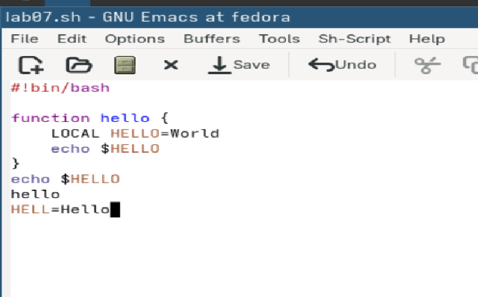
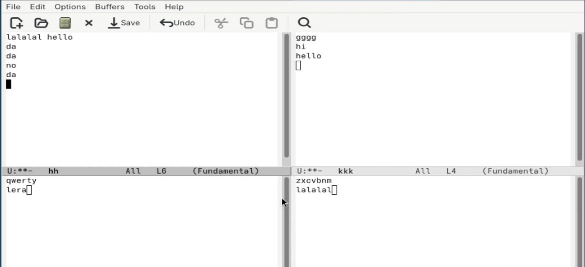

---
## Front matter
lang: ru-RU
title: Лабораторная работа №11
subtitle:Дисциплина: Операционные системы
author:
  - Дрекина Арина Андреевна
institute:
  - Российский университет дружбы народов, Москва, Россия
date: 2026.03.04

## i18n babel
babel-lang: russian
babel-otherlangs: english

## Formatting pdf
toc: false
toc-title: Содержание
slide_level: 2
aspectratio: 169
section-titles: true
theme: metropolis
header-includes:
 - \metroset{progressbar=frametitle,sectionpage=progressbar,numbering=fraction}
---

# Информация

## Докладчик

  * Дрекина Арина Андреевна
  * студентка факультета физико-математических и естественных наук
  * Российский университет дружбы народов им. П. Лумумбы
  * [1032253548@rudn.ru](mailto:1032253548@rudn.ru)

# Цель работы

Познакомиться с операционной системой Linux. Получить практические навыки работы с редактором Emacs.

# Задание

1. Открыть emacs.

2. Создать файл lab07.sh с помощью комбинации Ctrl-x Ctrl-f (C-x C-f).

3. Наберите текст.

4. Сохранить файл с помощью комбинации Ctrl-x Ctrl-s (C-x C-s).

---

5. Проделать с текстом стандартные процедуры редактирования, каждое действие должно осуществляться комбинацией клавиш.

5.1. Вырезать одной командой целую строку (С-k).

5.2. Вставить эту строку в конец файла (C-y).

5.3. Выделить область текста (C-space).

5.4. Скопировать область в буфер обмена (M-w).

5.5. Вставить область в конец файла.

5.6. Вновь выделить эту область и на этот раз вырезать её (C-w).

5.7. Отмените последнее действие (C-/).

---

6. Научитесь использовать команды по перемещению курсора.

6.1. Переместите курсор в начало строки (C-a).

6.2. Переместите курсор в конец строки (C-e).

6.3. Переместите курсор в начало буфера (M-<).

6.4. Переместите курсор в конец буфера (M->).

---

7. Управление буферами.

7.1. Вывести список активных буферов на экран (C-x C-b).

7.2. Переместитесь во вновь открытое окно (C-x) o со списком открытых буферов
и переключитесь на другой буфер.

7.3. Закройте это окно (C-x 0).

7.4. Теперь вновь переключайтесь между буферами, но уже без вывода их списка на
экран (C-x b).

8. Управление окнами.

8.1. Поделите фрейм на 4 части: разделите фрейм на два окна по вертикали (C-x 3),
а затем каждое из этих окон на две части по горизонтали (C-x 2)

8.2. В каждом из четырёх созданных окон откройте новый буфер (файл) и введите
несколько строк текста.

---

9. Режим поиска

9.1. Переключитесь в режим поиска (C-s) и найдите несколько слов, присутствующих
в тексте.

9.2. Переключайтесь между результатами поиска, нажимая C-s.

9.3. Выйдите из режима поиска, нажав C-g.

9.4. Перейдите в режим поиска и замены (M-%), введите текст, который следует найти
и заменить, нажмите Enter , затем введите текст для замены. После того как будут
подсвечены результаты поиска, нажмите ! для подтверждения замены.

9.5. Испробуйте другой режим поиска, нажав M-s o. Объясните, чем он отличается от
обычного режима?

# Теоретическое введение

Для запуска Emacs необходимо в командной строке набрать emacs (или emacs & для
работы в фоновом режиме относительно консоли).
Для работы с Emacs можно использовать как элементы меню, так и различные сочетания клавиш. Например, для выхода из Emacs можно воспользоваться меню File
и выбрать пункт Quit , а можно нажать последовательно Ctrl-x Ctrl-c (в обозначениях
Emacs: C-x C-c)

---

Основные комбинации клавиш для перемещения курсора в буфере Emacs

C-p переместиться вверх на одну строку

C-n переместиться вниз на одну строку

C-f переместиться вперёд на один символ

C-b переместиться назад на один символ

C-a переместиться в начало строки

C-e переместиться в конец строки

C-v переместиться вниз на одну страницу

---

Основные комбинации клавиш для работы с текстом в Emacs

C-d Удалить символ перед текущим положением курсора

M-d Удалить следующее за текущим положением курсора слово

C-k Удалить текст от текущего положения курсора
до конца строки

M-k Удалить текст от текущего положения курсора
до конца предложения

M-\ Удалить все пробелы и знаки табуляции вокруг
текущего положения курсора

---

Основные комбинации клавиш для работы с выделенной областью текста в Emacs

C-space Начать выделение текста с текущего положения
курсора

C-w Удалить выделенную область текста в список удалений

M-w Скопировать выделенную область текста в список удалений

C-y Вставить текст из списка удалений в текущую
позицию курсора

M-y Последовательно вставить текст из списка удалений

M-\ Выровнять строки выделенной области текста

# Выполнение лабораторной работы

Открываем emacs.

{#fig-001 width=100%}

---

Создаем файл lab07.sh и открываем его с помощью c-x и c-f.

{#fig-002 width=100%}

{#fig-003 width=100%}

---

Вводим текст.

{#fig-004 width=45%}

Сохраняеем файл(C-x C-s).

---

Проделаем с текстом стандартные процедуры редактирования, с помощью горячих клавиш.

Вырез одной командой целую строку (С-k),вставка этой строки в конец файла (C-y) и ряд других процедур

{#fig-005 width=60%}

---

Вывод списка активных буферов на экран (C-x C-b)

{#fig-006 width=60%}

---

Деление фрейма на 4 части

{#fig-007 width=60%}

# Выводы

В ходе выполнения лабораторной работы мы познакомились  с операционной системой Linux. Получили практические навыки работы с редактором Emacs.
