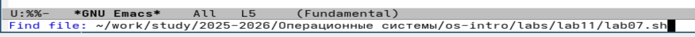
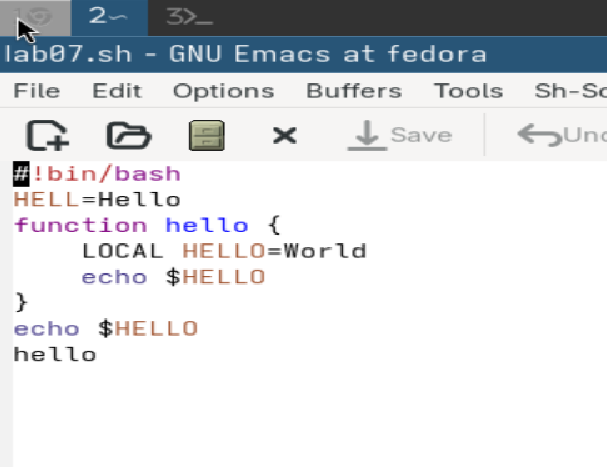
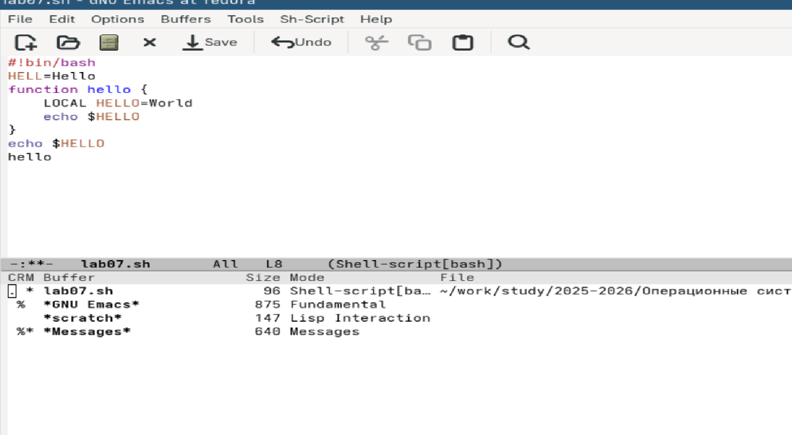

---
## Author
author:
  name: Арина Андреевна Дрекина
  degrees: DSc
  orcid: 0000-0002-0877-7063
  email: 1032253548@rudn.ru
  affiliation:
    - name: Российский университет дружбы народов
      country: Российская Федерация
      postal-code: 117198
      city: Москва
      address: ул. Миклухо-Маклая, д. 6

## Title
title: "Отчет по лабораторной работе №11"
subtitle: "Дисциплина: Операционные системы"
license: "CC BY"
---

# Цель работы

Познакомиться с операционной системой Linux. Получить практические навыки работы с редактором Emacs.

# Задание

1. Открыть emacs.

2. Создать файл lab07.sh с помощью комбинации Ctrl-x Ctrl-f (C-x C-f).

3. Наберите текст.

4. Сохранить файл с помощью комбинации Ctrl-x Ctrl-s (C-x C-s).

5. Проделать с текстом стандартные процедуры редактирования, каждое действие должно осуществляться комбинацией клавиш.

5.1. Вырезать одной командой целую строку (С-k).

5.2. Вставить эту строку в конец файла (C-y).

5.3. Выделить область текста (C-space).

5.4. Скопировать область в буфер обмена (M-w).

5.5. Вставить область в конец файла.

5.6. Вновь выделить эту область и на этот раз вырезать её (C-w).

5.7. Отмените последнее действие (C-/).

6. Научитесь использовать команды по перемещению курсора.

6.1. Переместите курсор в начало строки (C-a).

6.2. Переместите курсор в конец строки (C-e).

6.3. Переместите курсор в начало буфера (M-<).

6.4. Переместите курсор в конец буфера (M->).

7. Управление буферами.

7.1. Вывести список активных буферов на экран (C-x C-b).

7.2. Переместитесь во вновь открытое окно (C-x) o со списком открытых буферов
и переключитесь на другой буфер.

7.3. Закройте это окно (C-x 0).

7.4. Теперь вновь переключайтесь между буферами, но уже без вывода их списка на
экран (C-x b).

8. Управление окнами.

8.1. Поделите фрейм на 4 части: разделите фрейм на два окна по вертикали (C-x 3),
а затем каждое из этих окон на две части по горизонтали (C-x 2)

8.2. В каждом из четырёх созданных окон откройте новый буфер (файл) и введите
несколько строк текста.

9. Режим поиска

9.1. Переключитесь в режим поиска (C-s) и найдите несколько слов, присутствующих
в тексте.

9.2. Переключайтесь между результатами поиска, нажимая C-s.

9.3. Выйдите из режима поиска, нажав C-g.

9.4. Перейдите в режим поиска и замены (M-%), введите текст, который следует найти
и заменить, нажмите Enter , затем введите текст для замены. После того как будут
подсвечены результаты поиска, нажмите ! для подтверждения замены.

9.5. Испробуйте другой режим поиска, нажав M-s o. Объясните, чем он отличается от
обычного режима?

# Теоретическое введение

Для запуска Emacs необходимо в командной строке набрать emacs (или emacs & для
работы в фоновом режиме относительно консоли).
Для работы с Emacs можно использовать как элементы меню, так и различные сочетания клавиш. Например, для выхода из Emacs можно воспользоваться меню File
и выбрать пункт Quit , а можно нажать последовательно Ctrl-x Ctrl-c (в обозначениях
Emacs: C-x C-c)

Основные комбинации клавиш для перемещения курсора в буфере Emacs

C-p переместиться вверх на одну строку

C-n переместиться вниз на одну строку

C-f переместиться вперёд на один символ

C-b переместиться назад на один символ

C-a переместиться в начало строки

C-e переместиться в конец строки

C-v переместиться вниз на одну страницу

M-v переместиться вверх на одну страницу

M-f переместиться вперёд на одно слово

M-b переместиться назад на одно слово

M-< переместиться в начало буфера

M-> переместиться в конец буфера

C-g закончить текущую операцию

Основные комбинации клавиш для работы с текстом в Emacs

C-d Удалить символ перед текущим положением курсора

M-d Удалить следующее за текущим положением курсора слово

C-k Удалить текст от текущего положения курсора
до конца строки

M-k Удалить текст от текущего положения курсора
до конца предложения

M-\ Удалить все пробелы и знаки табуляции вокруг
текущего положения курсора

C-q Вставить символ, соответствующий нажатой клавише или сочетанию

M-q Выровнять текст в текущем параграфе буфера

Основные комбинации клавиш для работы с выделенной областью текста в Emacs

C-space Начать выделение текста с текущего положения
курсора

C-w Удалить выделенную область текста в список удалений

M-w Скопировать выделенную область текста в список удалений

C-y Вставить текст из списка удалений в текущую
позицию курсора

M-y Последовательно вставить текст из списка удалений

M-\ Выровнять строки выделенной области текста

# Выполнение лабораторной работы

Сначала я открыла emacs, введя в терминал команду.([рис. @fig-001])

{#fig-001 width=100%}

Затем я создала файл lab07.sh и открыла его с помощью c-x и c-f.([рис. @fig-002])([рис. @fig-003])

{#fig-002 width=100%}

{#fig-003 width=100%}

Потом я ввела туда текст.([рис. @fig-004])

{#fig-004 width=60%}

Затем я сохранила файл с помощью комбинации (C-x C-s).

Далее я проделала с текстом стандартные процедуры редактирования, с помощью горячих клавиш.

Я вырезала одной командой целую строку (С-k),
вставила эту строку в конец файла (C-y), выделила область текста (C-space), скопировала  область в буфер обмена (M-w),
вставила область в конец файла(с-y), вновь выделила область и на этот раз вырезала её (C-w), отменила последнее действие (C-/).([рис. @fig-005])

{#fig-005 width=60%}

Теперь я попробовала команды по перемещению курсора.

Я переместила курсор в начало строки (C-a), далее в конец строки(С-е), затем в начало буфера (M-<) и  в конец буфера (M->).

Потом я вывела список активных буферов на экран (C-x C-b). и проделела все необходимые действия.([рис. @fig-006])

{#fig-006 width=60%}

Далее я поделила фрейм на 4 части([рис. @fig-007]) : разделила фрейм на два окна по вертикали (C-x 3), а затем 
каждое из этих окон на две части по горизонтали (C-x 2)

{#fig-007 width=60%}

Я переключилась в режим поиска (C-s) и нашла несколько слов, присутствующих
в тексте.
Потом я вышла из режима поиска, нажав C-g.
И перешла в режим поиска и замены (M-%), ввела текст, который следует найти
и заменила.

# Выводы

В ходе выполнения лабораторной работы мы познакомились  с операционной системой Linux. Получили практические навыки работы с редактором Emacs.

# Контрольные вопросы

1. Кратко охарактеризуйте редактор emacs.

GNU Emacs — это текстовый редактор,
 который можно расширять и настраивать. 
Он используется не только для редактирования текста, но и как среда для программирования, работы с файлами,
 почтой и даже терминалом.

2. Какие особенности данного редактора могут сделать его сложным для освоения новичком?

Основная сложность — большое количество комбинаций клавиш и непривычное управление.
 Также Emacs очень гибкий, но из-за этого его нужно настраивать, а без этого он может казаться неудобным.

3. Своими словами опишите, что такое буфер и окно в терминологии emacs’а.

Буфер — это содержимое файла или текста, с которым работает редактор.

Окно — это область на экране, в которой отображается буфер.

4. Можно ли открыть больше 10 буферов в одном окне?

Да, можно. Ограничений почти нет. Но одновременно в одном окне отображается только один буфер — остальные просто остаются в памяти.

5. Какие буферы создаются по умолчанию при запуске emacs?

Обычно создаются:

*scratch* — для временного текста

*Messages* — для системных сообщений

6. Какие клавиши вы нажмёте, чтобы ввести следующую комбинацию C-c | и C-c C-|?

C-c | → зажать Ctrl + c, отпустить → нажать |

C-c C-| → зажать Ctrl + c, затем не отпуская Ctrl нажать |

7. Как поделить текущее окно на две части?

C-x 2 — разделить горизонтально

C-x 3 — разделить вертикально

8. В каком файле хранятся настройки редактора emacs?

В файле:

~/.emacs

9. Какую функцию выполняет клавиша и можно ли её переназначить?

Клавиша (например Ctrl или Meta/Alt) используется для вызова команд через сочетания.
Да, её можно переназначить, так как Emacs поддерживает гибкую настройку клавиш.

10. Какой редактор вам показался удобнее в работе vi или emacs? Поясните почему.

Лично удобнее может быть Emacs, потому что он более гибкий, много встроенных возможностей, всё можно настроить под себя

Но vi проще и быстрее для базовых задач, лучше подходит для работы через терминал
