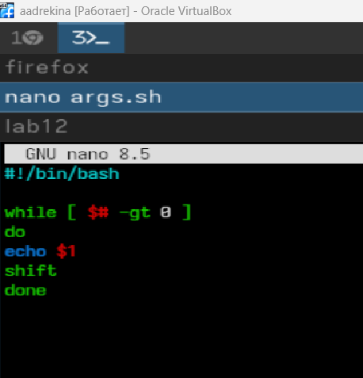
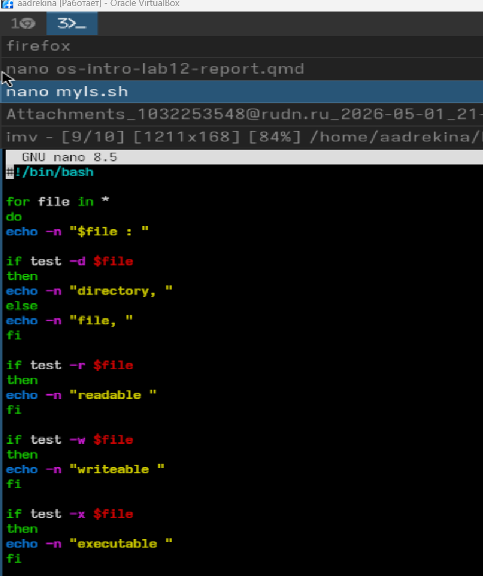
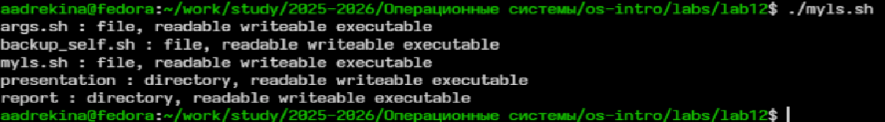
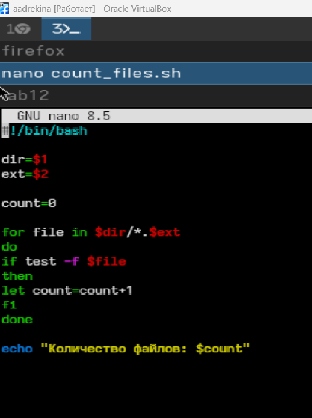

---
## Front matter
lang: ru-RU
title: Лабораторная работа №12
subtitle:Дисциплина: Операционные системы
author:
  - Дрекина Арина Андреевна
institute:
  - Российский университет дружбы народов, Москва, Россия
date: 2026.04.30

## i18n babel
babel-lang: russian
babel-otherlangs: english

## Formatting pdf
toc: false
toc-title: Содержание
slide_level: 2
aspectratio: 169
section-titles: true
theme: metropolis
header-includes:
 - \metroset{progressbar=frametitle,sectionpage=progressbar,numbering=fraction}
---

# Информация


## Докладчик

  * Дрекина Арина Андреевна
  * студентка факультета физико-математических и естественных наук
  * Российский университет дружбы народов им. П. Лумумбы
  * [1032253548@rudn.ru](mailto:1032253548@rudn.ru)

# Цель работы

Изучить основы программирования в оболочке ОС UNIX/Linux. Научиться писать небольшие командные файлы.

# Задание

1. Написать скрипт, который при запуске будет делать резервную копию самого себя (то
есть файла, в котором содержится его исходный код) в другую директорию backup
в вашем домашнем каталоге. При этом файл должен архивироваться одним из архиваторов на выбор zip, bzip2 или tar. Способ использования команд архивации
необходимо узнать, изучив справку.

2. Написать пример командного файла, обрабатывающего любое произвольное число
аргументов командной строки, в том числе превышающее десять. Например, скрипт
может последовательно распечатывать значения всех переданных аргументов.

---

3. Написать командный файл — аналог команды ls (без использования самой этой команды и команды dir). Требуется, чтобы он выдавал информацию о нужном каталоге
и выводил информацию о возможностях доступа к файлам этого каталога.

4. Написать командный файл, который получает в качестве аргумента командной строки
формат файла (.txt, .doc, .jpg, .pdf и т.д.) и вычисляет количество таких файлов
в указанной директории. Путь к директории также передаётся в виде аргумента командной строки.

# Теоретическое введение

Командный процессор — это программа, позволяющая пользователю взаимодействовать с операционной системой
компьютера. В операционных системах типа UNIX/Linux наиболее часто используются
следующие реализации командных оболочек:
– оболочка Борна — стандартная командная оболочка UNIX/Linux,
содержащая базовый, но при этом полный набор функций;

– С-оболочка — надстройка на оболочкой Борна, использующая С-подобный
синтаксис команд с возможностью сохранения истории выполнения команд;

– оболочка Корна — напоминает оболочку С, но операторы управления программой совместимы с операторами оболочки Борна;

– BASH — сокращение от Bourne Again Shell, в основе своей совмещает свойства оболочек С и Корна.

---

Оболочка bash поддерживает встроенные арифметические функции. Команда let
является показателем того, что последующие аргументы представляют собой выражение,
подлежащее вычислению.

например:

```

 $ let x=5
 $ while
 > (( x-=1 ))
 > do
 > something
 > done

```

---

В обобщённой форме оператор цикла for выглядит следующим образом:

```

for имя [in список-значений]
do список-команд
done

```

Оператор выбора case реализует возможность ветвления на произвольное число
ветвей.Пример:

```

case имя in
шаблон1) список-команд;;
шаблон2) список-команд;;
...
esac

```

---

В обобщённой форме оператор цикла while выглядит следующим образом:

```

while список-команд
do список-команд
done

```

---

break завершает выполнение цикла, а continue завершает данную итерацию
блока операторов.
Пример

```

while true
do
if [! -f $file]
then
break
fi
sleep 10
done

```

# Выполнение лабораторной работы

Cоздание файл для работы

{#fig-001 width=100%}

---

Ввод  кода программы

{#fig-002 width=60%}

---

Смена прав доступа

{#fig-003 width=100%}

Запуск файла и вывод

{#fig-004 width=100%}

---

Создание файла и ввод кода

{#fig-005 width=45%}

---

Смена прав доступа.

{#fig-006 width=100%}

---

Запуск программы и вывод.

{#fig-007 width=100%}

---

Новый файл и код программы

{#fig-008 width=40%}

---

Запуск файла и вывод

{#fig-009 width=100%}

---

Новый файл и новый код

{#fig-010 width=45%}

---

Смена прав доступа и запуск с выводом

{#fig-011 width=100%}

# Выводы

В ходе выполнения лабораторной работы мы изучили основы программирования в оболочке ОС UNIX/Linux. Научились писать
небольшие командные файлы.
