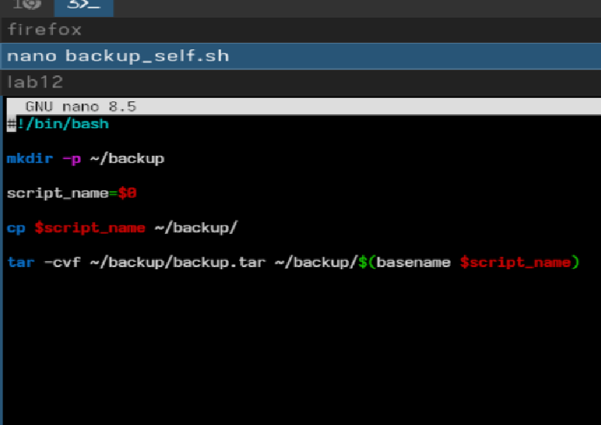
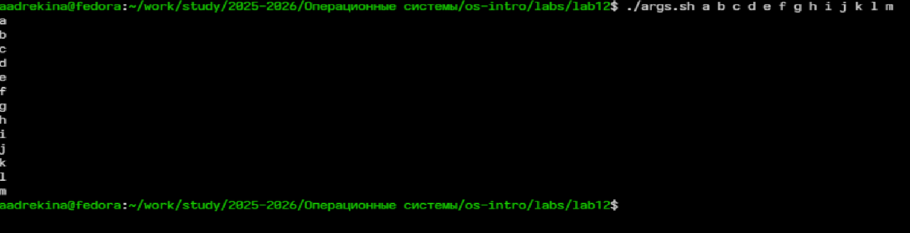

---
## Author
author:
  name: Арина Андреевна Дрекина
  degrees: DSc
  orcid: 0000-0002-0877-7063
  email: 1032253548@rudn.ru
  affiliation:
    - name: Российский университет дружбы народов
      country: Российская Федерация
      postal-code: 117198
      city: Москва
      address: ул. Миклухо-Маклая, д. 6

## Title
title: "Отчет по лабораторной работе №12"
subtitle: "Дисциплина: Операционные системы"
license: "CC BY"
---

# Цель работы

Изучить основы программирования в оболочке ОС UNIX/Linux. Научиться писать небольшие командные файлы.

# Задание

1. Написать скрипт, который при запуске будет делать резервную копию самого себя (то
есть файла, в котором содержится его исходный код) в другую директорию backup
в вашем домашнем каталоге. При этом файл должен архивироваться одним из архиваторов на выбор zip, bzip2 или tar. Способ использования команд архивации
необходимо узнать, изучив справку.

2. Написать пример командного файла, обрабатывающего любое произвольное число
аргументов командной строки, в том числе превышающее десять. Например, скрипт
может последовательно распечатывать значения всех переданных аргументов.

3. Написать командный файл — аналог команды ls (без использования самой этой команды и команды dir). Требуется, чтобы он выдавал информацию о нужном каталоге
и выводил информацию о возможностях доступа к файлам этого каталога.

4. Написать командный файл, который получает в качестве аргумента командной строки
формат файла (.txt, .doc, .jpg, .pdf и т.д.) и вычисляет количество таких файлов
в указанной директории. Путь к директории также передаётся в виде аргумента командной строки.

# Теоретическое введение

Командный процессор (командная оболочка, интерпретатор команд shell) — это программа, позволяющая пользователю взаимодействовать с операционной системой
компьютера. В операционных системах типа UNIX/Linux наиболее часто используются
следующие реализации командных оболочек:
– оболочка Борна (Bourne shell или sh) — стандартная командная оболочка UNIX/Linux,
содержащая базовый, но при этом полный набор функций;

– С-оболочка (или csh) — надстройка на оболочкой Борна, использующая С-подобный
синтаксис команд с возможностью сохранения истории выполнения команд;

– оболочка Корна (или ksh) — напоминает оболочку С, но операторы управления программой совместимы с операторами оболочки Борна;

– BASH — сокращение от Bourne Again Shell (опять оболочка Борна), в основе своей совмещает свойства оболочек С и Корна (разработка компании Free Software Foundation).

- POSIX (Portable Operating System Interface for Computer Environments) — набор стандартов
описания интерфейсов взаимодействия операционной системы и прикладных программ.

Оболочка bash поддерживает встроенные арифметические функции. Команда let
является показателем того, что последующие аргументы представляют собой выражение,
подлежащее вычислению.

например:

```

 $ let x=5
 $ while
 > (( x-=1 ))
 > do
 > something
 > done

```

Весьма необходимой при программировании является команда getopts, которая осуществляет синтаксический анализ командной строки, выделяя флаги, и используется
для объявления переменных. Синтаксис команды следующий:

```

getopts option-string variable [arg ... ]

```

В обобщённой форме оператор цикла for выглядит следующим образом:

```

for имя [in список-значений]
do список-команд
done

```

Оператор выбора case реализует возможность ветвления на произвольное число
ветвей.Пример:

```

case имя in
шаблон1) список-команд;;
шаблон2) список-команд;;
...
esac

```

В обобщённой форме условный оператор if выглядит следующим образом:

```

if список-команд
then список-команд
{elif список-команд
then список-команд}
[else список-команд]
fi

```

В обобщённой форме оператор цикла while выглядит следующим образом:

```

while список-команд
do список-команд
done

```

Два несложных способа позволяют вам прерывать циклы в оболочке bash. Команда
break завершает выполнение цикла, а команда continue завершает данную итерацию
блока операторов.
Пример бесконечного цикла while с прерыванием в момент,
когда файл перестаёт существовать:

```

while true
do
if [! -f $file]
then
break
fi
sleep 10
done

```

# Выполнение лабораторной работы

Для начала я создала файл для дальнейшей работы ([рис. @fig-001]).

{#fig-001 width=100%}

Далее я вбила код программы в файл ([рис. @fig-002])

{#fig-002 width=100%}

Затем я изменила права доступа ([рис. @fig-003])

{#fig-003 width=100%}

Теперь я запустила файл и получила вывод([рис. @fig-004]) 

{#fig-004 width=100%}

Далее я создала новый файл и ввела туда новый код ([рис. @fig-005])

{#fig-005 width=100%}

Теперь я снова изменила права.([рис. @fig-006])

{#fig-006 width=100%}

Потом я запустила файл и получила вывод.([рис. @fig-007])

{#fig-007 width=100%}

Затем я создала новый файл и ввела туда код ([рис. @fig-008])

{#fig-008 width=100%}

Теперь я запустила файл и получила вывод ([рис. @fig-009])

{#fig-009 width=100%}

Потом я создала	новый файл и ввела туда	код ([рис. @fig-010])

{#fig-010 width=100%}

Я изменила права доступа и  запустила файл и получила вывод ([рис. @fig-011])

{#fig-011 width=100%}

# Выводы

В ходе выполнения лабораторной работы мы изучили основы программирования в оболочке ОС UNIX/Linux. Научились писать
небольшие командные файлы.

# Контрольные вопросы

1. Объясните понятие командной оболочки. Приведите примеры командных оболочек. Чем они отличаются?

Командная оболочка (shell) — это программа, которая обеспечивает взаимодействие пользователя с операционной системой. Она принимает команды пользователя, интерпретирует их и передаёт на выполнение системе.

Примеры оболочек из лекции:

Bourne shell (sh) — базовая стандартная оболочка

C shell (csh) — имеет синтаксис, похожий на язык С и поддерживает историю команд

Korn shell (ksh) — сочетает особенности sh и csh

Bash — наиболее распространённая, объединяет возможности sh, csh и ksh

Отличия:

Они отличаются: синтаксисом, набором возможностей, удобством (например, наличие истории команд в csh)

2. Что такое POSIX?

POSIX — это набор стандартов, разработанный IEEE, который описывает интерфейсы взаимодействия операционной системы и программ.

Его основная цель — обеспечить: совместимость разных UNIX/Linux систем, переносимость программного кода

3. Как определяются переменные и массивы в языке программирования bash?

3.1 Переменные:

Определяются присваиванием:

```

a=value

``` 

Использование:

```

echo $a

```

или 

```

echo ${a}

``` 

3.2 Массивы:

Создаются с помощью команды:

```

set -A name value1 value2 value3

```

Доступ:

```

${name[0]}

```

4. Каково назначение операторов let и read?

let используется для арифметических вычислений:

```

let x=x+1

``` 

Позволяет выполнять вычисления, присваивать результат переменной

read считывает данные со стандартного ввода:

```

read a b

```

Используется для ввода данных пользователем

5. Какие арифметические операции можно применять в языке программирования bash?

```

сложение +
вычитание -
умножение *
деление /
остаток %

```

6. Что означает операция (( ))?

Используется для вычислений, условий

Пример:

```

(( x = x - 1 ))

```

7. Какие стандартные имена переменных Вам известны?

```

PATH — пути поиска программ
HOME — домашний каталог
IFS — разделители
MAIL — файл почты
TERM — тип терминала
LOGNAME — имя пользователя
PS1, PS2 — приглашение командной строки

```

8. Что такое метасимволы?

Метасимволы — это специальные символы, имеющие особое значение для оболочки.

Примеры:

```

* ? [ ] < > | \ " &

``` 

Они используются, например, для шаблонов файлов, перенаправления, конвейеров

9. Как экранировать метасимволы?

Чтобы убрать специальный смысл:

Способы:

1.Обратный слэш: 

```

\*

```

2.Одинарные кавычки:

```

'*'

```

3.Двойные кавычки (частично экранируют)

```

"*"

```

10. Как создавать и запускать командные файлы?

Создание это обычный текстовый файл с командами

Для запуска используется команда

```

bash file

``` 

или:

```

chmod +x file
./file

```

11. Как определяются функции в языке программирования bash?

Определяются так:

``` 

function name {
    команды
}

```

Удаление:

```

unset -f name

```

12. Каким образом можно выяснить, является файл каталогом или обычным файлом?

Используется команда test:

```

test -d file   # каталог
test -f file   # обычный файл

```

13. Каково назначение команд set, typeset и unset?

set показывает переменные, используется для массивов

typeset объявляет переменные (например, как целые),работает с функциями

unset удаляет переменные или функции

14. Как передаются параметры в командные файлы?

Передаются при запуске:

```

./script arg1 arg2

``` 

15. Назовите специальные переменные языка bash и их назначение.

```

$* — все аргументы
$# — количество аргументов
$? — код завершения
$$ — ID процесса
$! — ID последнего процесса
$- — флаги оболочки

```

