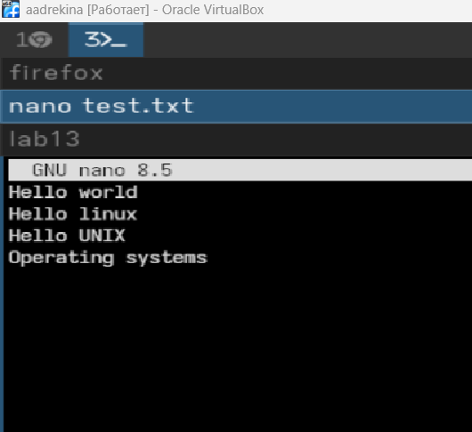
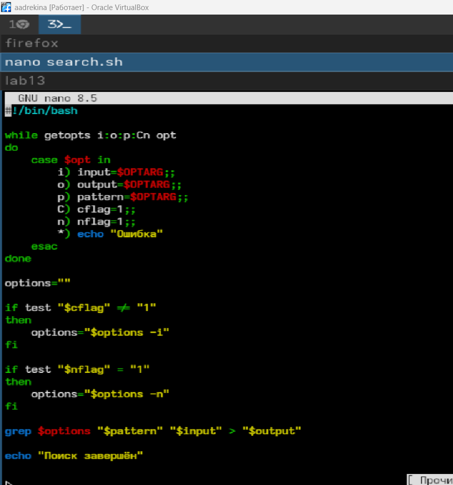
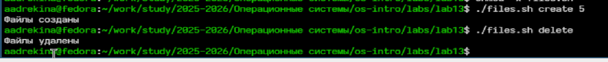
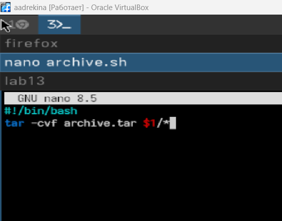
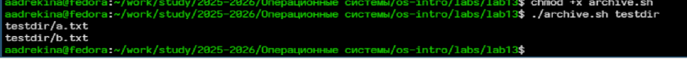

---
## Front matter
lang: ru-RU
title: Лабораторная работа №13
subtitle:Дисциплина: Операционные системы
author:
  - Дрекина Арина Андреевна
institute:
  - Российский университет дружбы народов, Москва, Россия
date: 2026.05.08

## i18n babel
babel-lang: russian
babel-otherlangs: english

## Formatting pdf
toc: false
toc-title: Содержание
slide_level: 2
aspectratio: 169
section-titles: true
theme: metropolis
header-includes:
 - \metroset{progressbar=frametitle,sectionpage=progressbar,numbering=fraction}
---

# Информация

## Докладчик

  * Дрекина Арина Андреевна
  * студентка факультета физико-математических и естественных наук
  * Российский университет дружбы народов им. П. Лумумбы
  * [1032253548@rudn.ru](mailto:1032253548@rudn.ru)

# Цель работы

Изучить основы программирования в оболочке ОС UNIX. Научится писать более
сложные командные файлы с использованием логических управляющих конструкций
и циклов.

# Задание

1. Используя команды getopts grep, написать командный файл, который анализирует
командную строку с ключами:
– -iinputfile — прочитать данные из указанного файла;
– -ooutputfile — вывести данные в указанный файл;
– -pшаблон — указать шаблон для поиска;
– -C — различать большие и малые буквы;
– -n — выдавать номера строк.
а затем ищет в указанном файле нужные строки, определяемые ключом -p.

---

2. Написать на языке Си программу, которая вводит число и определяет, является ли оно
больше нуля, меньше нуля или равно нулю. Затем программа завершается с помощью
функции exit(n), передавая информацию в о коде завершения в оболочку. Командный файл должен вызывать эту программу и, проанализировав с помощью команды
$?, выдать сообщение о том, какое число было введено.

---

3. Написать командный файл, создающий указанное число файлов, пронумерованных
последовательно от 1 до 𝑁 (например 1.tmp, 2.tmp, 3.tmp,4.tmp и т.д.). Число файлов,
которые необходимо создать, передаётся в аргументы командной строки. Этот же командный файл должен уметь удалять все созданные им файлы (если они существуют).

---

4. Написать командный файл, который с помощью команды tar запаковывает в архив
все файлы в указанной директории. Модифицировать его так, чтобы запаковывались
только те файлы, которые были изменены менее недели тому назад (использовать
команду find).

# Теоретическое введение

Командный процессор — это программа, позволяющая пользователю взаимодействовать с операционной системой
компьютера. В операционных системах типа UNIX/Linux наиболее часто используются
следующие реализации командных оболочек:
– оболочка Борна — стандартная командная оболочка UNIX/Linux,
содержащая базовый, но при этом полный набор функций;

– С-оболочка — надстройка на оболочкой Борна, использующая С-подобный
синтаксис команд с возможностью сохранения истории выполнения команд;

– оболочка Корна — напоминает оболочку С, но операторы управления программой совместимы с операторами оболочки Борна;

– BASH — сокращение от Bourne Again Shell, в основе своей совмещает свойства оболочек С и Корна.

---

Оболочка bash поддерживает встроенные арифметические функции. Команда let
является показателем того, что последующие аргументы представляют собой выражение,
подлежащее вычислению.

например:

 $ let x=5
 $ while
 > (( x-=1 ))
 > do
 > something
 > done

Весьма необходимой при программировании является команда getopts, которая осуществляет синтаксический анализ командной строки, выделяя флаги, и >
для объявления переменных. Синтаксис команды следующий:

getopts option-string variable [arg ... ]

---

В обобщённой форме оператор цикла for выглядит следующим образом:

for имя [in список-значений]
do список-команд
done

Оператор выбора case реализует возможность ветвления на произвольное число
ветвей.Пример:

case имя in
шаблон1) список-команд;;
шаблон2) список-команд;;
...
esac

В обобщённой форме условный оператор if выглядит следующим образом:

if список-команд
then список-команд
{elif список-команд
then список-команд}
[else список-команд]
fi

---

В обобщённой форме оператор цикла while выглядит следующим образом:

while список-команд
do список-команд
done

Два несложных способа позволяют вам прерывать циклы в оболочке bash. Команда
break завершает выполнение цикла, а команда continue завершает данную итерацию
блока операторов.
Пример бесконечного цикла while с прерыванием в момент,
когда файл перестаёт существовать:

while true
do
if [! -f $file]
then
break
fi
sleep 10
done

# Выполнение лабораторной работы

Cоздание текстового файла и ввод программы.

{#fig-001 width=45%}

---

Создание еще одного файла для программы.

{#fig-002 width=45%}

---

Запуск программы.

{#fig-003 width=45%}

---

Ввод кода на си.

{#fig-006 width=45%}

---

Еще один код.

{#fig-008 width=45%}

---

Запуск программы.

{#fig-009 width=45%}

---

Новый  код программы

{#fig-010 width=25%}

---

Запуск программы.

{#fig-011 width=45%}

Создалось то количество текстовых файлов, которое я ввела и удалилось.

---

Создание еще одного файла и ввод кода

{#fig-013 width=45%}

---

Запуск программы

{#fig-014 width=45%}

# Выводы

В ходе выполнения лабораторной работы мы изучили основы программирования в оболочке ОС UNIX. Научились писать более
сложные командные файлы с использованием логических управляющих конструкций
и циклов.
