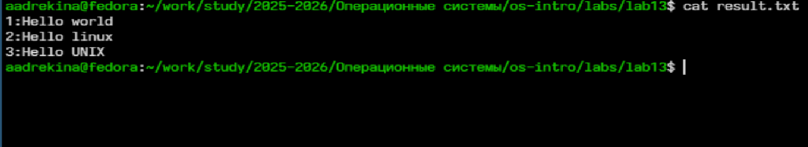
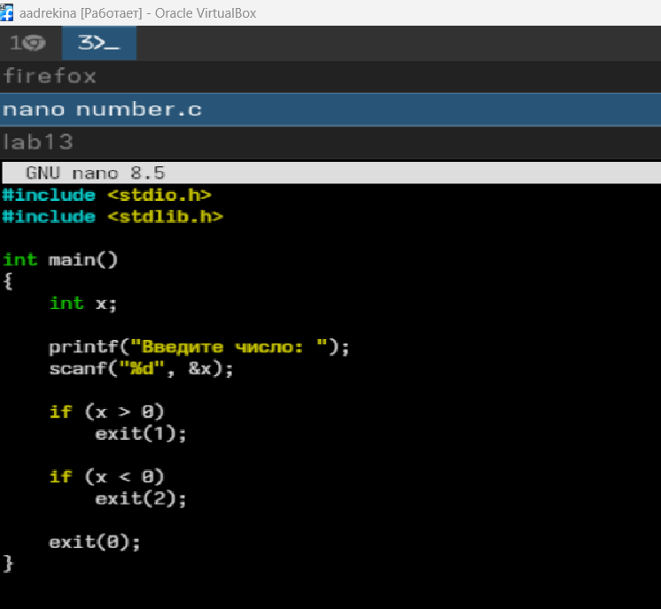
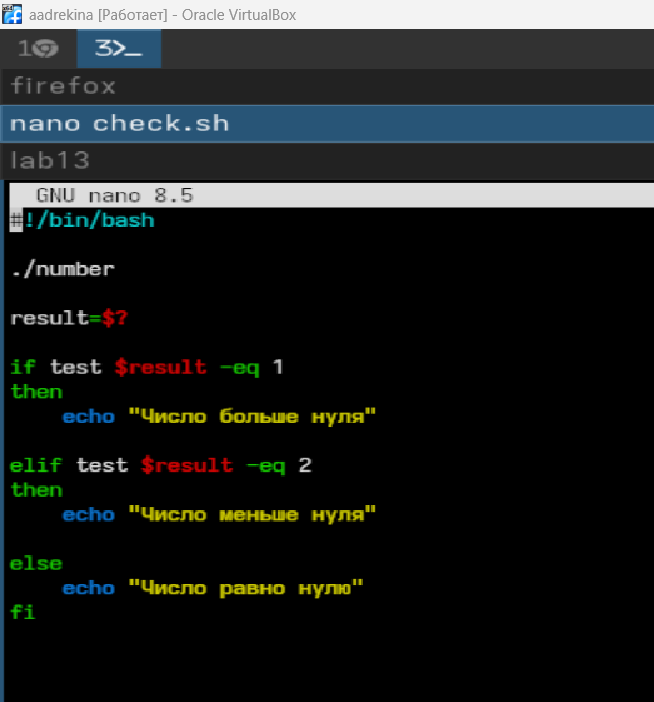
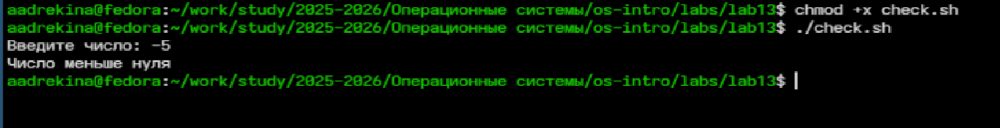
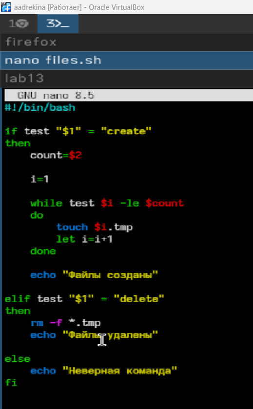

---
## Author
author:
  name: Арина Андреевна Дрекина
  degrees: DSc
  orcid: 0000-0002-0877-7063
  email: 1032253548@rudn.ru
  affiliation:
    - name: Российский университет дружбы народов
      country: Российская Федерация
      postal-code: 117198
      city: Москва
      address: ул. Миклухо-Маклая, д. 6

## Title
title: "Отчет по лабораторной работе №13"
subtitle: "Дисциплина: Операционные системы"
license: "CC BY"
---

# Цель работы

Изучить основы программирования в оболочке ОС UNIX. Научится писать более
сложные командные файлы с использованием логических управляющих конструкций
и циклов.

# Задание

1. Используя команды getopts grep, написать командный файл, который анализирует
командную строку с ключами:
– -iinputfile — прочитать данные из указанного файла;
– -ooutputfile — вывести данные в указанный файл;
– -pшаблон — указать шаблон для поиска;
– -C — различать большие и малые буквы;
– -n — выдавать номера строк.
а затем ищет в указанном файле нужные строки, определяемые ключом -p.

2. Написать на языке Си программу, которая вводит число и определяет, является ли оно
больше нуля, меньше нуля или равно нулю. Затем программа завершается с помощью
функции exit(n), передавая информацию в о коде завершения в оболочку. Командный файл должен вызывать эту программу и, проанализировав с помощью команды
$?, выдать сообщение о том, какое число было введено.

3. Написать командный файл, создающий указанное число файлов, пронумерованных
последовательно от 1 до 𝑁 (например 1.tmp, 2.tmp, 3.tmp,4.tmp и т.д.). Число файлов,
которые необходимо создать, передаётся в аргументы командной строки. Этот же командный файл должен уметь удалять все созданные им файлы (если они существуют).

4. Написать командный файл, который с помощью команды tar запаковывает в архив
все файлы в указанной директории. Модифицировать его так, чтобы запаковывались
только те файлы, которые были изменены менее недели тому назад (использовать
команду find).

# Теоретическое введение

Командный процессор (командная оболочка, интерпретатор команд shell) — это программа, позволяющая пользователю взаимодействовать с операционной
системой
компьютера. В операционных системах типа UNIX/Linux наиболее часто используются
следующие реализации командных оболочек:
– оболочка Борна (Bourne shell или sh) — стандартная командная оболочка UNIX/Linux,
содержащая базовый, но при этом полный набор функций;

– С-оболочка (или csh) — надстройка на оболочкой Борна, использующая С-подобный
синтаксис команд с возможностью сохранения истории выполнения команд;

– оболочка Корна (или ksh) — напоминает оболочку С, но операторы управления программой совместимы с операторами оболочки Борна;

– BASH — сокращение от Bourne Again Shell (опять оболочка Борна), в основе своей совмещает свойства оболочек С и Корна (разработка компании Free Software Foundation).

- POSIX (Portable Operating System Interface for Computer Environments) — набор стандартов
описания интерфейсов взаимодействия операционной системы и прикладных программ.

Оболочка bash поддерживает встроенные арифметические функции. Команда let
- POSIX (Portable Operating System Interface for Computer Environments) — набор стандартов
описания интерфейсов взаимодействия операционной системы и прикладных программ.

Оболочка bash поддерживает встроенные арифметические функции. Команда let
является показателем того, что последующие аргументы представляют собой выражение,
подлежащее вычислению.

например:

```

 $ let x=5
 $ while
 > (( x-=1 ))
 > do
 > something
 > done

```

Весьма необходимой при программировании является команда getopts, которая осуществляет синтаксический анализ командной строки, выделяя флаги, и используется
для объявления переменных. Синтаксис команды следующий:

```

getopts option-string variable [arg ... ]

```

В обобщённой форме оператор цикла for выглядит следующим образом:

```

for имя [in список-значений]
do список-команд
done

```

Оператор выбора case реализует возможность ветвления на произвольное число
ветвей.Пример:


```

case имя in
шаблон1) список-команд;;
шаблон2) список-команд;;
...
esac

```

В обобщённой форме условный оператор if выглядит следующим образом:

```

if список-команд
then список-команд
{elif список-команд
then список-команд}
[else список-команд]
fi

```

В обобщённой форме оператор цикла while выглядит следующим образом:

```

while список-команд
do список-команд
done

```

Два несложных способа позволяют вам прерывать циклы в оболочке bash. Команда
break завершает выполнение цикла, а команда continue завершает данную итерацию
блока операторов.
Пример бесконечного цикла while с прерыванием в момент,
когда файл перестаёт существовать:

```

while true
do
if [! -f $file]
then
break
fi
sleep 10
done

```

# Выполнение лабораторной работы

Для начала я создадим тестовый файл и введем туда код. ([рис. @fig-001])

{#fig-001 width=100%}

Затем я сохранила изменения в файле и создала еще один файл для программы.([рис. @fig-002])

{#fig-002 width=100%}

Затем я изменила права доступа и запустила программу.([рис. @fig-003])

{#fig-003 width=100%}

После выполнения программы создались файлы

Затем я создала новый файл, в котором можно написать прогграмму на си и ввела туда код.([рис. @fig-004])

{#fig-004 width=100%}

Затем я провела компиляцию([рис. @fig-005])

{#fig-005 width=100%}

Затем я создала еще одни файл и ввела туда еще один код.([рис. @fig-006])

{#fig-006 width=100%}

Изменяем права доступа и запускаем программу.([рис. @fig-007])

{#fig-007 width=100%}

Затем я создала еще один файл и ввела туда код программы([рис. @fig-008])

{#fig-008 width=100%}

Затем я изменила права и запустила программу.([рис. @fig-009])

{#fig-009 width=100%}

У меня создалось то количество текстовых файлов, которое я ввела.

Далее я удалила созданные файлы.([рис. @fig-010])

{#fig-010 width=100%}

Для четвертого задания необходимо создать новую дирикторую, а в ней создать еще два текстовых файла.

Потом я создала еще один файл и ввела туда код.([рис. @fig-011])

{#fig-011 width=100%}

Затем мы изменяем права доступа и запускаем программу.([рис. @fig-012])

{#fig-012 width=100%}

# Выводы

В ходе выполнения лабораторной работы мы изучили основы программирования в оболочке ОС UNIX. Научились писать более
сложные командные файлы с использованием логических управляющих конструкций
и циклов.

#Контрольные вопросы

1. Каково предназначение команды getopts?

Команда getopts используется для анализа аргументов командной строки и выделения ключей (флагов).

Она позволяет распознавать опции вида -i, -o, -n, получать аргументы этих опций,
удобно обрабатывать параметры в shell-скриптах

2. Какое отношение метасимволы имеют к генерации имён файлов?

Метасимволы используются для формирования шаблонов имён файлов.

Командный процессор автоматически подставляет вместо шаблона имена файлов, подходящие под условие.

Основные метасимволы:

* — любая последовательность символов
? — любой один символ
[a-z] — любой символ из диапазона

3. Какие операторы управления действиями вы знаете?

Операторы ветвления if, cas
e
Операторы циклов for, while, until

Они используются для организации условий, повторения действий, выбора вариантов выполнения программы

4. Какие операторы используются для прерывания цикла?

Для управления выполнением цикла используются break, continue

5. Для чего нужны команды false и true?

true

Всегда возвращает код завершения:

0

то есть «истина».

false

Всегда возвращает ненулевой код завершения:
то есть «ложь».

Они используются в условиях, в бесконечных циклах, при тестировании логики shell-скриптов

6. Что означает строка if test -f man$s/$i.$s, встреченная в командном файле?

Эта строка проверяет существует ли обычный файл с указанным именем

7. Объясните различия между конструкциями while и until.

while  выполняется пока условие истинно.

until выполняется пока условие ложно.
