---
## Front matter
lang: ru-RU
title: Отчет о выполнение внешнего курса, второй блок
subtitle:Дисциплина: Операционные системы
author:
  - Дрекина Арина Андреевна
institute:
  - Российский университет дружбы народов, Москва, Россия
date: 2026.05.16

## i18n babel
babel-lang: russian
babel-otherlangs: english

## Formatting pdf
toc: false
toc-title: Содержание
slide_level: 2
aspectratio: 169
section-titles: true
theme: metropolis
header-includes:
 - \metroset{progressbar=frametitle,sectionpage=progressbar,numbering=fraction}
---
## Информация

---

## Докладчик

  * Дрекина Арина Андреевна
  * студентка факультета физико-математических и естественных наук
  * Российский университет дружбы народов им. П. Лумумбы
  * [1032253548@rudn.ru](mailto:1032253548@rudn.ru)

---

# Цель работы

Основной задачей настоящей работы является знакомство с	основами ОС Linux,
приобретение навыков работы в командном интерпретаторе, получение практических умений по администрированию серверной 
инфраструктуры и написанию сценариев на языке bash посредством освоения стороннего обучающего онлайн-курса.

# Теоретическое введение

Linux (Линукс) представляет собой семейство Unix-подобных операционных систем с открытым кодом,
которые строятся на основе одноимённого ядра.
В отличие от ОС Windows, Linux распространяется бесплатно,
даёт широкие возможности для тонкой настройки,
отличается высокой защищённостью и массово применяется на серверном оборудовании, 
в суперкомпьютерных системах, на мобильных устройствах под управлением Android, а также в компонентах интернета вещей.

# Выполнение лабораторной работы

Задание 2.1

Вопрос: Какие задачи может решать удаленный сервер?

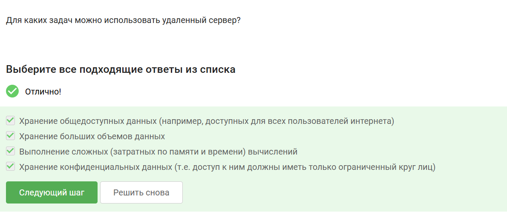{#fig-001 width=45%}

Пояснение по выбору ответа: Так как серверы могут использоваться для самых разных целей, были отмечены все четыре предложенных варианта,
включая хранение любых типов данных и выполнение вычислительных операций.

---

Задание 2.2
Вопрос: Какой из ключей, создаваемых ssh-keygen, разрешено пересылать другим пользователям? 

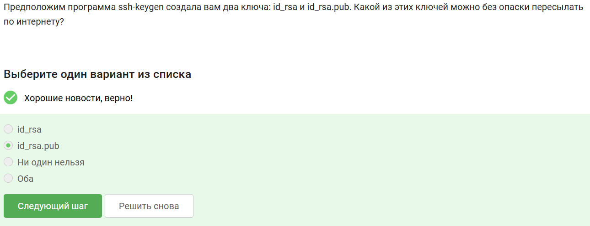{#fig-002 width=45%}

Пояснение по выбору ответа: Файл id_rsa.pub представляет собой открытую часть ключа, которую разрешается и безопасно передавать другим
пользователям или системам для настройки аутентификации

---

Задание 2.3

Вопрос: С помощью какой команды можно скопировать целую директорию на удаленный сервер?

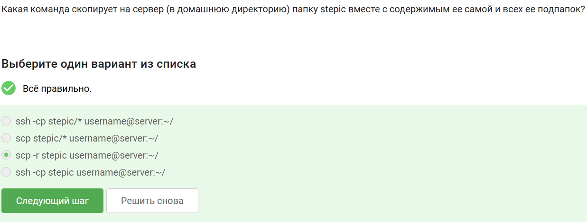{#fig-003 width=45%}

Пояснение по выбору ответа: Был выбран вариант scp -r stepic username@server:~/ (рекурсивное копирование по защищенному протоколу).

---

Задание 2.4 

Вопрос: Что делать, если терминал сообщает, что не может найти пакет для установки?

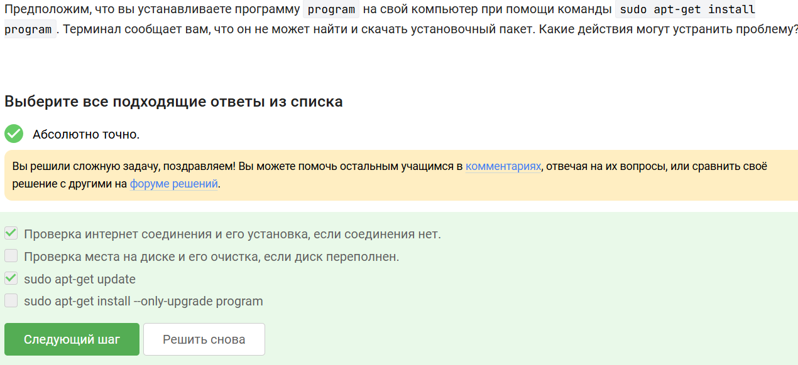{#fig-004 width=45%}

Пояснение по выбору ответа: В такой ситуации требуется проверить наличие подключения к интернету либо обновить локальный кэш списка пакетов
с помощью команды 'sudo apt-get update' 

---

Задание 2.5

Вопрос: С какой целью применяется программа Filezilla?

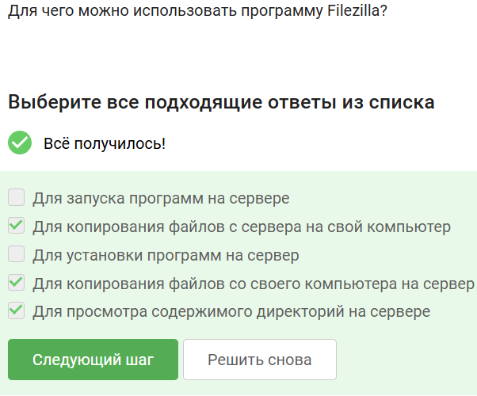{#fig-005 width=45%}

Пояснение по выбоору ответа: Данное приложение дает возможность просматривать просматривать содержимое каталогов как на локальном,
так и на удаленной машине, а также копировать файлы между ними.

---

Задание 2.6

Вопросы: Как можно запустить графическое приложение, находясь на сервере? Как можно запустить графическое приложение, находясь на сервере?

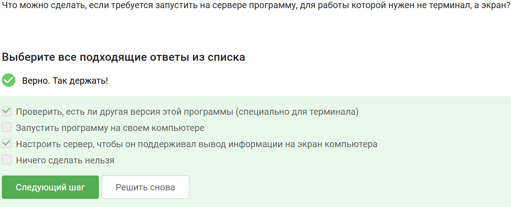{#fig-006 width=45%}

Пояснение по выбору ответа: Существует несколько способов: настроить проброс графики (X11 forwarding), запустить программу локально, либо найти консольную версию, выполняющую те же функции.

---

Задание 2.7

Вопрос: Какими способами можно получить справочную информацию о команде или программе?

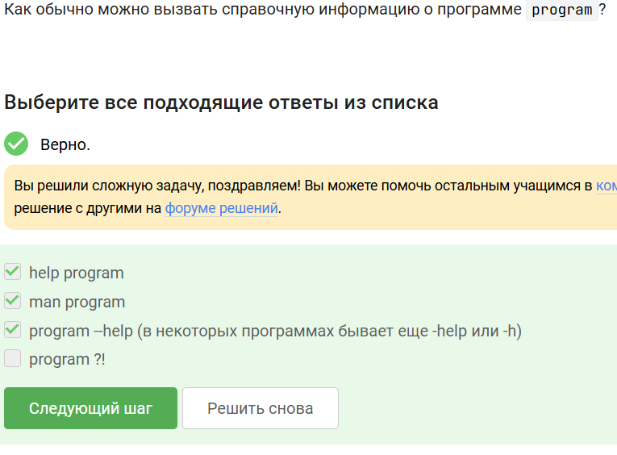{#fig-007 width=45%}

Пояснение по выбору ответа: Основными способами являются использование команды man название_программы (открывается руководство) либо вызов встроенной подсказки через название_программы –help.

---

Задание 2.8

Вопрос: Какие форматы входных данных поддерживает утилита FastQC?

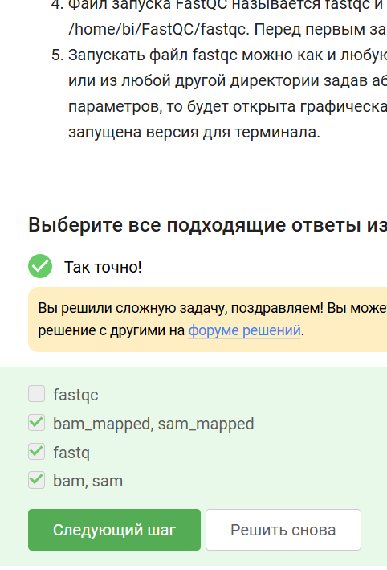{#fig-008 width=45%}

Пояснение по выбору ответа: Согласно справочной странице (man fastqc), данная утилита работает со следующими форматами: fastq, bam, sam, bam_mapped, sam_mapped.

---

Задание 2.9 (Интерактивное)

Вопрос: Как запустить Clustal для выполнения множественного выравнивания последовательностей?

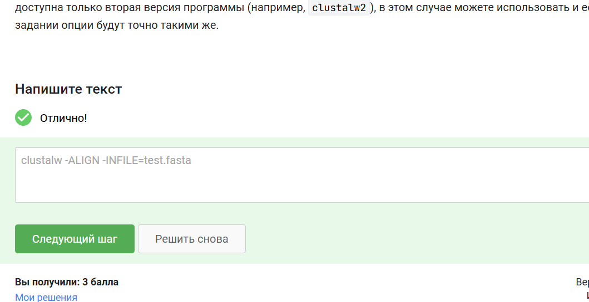{#fig-009 width=45%}

Пояснение по выполнению: Предварительно была изучена встроенная документация, после чего составлена корректная команда: clustalw -infile=test.fasta -align.

---

Задание 2.10

Вопрос: Какие процессы будут показаны командой jobs, если одна из запущенных программ была прервана через Ctrl+C?

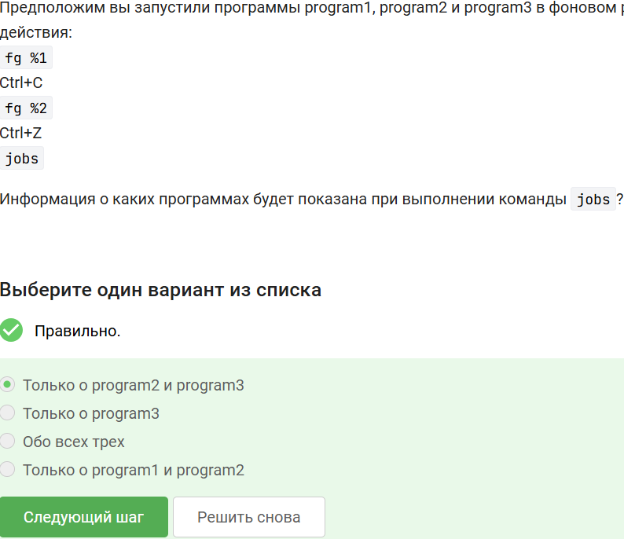{#fig-010 width=45%}

Пояснение по выбору ответа: Первая запущенная программа была прервана сочетанием клавиш Ctrl+C, поэтому команда jobs отобразит только второй и третий процессы (находящиеся в состоянии выполнения или остановки).

---

Задание 2.11

Вопрос: Почему идентификаторы процессов в выводе команд jobs, top и ps могут различаться?

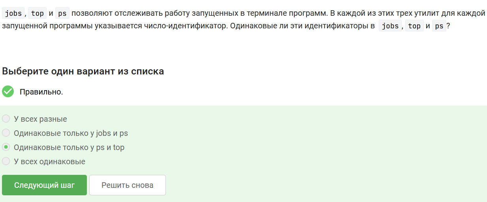{#fig-011 width=45%}

Пояснение по выбору ответа: В этих командах используются разные типы идентификаторов: jobs оперирует номерами заданий внутри текущей оболочки (job ID), тогда как top и ps показывают системные идентификаторы процессов (PID).

---

Задание 2.12

Вопрос: Как можно мгновенно и гарантированно завершить процесс?

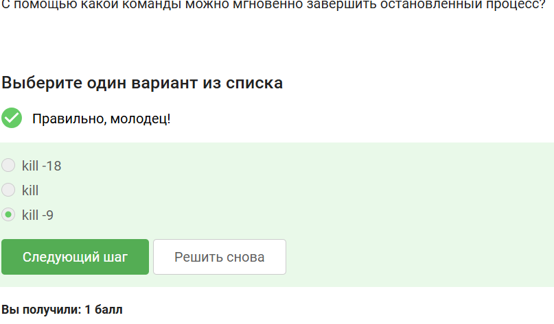{#fig-012 width=45%}

Пояснение по выбору ответа: Сигнал SIGKILL невозможно перехватить или проигнорировать приложением. Команда kill -9 гарантированно завершает процесс немедленно и безусловно.

---

Задание 2.13

Вопрос: Что произойдёт, если отправить сигнал kill процессу, который находится в остановленном состоянии (после Ctrl+Z)?

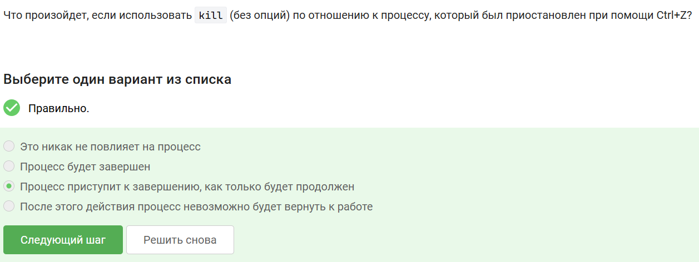{#fig-013 width=45%}

Пояснение по выбору ответа: Сигнал номер 15 (используемый по умолчанию) будет передан процессу и обработан только после того, как процесс будет возобновлён командами fg или bg.

---

Задание 2.14

Вопрос: Какое количество вычислительных ресурсов (процессорного времени) потребляет остановленный (приостановленный) процесс? 

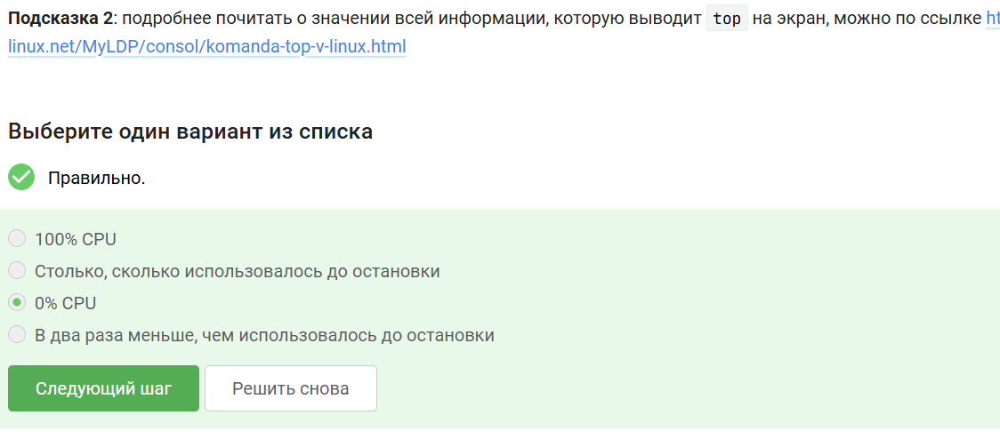{#fig-014 width=45%}

Пояснение по выбору ответа: Приостановленный процесс полностью исключается из очереди планировщика центрального процессора, следовательно, его потребление процессорного времени равно 0%.

---

Задание 2.15

Вопрос: Что происходит с оперативной памятью, занятой процессом, когда его останавливают (Ctrl+Z)? 

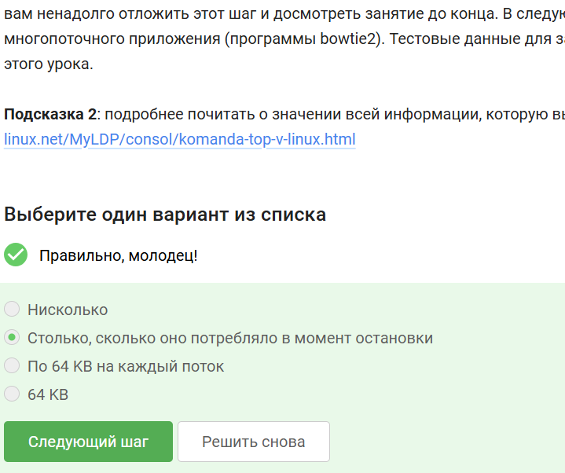{#fig-015 width=45%}

Пояснение по выбору ответа: Оперативная память не освобождается в момент приостановки задачи. Процесс продолжает занимать ровно столько ОЗУ, сколько было выделено на момент его остановки.

---

Задание 2.16

Вопрос: Как завершить не весь процесс, а только один из его потоков?

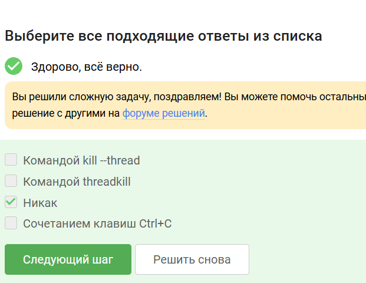{#fig-016 width=45%}

Пояснение по выбору ответа: Штатными системными утилитами выполнить такое действие невозможно. Команда kill отправляет сигнал всему процессу целиком (то есть всей группе потоков сразу).

---

Задание 2.17

Вопрос: Поддерживает ли утилита bowtie2 многопоточность и для каких именно операций?

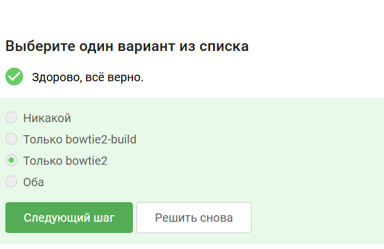{#fig-017 width=45%}

Пояснение по выбору ответа: Как следует из руководства (man), параметр -p (задающий число потоков) присутствует только в команде выравнивания bowtie2, но отсутствует в команде bowtie2-build.

---

Задание 2.18

Вопрос: Что произойдёт, если попытаться выполнить команду fg в другой вкладке терминала, отличной от той, где был запущен фоновый процесс?

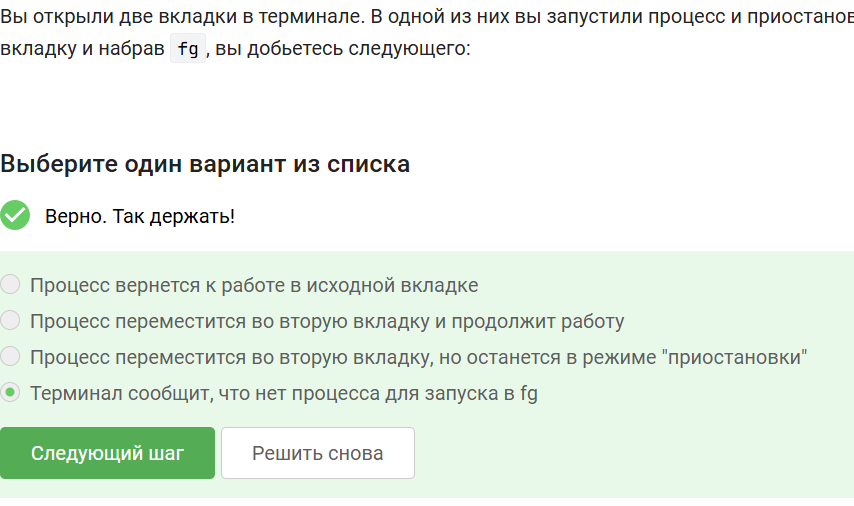{#fig-018 width=45%}

Пояснение по выбору ответа: Управление заданиями (job control) действует исключительно в пределах одной сессии bash. При попытке вызвать fg из другой вкладки терминал сообщит, что фоновых задач не обнаружено.

---

Задание 2.19

Вопрос: Что случится, если ввести exit в последней (единственной) открытой вкладке tmux?

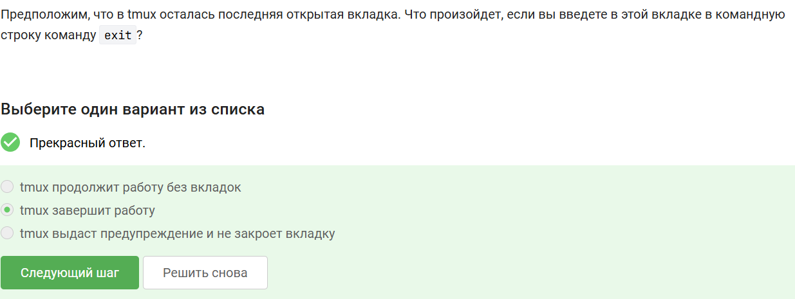{#fig-019 width=45%}

Пояснение по выбору ответа: После ввода exit в последней (единственной) вкладке текущая сессия tmux будет закрыта, сама утилита tmux завершит своё выполнение, и пользователь вернётся в обычный терминал.

---

Задание 2.20

Вопрос: Если закрыть окно терминала, в котором была активна сессия tmux на удалённом сервере, что произойдёт с процессами внутри tmux?

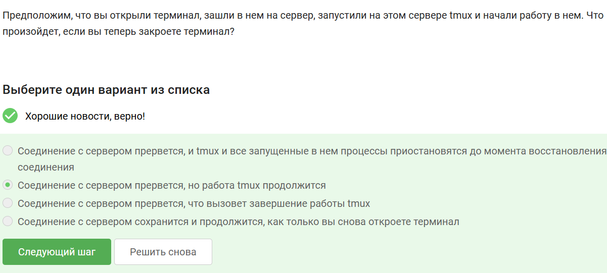{#fig-020 width=45%}

Пояснение по выбору ответа: SSH-соединение разорвётся, однако сессия tmux останется активной на сервере в фоновом режиме. Запущенные внутри процессы продолжают выполняться и не будут прерваны.

---

Задание 2.21

Вопрос: Что произойдёт с фоновыми процессами, если принудительно закрыть вкладку tmux, в которой они выполняются?

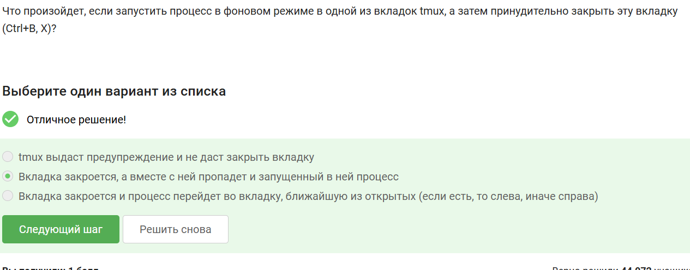{#fig-021 width=45%}

Пояснение по выбору ответа: В случае уничтожения окна tmux все дочерние процессы (включая саму оболочку и всё, что в ней запущено) будут принудительно завершены.

---

Задание 2.22

Вопрос: Какая команда (или сочетание клавиш) в tmux отвечает за переименование текущей вкладки?

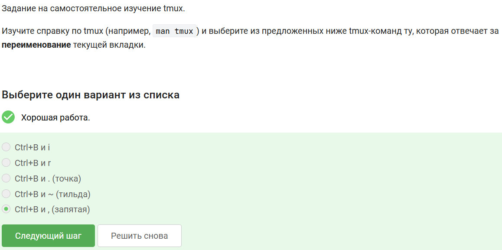{#fig-022 width=45%}

Пояснение по выбору ответа: Стандартная комбинация клавиш для переименования текущей вкладки — это Ctrl+B с последующим нажатием запятой (,).

---

Задание 2.23

Вопрос: Как работают сплиты (разделения панелей) внутри tmux и как команды разделения применяются к вкладкам?

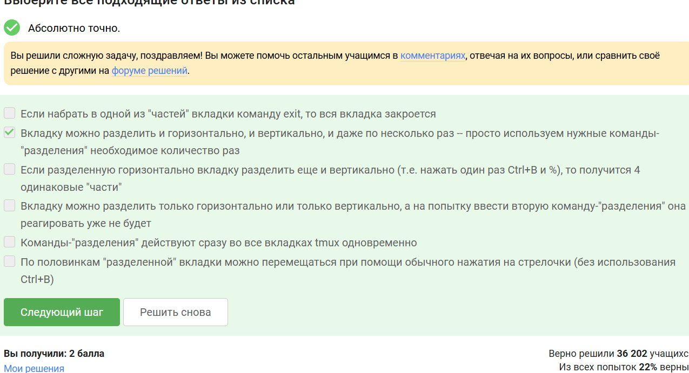{#fig-023 width=45%}

Пояснение по выбору ответа: Создаваемые разделения (панели, сплиты) являются изолированными друг от друга. Верным утверждением считается то, что команды для разделения применяются локально к активной в данный момент панели, формируя иерархическую структуру мелких окон.

# Выводы

В процессе прохождения заданий стороннего онлайн-курса были освоены и отработаны 
на практике основные принципы работы с операционной системой Linux.
Однако самым важным итогом стал полученный сертификат об окончании.

