---
## Front matter
lang: ru-RU
title: Отчет о выполнение внешнего курса, третий блок
subtitle:Дисциплина: Операционные системы
author:
  - Дрекина Арина Андреевна
institute:
  - Российский университет дружбы народов, Москва, Россия
date: 2026.05.16

## i18n babel
babel-lang: russian
babel-otherlangs: english

## Formatting pdf
toc: false
toc-title: Содержание
slide_level: 2
aspectratio: 169
section-titles: true
theme: metropolis
header-includes:
 - \metroset{progressbar=frametitle,sectionpage=progressbar,numbering=fraction}
---
## Информация

---

## Докладчик

  * Дрекина Арина Андреевна
  * студентка факультета физико-математических и естественных наук
  * Российский университет дружбы народов им. П. Лумумбы
  * [1032253548@rudn.ru](mailto:1032253548@rudn.ru)

---

# Цель работы

Основной задачей настоящей работы является знакомство с	основами ОС Linux,
приобретение навыков работы в командном интерпретаторе, получение практических умений по администрированию серверной 
инфраструктуры и написанию сценариев на языке bash посредством освоения стороннего обучающего онлайн-курса.

# Теоретическое введение

Linux (Линукс) представляет собой семейство Unix-подобных операционных систем с открытым кодом,
которые строятся на основе одноимённого ядра.
В отличие от ОС	Windows, Linux распространяется бесплатно,
даёт широкие возможности для тонкой настройки,
отличается высокой защищённостью и массово применяется на серверном оборудовании,
в суперкомпьютерных системах, на мобильных устройствах под управлением Android, а также в компонентах интернета вещей.

# Выполнение лабораторной работы

Задание 3.1

Вопрос: Каким образом можно закрыть редактор vim без сохранения изменений?

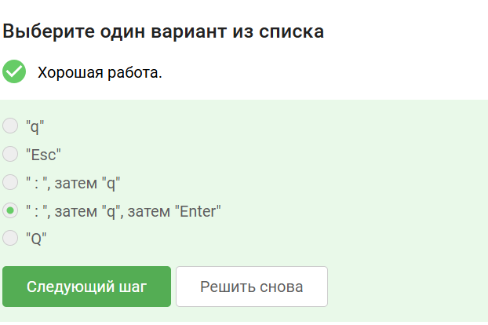{#fig-001 width=45%}

Пояснение по выбору: Нужно перейти в командный режим и ввести команду выхода без сохранения нажать ; , а затем q , затем Enter

---

Задание 3.2

Вопрос: Как vim осуществляется перемещение между словами с учетом word и WORD? 

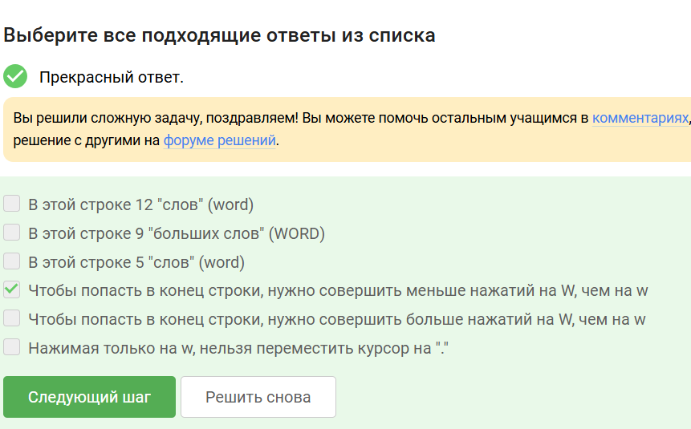{#fig-002 width=45%}

Поянение по выбору: Строчные клавиши w учитывают спецсимволы как разделители, а заглавные W - только пробелы. Были подсчитаны слова по этим
правилам.

---

Задание 3.3 (Интерактивное)

Вопрос: Как в vim выполнить замену, затрагивающую только первое вхождение образца в каждой строке

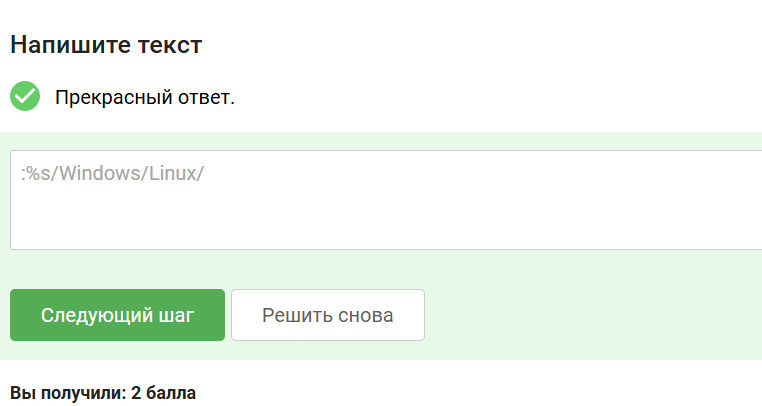{#fig-003 width=45%}

Пояснение по выполнению: Чтобы заменить только первое вхождение слова в каждой строке, глобальный флаг g не ставится. Команда: :%s/Windows/Linux/.

---

Задание 3.4

Вопрос: Какие утверждения о режиме Visual в vim являются верными? 

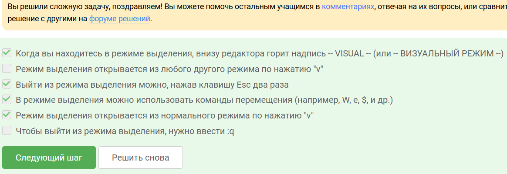{#fig-004 width=45%}

Пояснение по выбору ответа: В визуальном режиме можно перемещаться (w, $), копировать (y), удалять (d). Индикатор режима — надпись – VISUAL –.

---

Задание 3.5

Вопрос: Как bash хранит историю выполненных команд в рамках одной сессии?

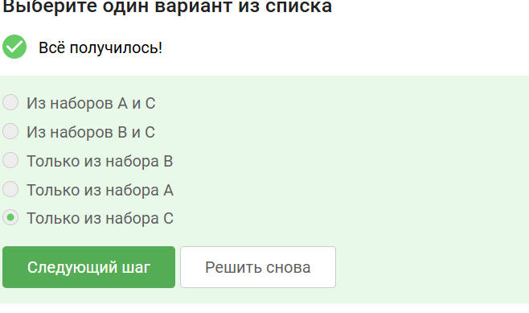{#fig-005 width=45%}

Пояснение по выбору ответа: Каждая запущенная подоболочка хранит свою локальную историю команд до завершения сеанса (Набор С).

---

Задание 3.6

Вопрос: Каким будет абсолютный путь к файлу file1.txt, созданному командой touch file1.txt после выполнения cd /home/bi/?

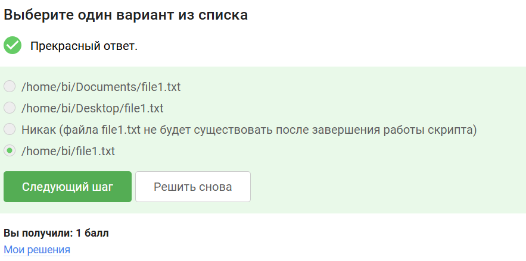{#fig-006 width=45%}

Пояснение по выбору ответа: Команда была выполнена после cd /home/bi/, значит путь будет /home/bi/file1.txt. Дальнейшие cd на файл уже не влияют.

---

Задание 3.7

Вопрос: Какие имена переменных в bash являются допустимыми?

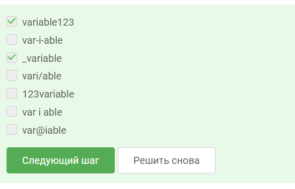{#fig-007 width=45%}

Пояснение по выбору ответа: Разрешены буквы, цифры и символ _. Имя не может начинаться с цифры и не должно содержать спецсимволов (вроде @).

---

Задание 3.8 (Интерактивное)

Вопрос: Напишите скрипт, который выводит переданные ему аргументы.

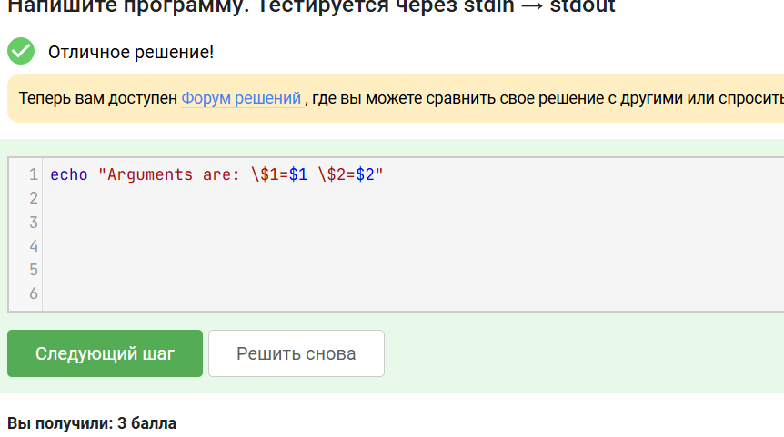{#fig-008 width=45%}

Пояснение по выполнению: Написан скрипт, использующий встроенные переменные позиционных аргументов 1и1и2.

---

Задание 3.9

Вопрос: Какие условия в конструкции if всегда будут истинными независимо от контекста?

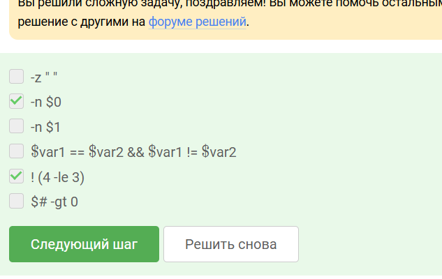{#fig-009 width=45%}

Пояснение по выбору ответа: Конструкция # -ge 0 (число аргументов ≥ 0), 5 -ge 5 и проверка непустого имени скрипта -n 0 всегда истинны.

---

Задание 3.10

Вопрос: Как будет работать ветвление в скрипте, если переменной var присвоить значения 3 или 5?

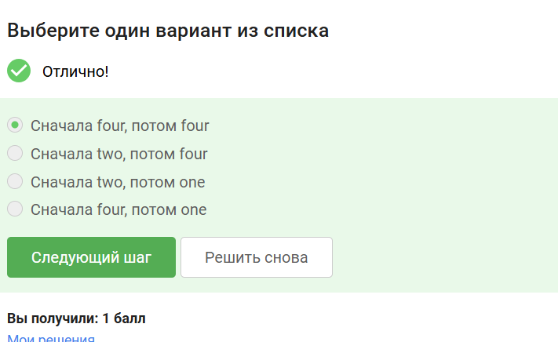{#fig-010 width=45%}

Пояснение по выбору ответа: Согласно коду, в обоих случаях (var=3, var=5) не выполняется ни одно из условий if/elif, поэтому срабатывает блок else (выводит “four”).

---

Задание 3.11 (Интерактивное)

Вопрос: Реализуйте скрипт, который правильно склоняет слово «студент» в зависимости от введённого числа.

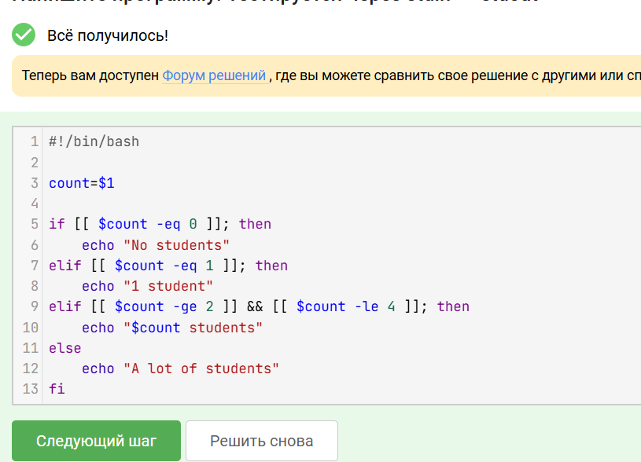{#fig-011 width=45%}

Пояснение по выполнению: Реализовано ветвление на bash с проверкой входа (-eq 0, -eq 1, -ge 2 && -le 4) для правильного склонения числительных.

---

Задание 3.12

Вопрос: Сколько раз в цикле будут выведены строки «start» и «finish»? 

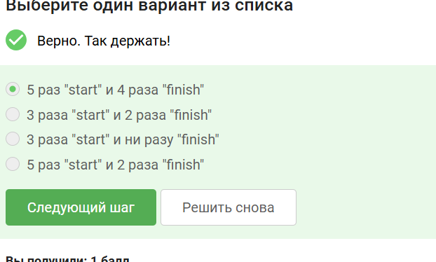{#fig-012 width=45%}

Пояснение по выбору ответа: Цикл исполняется 5 раз (“start”). На одной из итераций срабатывает continue, обрывая текущий шаг, поэтому “finish” выводится 4 раза.

---

Задание 3.13 (Интерактивное)

Вопрос: Напишите скрипт, который определяет возрастную группу пользователя (ребёнок, молодёжь, взрослый).

{#fig-013 width=45%}

Пояснение по выполнению: Написан while true цикл с командой read. Логика if/elif распределяет пользователя в группу child/youth/adult и завершает цикл при вводе 0 или пустоты.

---

Задание 3.14

Вопрос: Какие способы увеличения значения переменной в bash являются корректными?

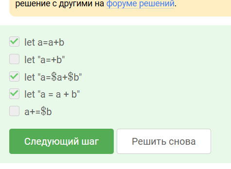{#fig-014 width=45%}

Пояснение по выбору ответа: Все 5 предложенных вариантов использования команды let (с кавычками, без, с +=) синтаксически корректно отрабатывают сложение в bash.

---

Задание 3.15

Вопрос: Что выведет команда echo «pwd» с обратными кавычками?

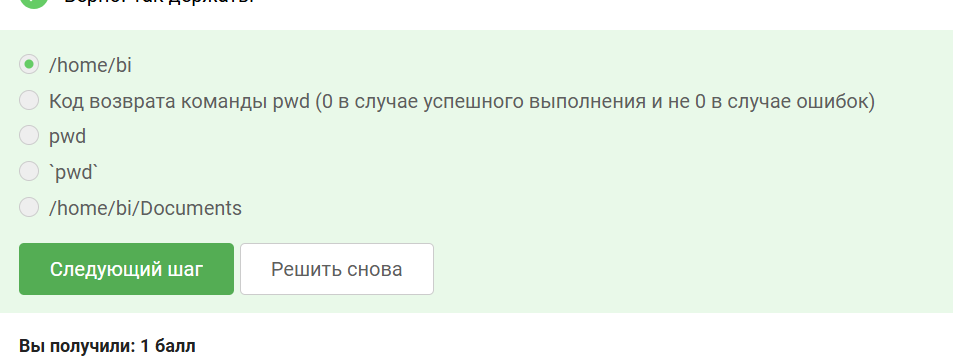{#fig-015 width=45%}

Пояснение по выбору ответа: Обратные кавычки вызывают команду внутри subshell. Результат «pwd» (путь /home/bi) подставляется в команду echo.

---

Задание 3.16

Вопрос: Как правильно работать с кодом возврата (exit code) программы в bash?

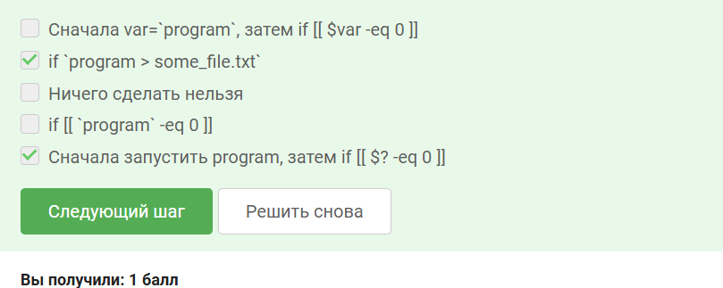{#fig-016 width=45%}

Пояснение по выбору ответа: Переменная ?храниткодзавершенияпоследнейпрограммы.Правильнаяконструкция:Запуститьprogram,затемпроверитьif[[?храниткодзавершенияпоследнейпрограммы.Правильнаяконструкция:Запуститьprogram,затемпроверитьif[[? -eq 0 ]].

---

Задание 3.17

Вопрос: Как работает область видимости переменных в bash на примере локальной и глобальной переменных? 

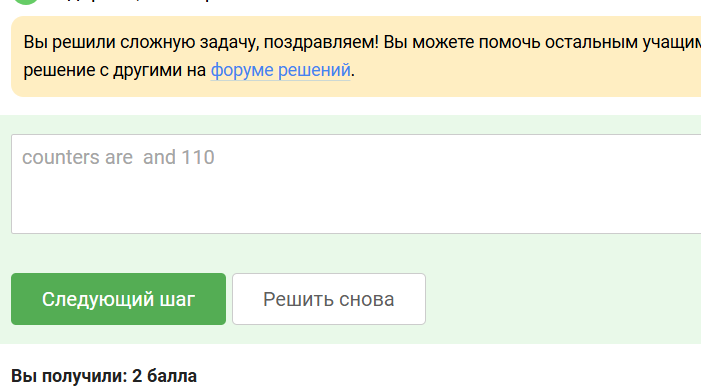{#fig-017 width=45%}

Пояснение по выбору ответа: Ключевое слово local оставляет c1 внутри функции. Переменная c2 глобальна, она аккумулируется в цикле, выдавая 55 и 110.

---

Задание 3.18 (Интерактивное)

Вопрос: Реализуйте скрипт для нахождения наибольшего общего делителя (НОД) по алгоритму Евклида.

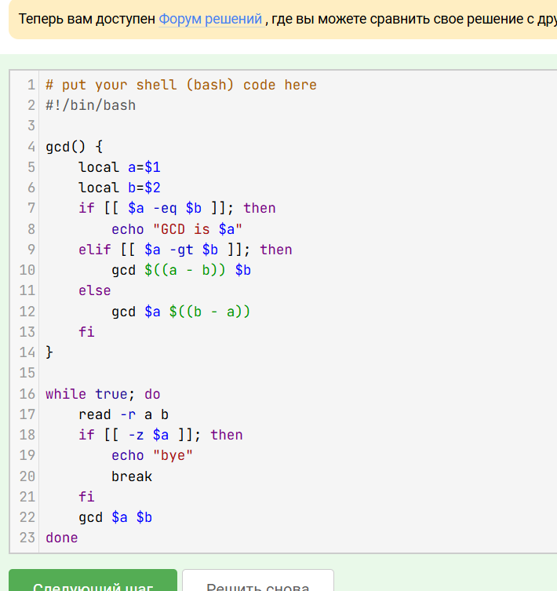{#fig-018 width=45%}

Пояснение по выполнению: Написана рекурсивная функция gcd, которая вычитает меньшее число из большего, пока они не сравняются.

---

Задание 3.19 (Интерактивное)

Вопрос: Напишите скрипт-калькулятор, выполняющий арифметические операции на основе введённого знака.

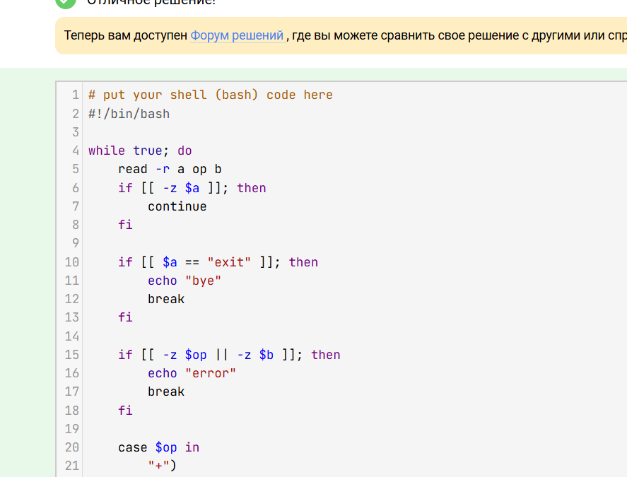{#fig-019 width=45%}

Пояснение по выполнению: Использована конструкция case для обработки знаков арифметических операций и перехвата ошибок при неверном вводе.

---

Задание 3.20

Вопрос: В чём разница между параметрами -name и -iname команды find?

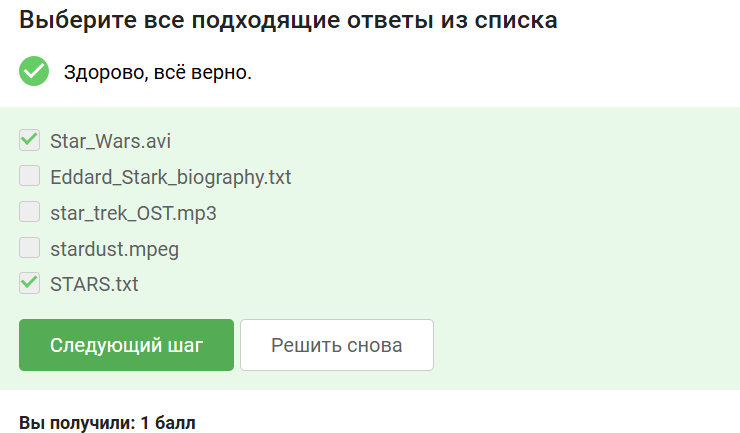{#fig-020 width=45%}

Пояснение по выбору ответа: Флаг -iname игнорирует регистр символов. Поэтому он найдет STARS.txt и Star_Wars.avi, в то время как строгий -name их пропустит.

---

Задание 3.21

Вопрос: Как правильно понимать различие между find -path и find -name?

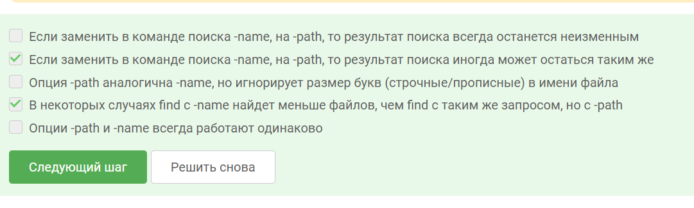{#fig-021 width=45%}

Пояснение по выбору ответа: path ищет совпадения по всему абсолютному пути, а name — только по имени файла. Иногда результаты могут совпадать или name найдет больше (если паттерн не включает слеши).

---

Задание 3.22

Вопрос: Как параметры mindepth и maxdepth влияют на глубину поиска файлов?

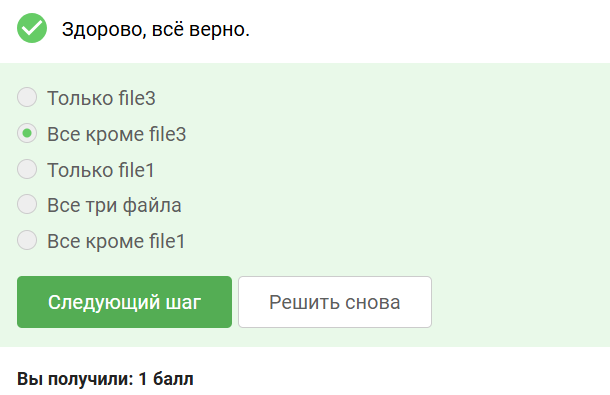{#fig-022 width=45%}

Пояснение по выбору ответа: Установленные лимиты (глубина 2 и 3) отсекают файл file3, который лежит на глубине 4. Остальные будут найдены.

---

Задание 3.23

Вопрос: Как работают ключи контекста grep (-A, -B, -C) в случае, когда искомое слово встречается в каждой строке файла?

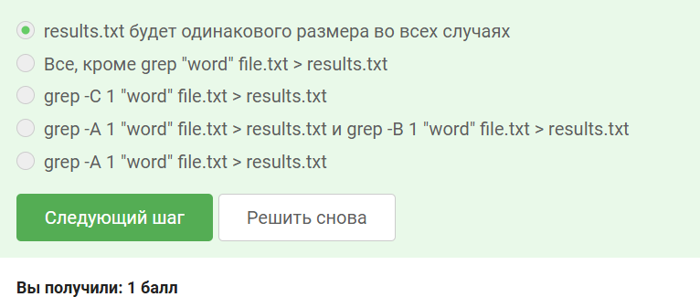{#fig-023 width=45%}

Пояснение по выбору ответа: Поскольку слово “word” есть в каждой строке файла, ключи контекста (до, после) не добавят новых строк. Размер файла во всех случаях одинаков.

---

Задание 3.24

Вопрос: Как работает регулярное выражение [xkLХKL]?[uU]buntuвgrep−E и почему фраза«Hmm,XKLubuntu» не подходит?

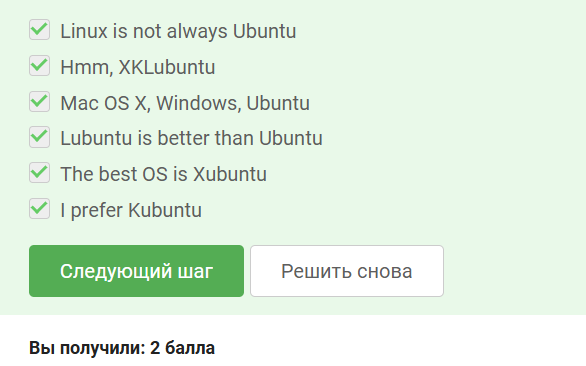{#fig-024 width=45%}

Пояснение по выбору ответа: Регулярноевыражение[xkLХKL]?[uU]buntuвgrep−Eипочемуфраза«Hmm,XKLubuntu»неподходит?Пояснениеповыборуответа:Регулярноевыражение[xkLХKL]?[uU]buntu означает опциональную первую букву.

---

Задание 3.25

Вопрос: Как ведёт себя sed при выполнении подстановки без ключа -n?

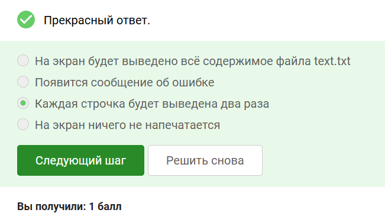{#fig-025 width=45%}

Пояснение по выбору ответа: Без “тихого режима” sed выводит паттерн (из-за флага /p) и одновременно дублирует стандартный вывод (по умолчанию), выводя строки дважды.

---

Задание 3.26 (Интерактивное)

Вопрос: Напишите регулярное выражение в sed, которое заменяет аббревиатуры (слова из двух и более заглавных букв) на слово «abbreviation».

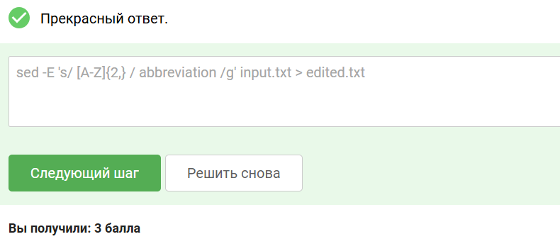{#fig-026 width=45%}

Пояснение по выполнению: Запрос sed -E ‘s/ [A-Z]{2,} / abbreviation /g’ находит слова из двух и более заглавных латинских букв, окруженные пробелами.

---

Задание 3.27

Вопрос: Какая опция gnuplot позволяет предотвратить закрытие окна с графиком после завершения выполнения скрипта?

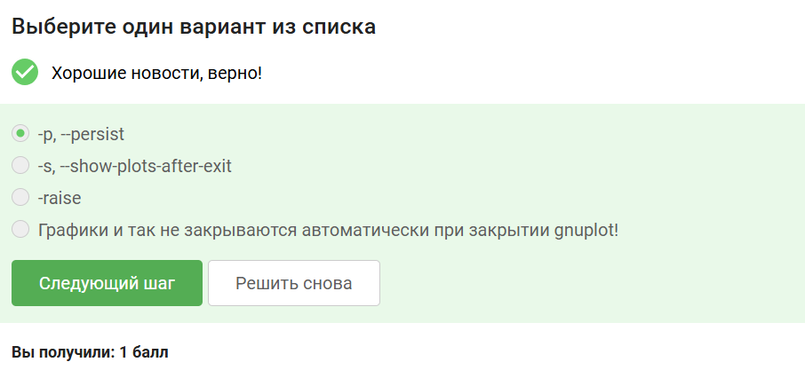{#fig-027 width=45%}

Пояснение по выбору ответа: Ключ -p или –persist заставляет графическое окно X11 оставаться открытым после завершения скрипта рисования.
 
# Выводы

В процессе прохождения заданий стороннего онлайн-курса были освоены и отработаны на практике основные принципы 
работы с POSIX-совместимыми операционной системой Linux. Однако самым важным итогом стал полученный сертификат.
