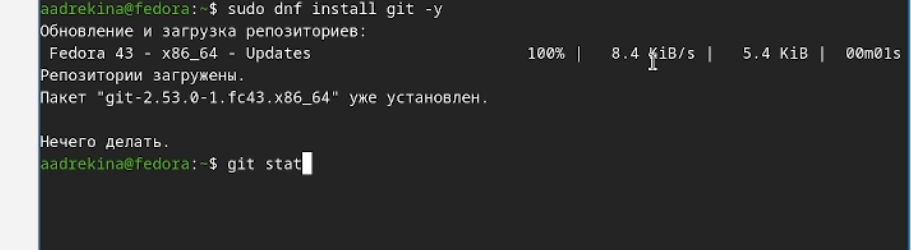
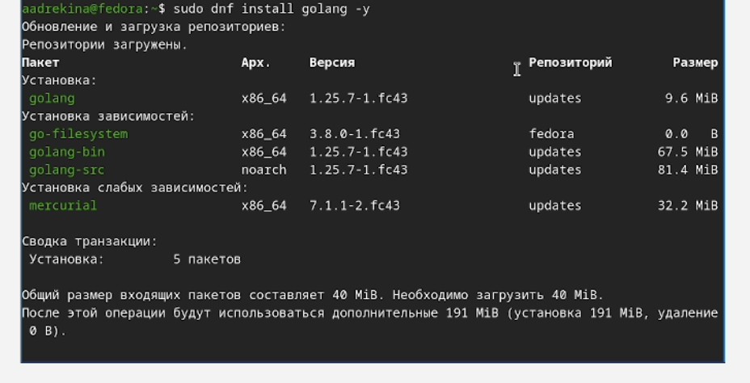
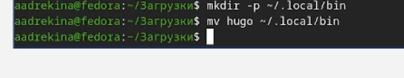
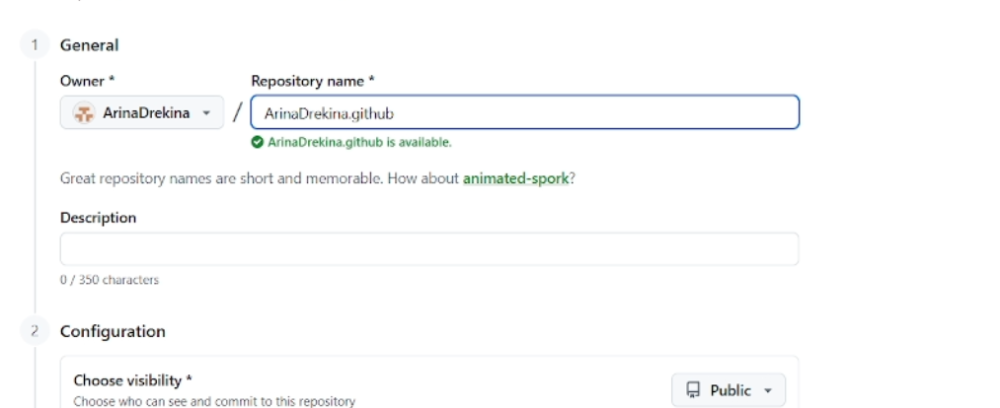
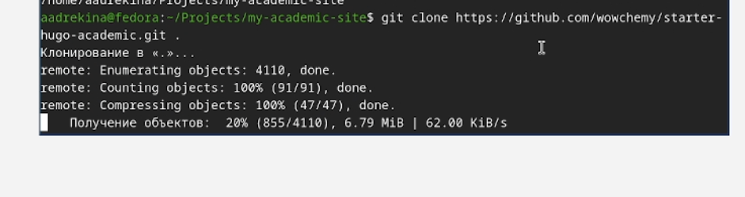
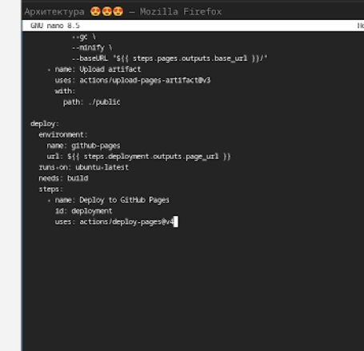
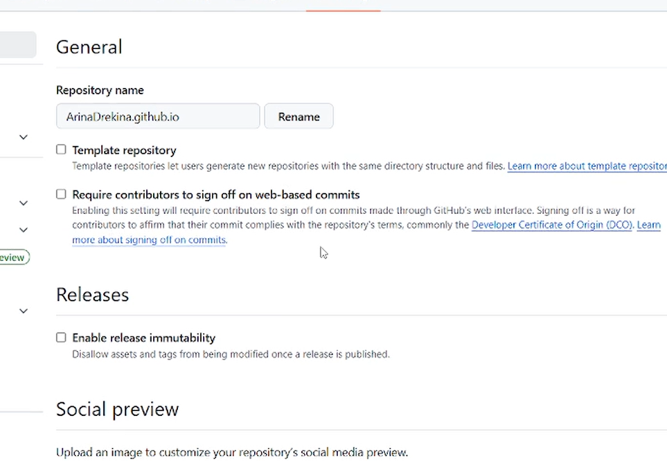

---
## Front matter
lang: ru-RU
title: Отчет по индивидуальному проекту, первый этап
subtitle:Дисциплина: Операционные системы
author:
  - Дрекина Арина Андреевна
institute:
  - Российский университет дружбы народов, Москва, Россия
date: 2026.03.04

## i18n babel
babel-lang: russian
babel-otherlangs: english

## Formatting pdf
toc: false
toc-title: Содержание
slide_level: 2
aspectratio: 169
section-titles: true
theme: metropolis
header-includes:
 - \metroset{progressbar=frametitle,sectionpage=progressbar,numbering=fraction}
---

## Информация

---

## Докладчик

  * Дрекина Арина Андреевна
  * студентка факультета физико-математических и естественных наук
  * Российский университет дружбы народов им. П. Лумумбы
  * [1032253548@rudn.ru](mailto:1032253548@rudn.ru)

---

# Цель работы

Приобретение навыков в создании своего сайта

# Задание

Установка необходимого программного обеспечение. Скачивание шаблона сайта. Уставнока параметра для URLs сайта. Размещение заготовок сайта на GitHub pages.

---

## Выполнение лабораторной работы

Проверка установки git.

{#fig-001 width=70%}

---

Скачивание програмного обеспечения.

{#fig-002 width=70%}

---

Cкачиваем пакет Extended.

{#fig-003 width=70%}

---

Распоковываем пакет.

{#fig-004 width=70%}

---

Далее перенесем файл в папку, которая в PATH.([рис. @fig-005])

{#fig-005 width=70%}

---

Добавление команды в папку чтобы система могла запускать Hugo из любой директории

{#fig-006 width=50%}

{#fig-007 width=50%}

---

Создание  репозитория. 

{#fig-008 width=60%}

---

Создание репозитория.

{#fig-009 width=60%}

---

Клонирование шаблона Academic к себе на компьютер.

{#fig-010 width=50%}

{#fig-011 width=50%}

---

Инициализация и обновление подмодулей Git

{#fig-012 width=70%}

---

Запуск локальный сервер для проверки. 

{#fig-013 width=60%}

---

На выходе программ напечатала "Web server is available at http:/localhost:1313/"

Копируем текст ссылки и вставляем ее в браузер. Видим сайт. 

{#fig-014 width=70%}

---

Создаем файл и вставляем в это него текст с настройками. 

{#fig-016 width=50%}

---

Настраиваем, откуда GitHub Pages будет брать готовый сайт.

{#fig-017 width=70%}

---

В конце мы отправляем изменения и запускаем деплой.(

{#fig-018 width=70%}

---

## Вывод

В ходе выполнения первого этапа индивидуального проекта мы разместили на GitHub pages заготовки для персонального сайта.

