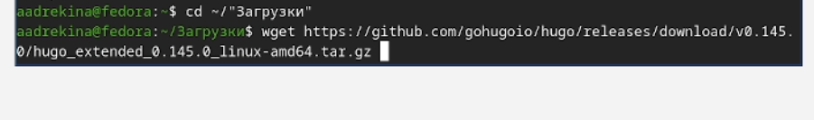
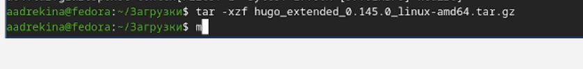
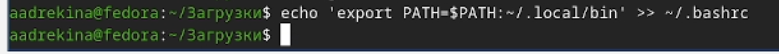
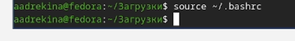
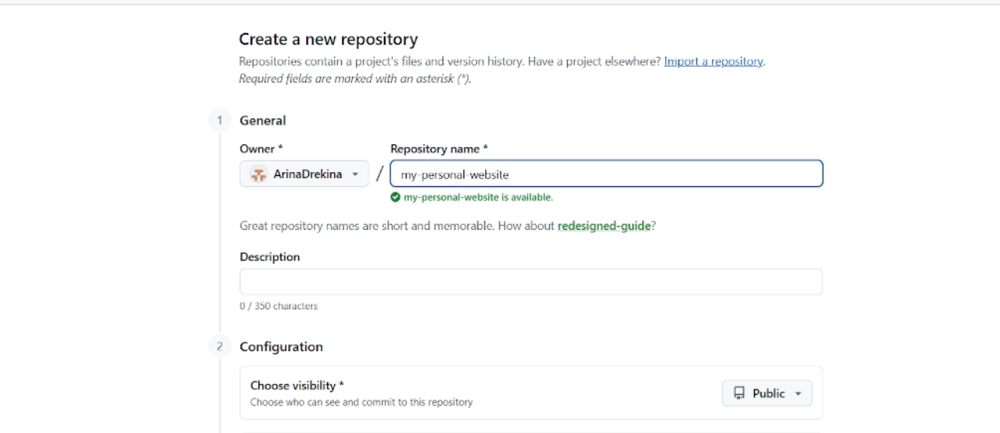
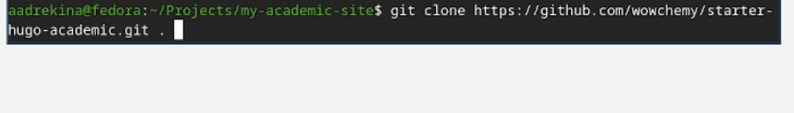
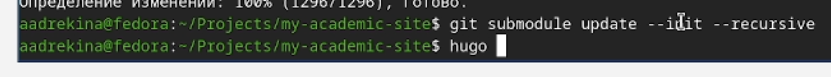
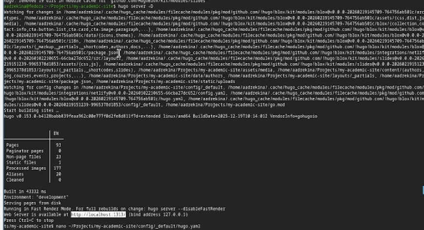
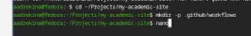
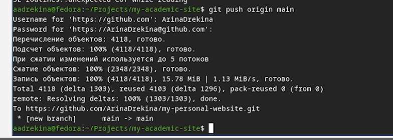

---
## Author
author:
  name: Арина Андреевна Дрекина
  degrees: DSc
  orcid: 0000-0002-0877-7063
  email: 1032253548@rudn.ru
  affiliation:
    - name: Российский университет дружбы народов
      country: Российская Федерация
      postal-code: 117198
      city: Москва
      address: ул. Миклухо-Маклая, д. 6

## Title
title: "Отчет по индивидуальному проекту, первый этап"
subtitle: "Дисциплина: Операционные системы"
license: "CC BY"
---

# Цель работы

Приобретение навыков в создании своего сайта

# Задание

Установка необходимого программного обеспечение. Скачивание шаблона сайта. Уставнока параметра для URLs сайта. Размещение заготовок сайта на GitHub pages.

# Выполнение лабораторной работы

## Установка ПО.

Перед тем как начать разрабатывать сайт необходимо скачать программное обеспечение. 

Проверяем установлен ли Git ([рис. @fig-001])

{#fig-001 width=70%}

Затем скачиваем Golang. ([рис. @fig-002])

{#fig-002 width=70%}

Потом с помощью команды wget скачиваем пакет Extended.([рис. @fig-003]) 

{#fig-003 width=70%}

После успешной установки необходимо распоковать. ([рис. @fig-004])

{#fig-004 width=70%}

Далее перенесем файл в папку, которая в PATH.([рис. @fig-005])

{#fig-005 width=70%}

Добавим команду в  папку с установленным Hugo в переменную окружения PATH, чтобы система могла запускать Hugo из любой директории без указания полного пути к исполняемому файлу.([рис. @fig-006])([рис. @fig-007])

{#fig-006 width=70%}

{#fig-007 width=70%}

## Создание репозитория.

Затем через сайт GitHub я создала два репозитория. Один для исходного кода, его я назвала "my-personal-website"([рис. @fig-008])

{#fig-008 width=70%}

А второй нужен для готового сайта. И он уже не может отличаться от юзера на GitHub. ([рис. @fig-009])

{#fig-009 width=70%}

## Скачивание и настройка шаблона темы. 

Клонируем шаблон Academic к себе на компьютер. (рис. [@fig-010])([рис. @fig-011])

{#fig-010 width=70%}

{#fig-011 width=70%}

После этого инициализируем и обновляем подмодули Git([@fig-012])

{#fig-012 width=70%}

Теперь нам необходимо запустить локальный сервер для проверки. ([рис. @fig-013])

{#fig-013 width=70%}

На выходе программ напечатала "Web server is available at http:/localhost:1313/"

Я скопировала текст ссылки и вставила ее в браузер. У меня загрузился сайт. ([рис. @fig-014])

{#fig-014 width=70%}

Потом я создала файл, чтобы в дальнейшем написать туда настройки.([рис. @fig-015])

{#fig-015 width=70%}

Потом я вставила в этот файл текст с настройками. ([рис. @fig-016])

{#fig-016 width=70%}

## Настройка GitHub Pages в репозитории.  

Затем нужно настроить, откуда GitHub Pages  будет брать готовый сайт.

Для этого заходим на Github в репозиторий ArinaDrekina.github.io. Заходим в Pages ([@fig-017])

{#fig-017 width=70%}

В конце мы отправляем изменения и запускаем деплой.([@fig-018])

{#fig-018 width=70%}

## Вывод

В ходе выполнения первого этапа индивидуального проекта мы разместили на GitHub pages заготовки для персонального сайта.

