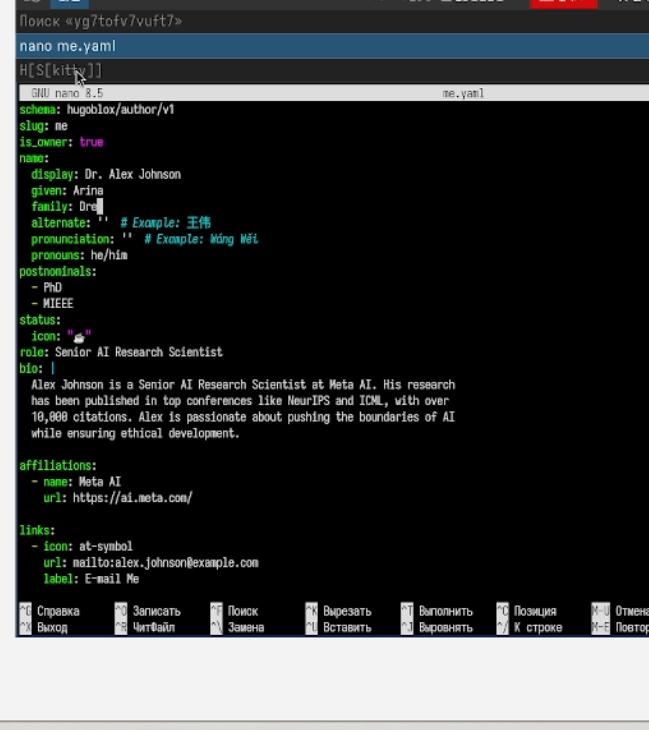

---
## Front matter
lang: ru-RU
title: Отчет по индивидуальному проекту, третий этап
subtitle:Дисциплина: Операционные системы
author:
  - Дрекина Арина Андреевна
institute:
  - Российский университет дружбы народов, Москва, Россия
date: 2026.03.04

## i18n babel
babel-lang: russian
babel-otherlangs: english

## Formatting pdf
toc: false
toc-title: Содержание
slide_level: 2
aspectratio: 169
section-titles: true
theme: metropolis
header-includes:
 - \metroset{progressbar=frametitle,sectionpage=progressbar,numbering=fraction}
---

## Информация

## Докладчик

  * Дрекина Арина Андреевна
  * студентка факультета физико-математических и естественных наук
  * Российский университет дружбы народов им. П. Лумумбы
  * [1032253548@rudn.ru](mailto:1032253548@rudn.ru)

# Цель работы

Приобретение навыков в создании своего сайта

# Задание

Добавить к сайту данные о себе.
Список добавляемых данных.
Разместить фотографию владельца сайта.
Разместить краткое описание владельца сайта (Biography).
Добавить информацию об интересах (Interests).
Добавить информацию от образовании (Education).
Сделать пост по прошедшей неделе.Добавить пост на тему по выбору:Управление версиями. Git.Непрерывная интеграция и непрерывное развертывание (CI/CD).

# Выполнение лабораторной работы

---

Для начала нужно изменить фотографию владельца сайта. Для этого я перешла в папку, в которой хранится предыдущая фотография, удалила ее и вставила свое фото. 

{#fig-001 width=60%}

---

После этого нужно разместить информацию о своем образование. Для этого необходимо найти файл с этим текстом. После того как я нашла этот файл, я перешла в папку и открыла нужный текстовый файл.

{#fig-002 width=60%}

---

Далее редактируем текст, размещаем информацию о себе, своем образование и добавляем свои интересы.

{#fig-003 width=60%}

---

Теперь, таким же образом нужно написать два поста. Я нашла нужные текстовые файлы, изменила в них текст. Первый пост я написала о своей прошедшей неделе. А второй пост я написала на тему: «Управление версиями Git»

#Вывод

В ходе выполнения второго этапа индивидуального проекта мы смогли добавить свое фото, информацию о себе, а так же научились выставлять посты.
