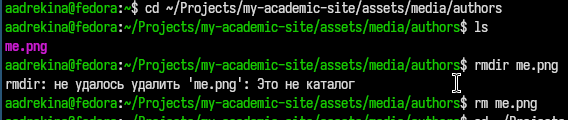
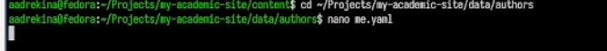

---
## Author
author:
  name: Арина Андреевна Дрекина
  degrees: DSc
  orcid: 0000-0002-0877-7063
  email: 1032253548@rudn.ru
  affiliation:
    - name: Российский университет дружбы народов
      country: Российская Федерация
      postal-code: 117198
      city: Москва
      address: ул. Миклухо-Маклая, д. 6

## Title
title: "Отчет по индивидуальному проекту, второй этап"
subtitle: "Дисциплина: Операционные системы"
license: "CC BY"
---

# Цель работы

Приобретение навыков в создании своего сайта

# Задание

Добавить к сайту данные о себе.

    Список добавляемых данных.
        Разместить фотографию владельца сайта.
        Разместить краткое описание владельца сайта (Biography).
        Добавить информацию об интересах (Interests).
        Добавить информацию от образовании (Education).
    Сделать пост по прошедшей неделе.
    Добавить пост на тему по выбору:
        Управление версиями. Git.
        Непрерывная интеграция и непрерывное развертывание (CI/CD).

# Выполнение лабораторной работы

Для начала нужно изменить фотографию владельца сайта. Для этого я перешла в папку, в которой хранится предыдущая фотография, удалила ее и вставила свое фото. ([рис. @fig-001])

{#fig-001 width=60%}

После этого нужно разместить информацию о своем образование. Для этого необходимо найти файл с этим текстом. После того как я нашла этот файл, я перешла в папку и открыла нужный текстовый файл.([рис. @fig-002])

{#fig-002 width=60%}

Далее редактируем текст, размещаем информацию о себе, своем образование и добавляем свои интересы.([рис. @fig-003])

{#fig-003 width=60%}

Теперь, таким же образом нужно написать два поста. Я нашла нужные текстовые файлы, изменила в них текст. Первый пост я написала о своей прошедшей неделе. А второй пост я написала на тему: «Управление версиями Git»

#Вывод

В ходе выполнения второго этапа индивидуального проекта мы смогли добавить свое фото, информацию о себе, а так же научились выставлять посты.

# Список литературы{.unnumbered}

::: {#refs}
:::
